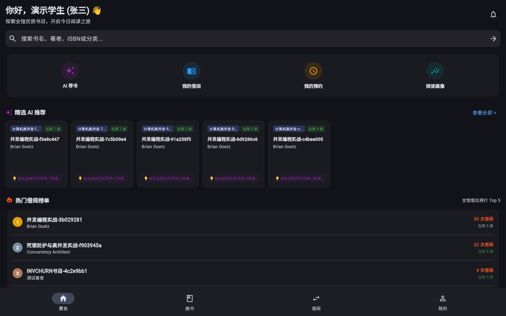
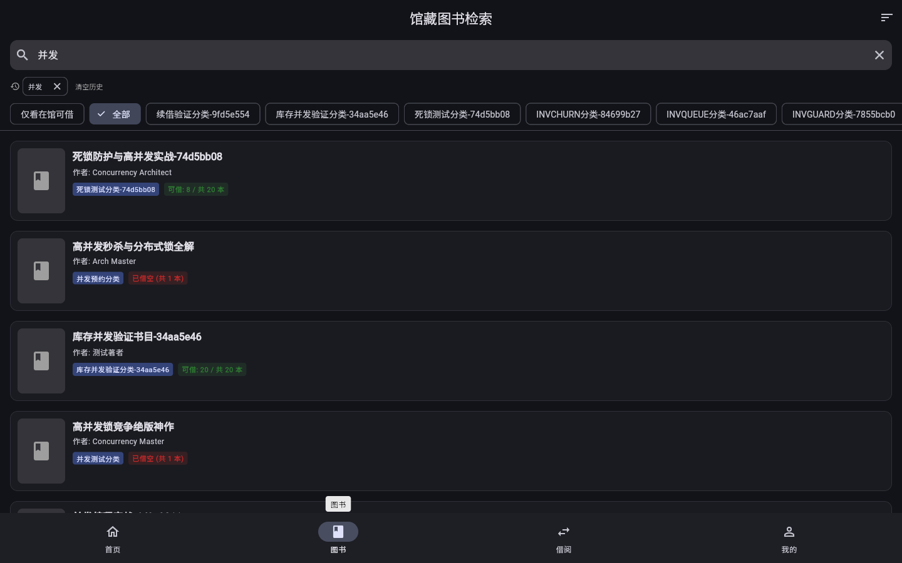
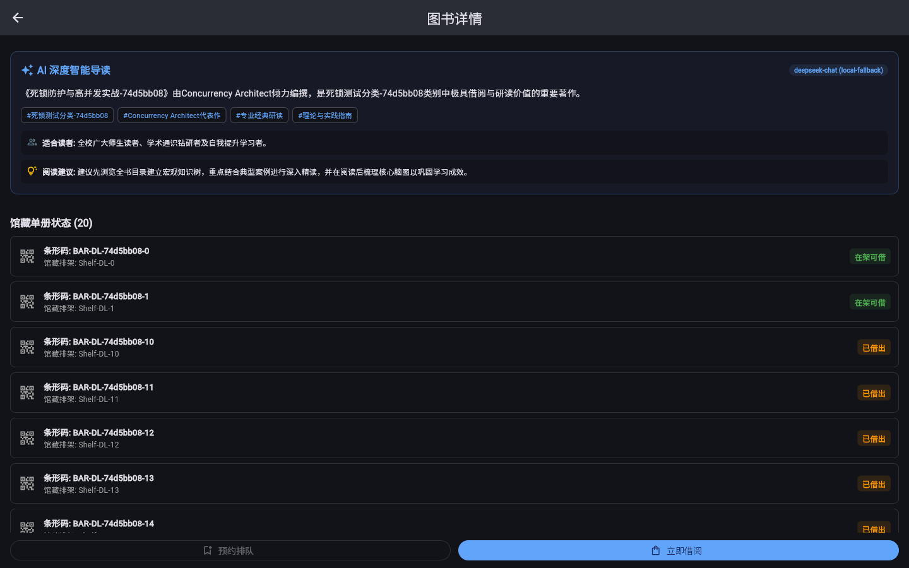
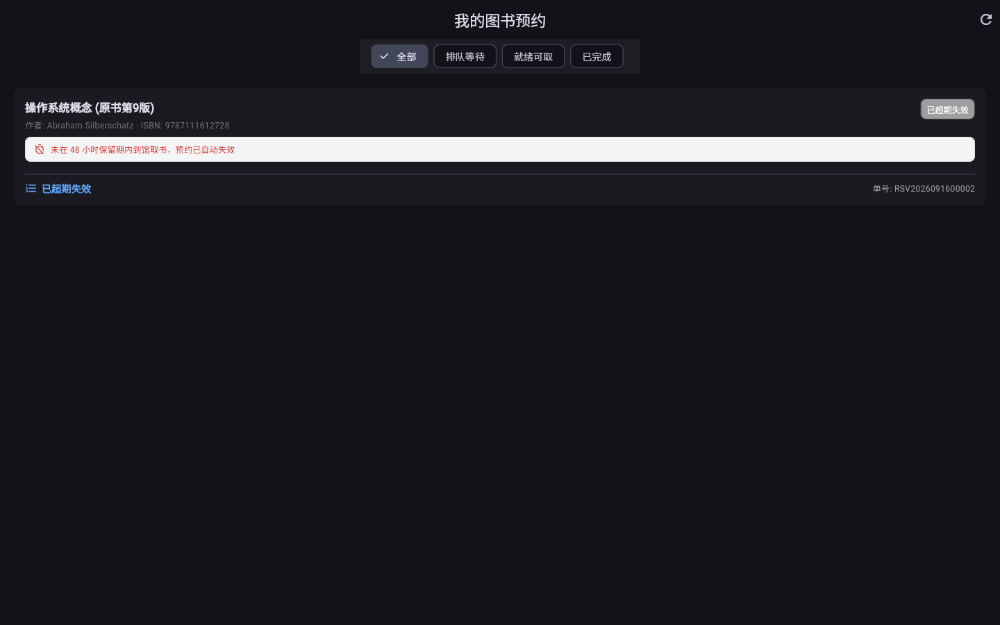
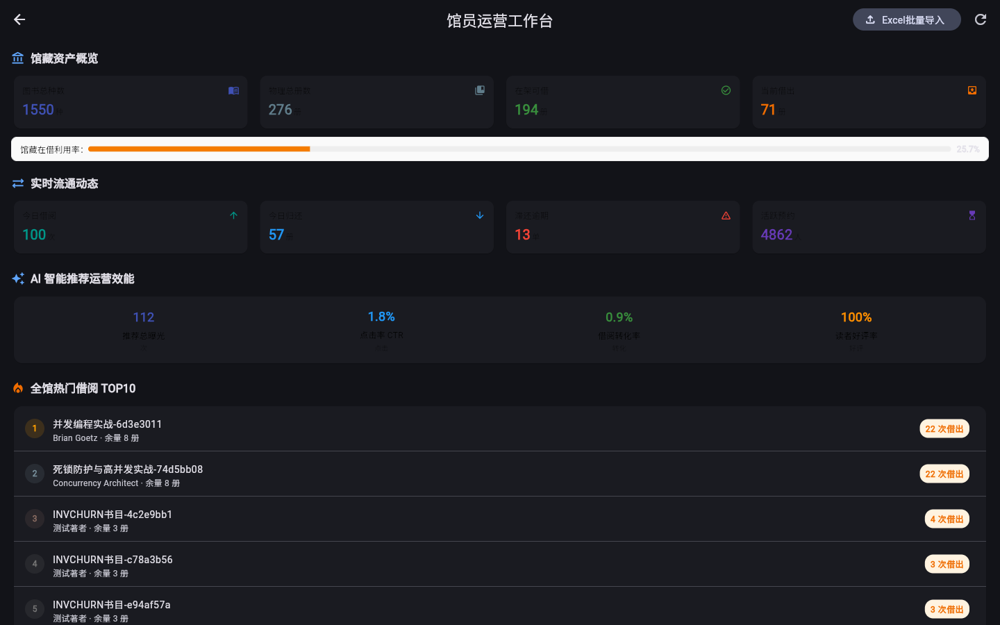
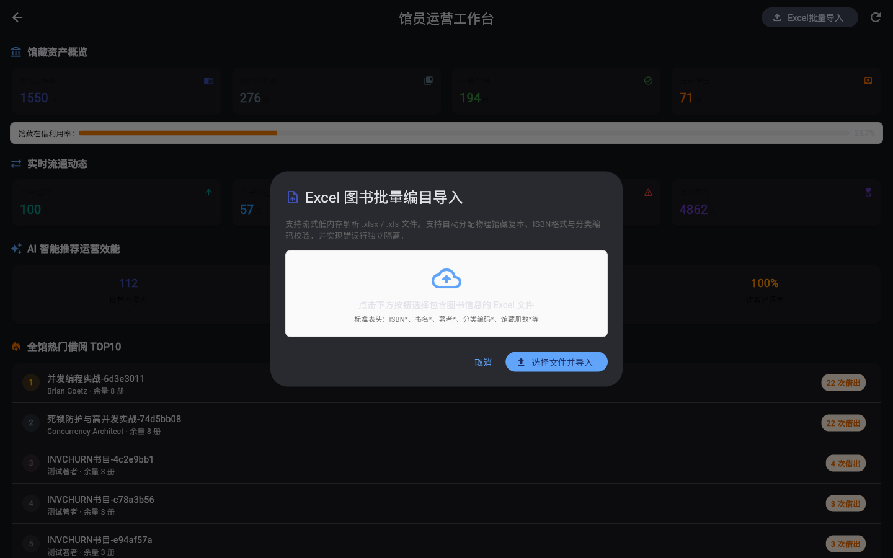

<div align="center">

# 📚 校园图书借阅系统 (Campus Library Borrowing System)

> **基于 Spring Boot 3 + Flutter 3 + PostgreSQL 17 + Redis 8 的工业级高并发校园数字化图书流通与智能推荐平台**

[](LICENSE)
[](https://spring.io/projects/spring-boot)
[](https://openjdk.org/)
[](https://flutter.dev/)
[](https://www.postgresql.org/)
[](https://redis.io/)
[](https://www.docker.com/)
[](backend)
[](frontend)
[](frontend)
[](.github/workflows/ci.yml)

> **口径说明**：以上数字均为实测值，产生命令与原始输出见 [质量基线](#-自动化测试与质量基线-testing--quality) 一节。
> 徽章数字目前是手写的，改代码后需同步更新；CI 已配置（`.github/workflows/ci.yml`），可替换为 CI 动态徽章以避免漂移。
>
> **JDK 版本口径**：构建产物为 **Java 17 字节码**（`backend/pom.xml` 的 `<java.version>17</java.version>`），
> 生产镜像与 CI 使用 **JDK 21** 运行时（`docker/backend/Dockerfile` 的 `eclipse-temurin:21-jre-alpine`，
> 用于 `-XX:+ZGenerational` 分代 ZGC）。两者不一致是刻意选择，不是笔误。

[English](./docs/Stage8-Github-Showcase.md) | 简体中文

</div>

---

## 📖 项目简介

### 一句话介绍
**《校园图书借阅系统》** 是一套面向现代高校图书馆的全栈数字化解决方案，依托响应式跨平台前端与容器化微服务编排架构，深度融合高并发行级排他锁、FIFO 闭环排队状态机、基于读者偏好与在架感知的多路加权推荐以及具备结构化元数据约束的智能导读生成引擎。

### 为什么需要这个系统？
传统高校图书管理系统普遍存在三大致命痛点：
1. **热点图书并发超借与循环死锁**：每逢选课周与考试季，数十名学生瞬间争抢热门教材，传统乐观锁或单机同步锁在数据库层面引发“借书锁父表、还书锁子表”的互相循环等待，导致数据库连接池被打爆且产生大量负库存超借；
2. **预约流程无序与资源僵化死锁**：书籍借出后缺乏透明的排队位次追踪，归还后无法自动定向锁定与流转，逾期未取书造成馆藏图书闲置浪费；
3. **算法推荐脱离实体库存与大模型幻觉**：通用推荐算法无法感知真实物理库存，推荐得出却借不到；引入外部大模型时不仅凭空捏造虚假书目，更因长时网络 I/O 长期霸占数据库连接池，造成全站雪崩。

本项目针对上述工业级痛点进行了深度重构与架构攻关，致力于提供高可靠、高性能、易交付的现代智慧校园阅读生态。

---

## 📸 系统截图 (Screenshots)

> 以下截图均为**真实运行截图**（本机启动后端 + `flutter run -d chrome` 后用演示账号登录截取），
> 原文件存放于 [`docs/screenshots/`](docs/screenshots/)。
> 截图环境：后端 dev profile、PostgreSQL 17、Redis 8；AI 导读展示的是 `local-fallback` 规则引擎分支
> （未配置外部 LLM API Key 时的降级路径，属设计内行为）。

<div align="center">
  <table>
    <tr>
      <td align="center"><b>读者端 - 首页与智能推荐</b></td>
      <td align="center"><b>读者端 - 多维检索</b></td>
    </tr>
    <tr>
      <td></td>
      <td></td>
    </tr>
    <tr>
      <td align="center"><b>读者端 - AI 智能导读 (元数据约束生成)</b></td>
      <td align="center"><b>读者端 - 预约状态与流转时间线</b></td>
    </tr>
    <tr>
      <td></td>
      <td></td>
    </tr>
    <tr>
      <td align="center"><b>管理端 - 馆员运营监控看板</b></td>
      <td align="center"><b>管理端 - Excel 流式批量编目</b></td>
    </tr>
    <tr>
      <td></td>
      <td></td>
    </tr>
  </table>
</div>

---

## 🏗️ 整体技术架构 (Architecture)

系统采用现代前后端分离与分层架构，全链路贯穿请求分布式 TraceId 与结构化日志：


---

## 🌟 核心技术亮点 (Key Engineering Highlights)

### 1. 基于确定性锁拓扑的高并发借阅一致性控制
- **痛点破除**：借阅业务（先锁 `Book` 后锁 `BookCopy`）与还书业务（先锁 `BookCopy` 后锁 `Book`）在高频交叉执行时形成循环等待死锁。
- **架构方案**：推导死锁充分必要条件，确立**全局确定性锁顺序模型（Deterministic Lock Ordering）**。全系统所有涉及图书流转的事务，一律强制且仅能按照父实体到子实体（`Book` $\to$ `BookCopy`）拓扑顺序申请行级悲观排他锁（`SELECT ... FOR UPDATE`）。
- **实测成果**：经过全链路加锁拓扑审计与 DAG 偏序约束，根除了借还与预约主干路径的循环等待死锁。并发用例断言：50 借 + 50 还共 100 线程交叉争抢同一批副本时超借数严格为 0（`ConcurrentBorrowReturnTest`），50 线程争抢单册副本时库存不足拦截恰好为 49（`ConcurrentBorrowTest`），100 线程预约同一书目时排位恰好覆盖 1~100 无重复（`ReservationConcurrentTest`）。

### 2. 具备自动唤醒与时效淘汰的闭环 FIFO 预约状态机
- **痛点破除**：传统排队靠无序抢占，归还图书后缺乏主动流转，未到馆读者恶意长期占坑。
- **架构方案**：基于数据库锁构建单调递增排队号；设计完整的状态生命周期（`WAITING` $\to$ `READY` $\to$ `FULFILLED` / `EXPIRED`）；在图书还书事务后触发领域事件毫秒级定向唤醒队首读者并物理锁定副本；结合整点定时调度器自动清退 48 小时未取书记录并自动顺延。

### 3. 基于读者偏好与在架感知的多路加权启发式推荐引擎
- **痛点破除**：新进图书无借阅记录导致的冷启动瘫痪；传统算法推送"已全部借空"的图书导致用户体验断层。
- **架构方案**：构建基于读者历史分类/作者偏好与在架库存感知的多路加权启发式推荐算法：
  $$\text{Score}(u, i) = 0.4 \cdot S_{\text{content}} + 0.4 \cdot S_{\text{behavior}} + 0.2 \cdot S_{\text{pop}} + S_{\text{stock}}$$
  其中 $S_{\text{content}}$ 基于读者历史借阅分类与作者匹配度打分，$S_{\text{behavior}}$ 基于读者阅读行为轨迹与分类命中度打分，$S_{\text{pop}}$ 为全校借阅热度归一化，$S_{\text{stock}}$ 为在架库存激励（可借时 $+15.0$ 分加成）。针对借阅量少于 3 本的新生自动切换为"全校热榜 + 在架优先"的冷启动推荐，该分支额外给在架库存 $+20.0$ 分加成（`AiRecommendServiceImpl` 冷启动分支）。候选池大小取 $\max(5 \times limit,\ 50)$ 并下推至 PostgreSQL 存储层分页，避免全表载入内存；推荐接口端到端实测 28~42ms（首次含预热 122ms，`limit=10`，本机 dev 环境）。

### 4. 具备结构化元数据约束的智能导读生成引擎（支持云端 LLM 与本地规则引擎双模容灾切换）
- **痛点破除**：外部通用大模型缺乏专业图书大纲导致凭空虚构（幻觉）；外部网络调用耗时 2~4 秒若置于 `@Transactional` 内将迅速占死数据库连接池。
- **架构方案**：提取本馆严格编目的结构化元数据作为 Context 注入 Prompt，强行收敛大模型发散输出；将耗时网络调用彻底移出数据库事务环境，生成完毕后通过配置 `@Transactional(propagation = REQUIRES_NEW)` 的独立小事务落盘并写入 Redis 缓存；内建 `RuleBasedMockAiProvider` 实现网络断流时的秒级降级兜底（无需外部 API Key 也可完整演示）。

### 5. 多阶段安全裁剪与云原生容器化生产交付- **痛点破除**：开发运行环境不一致、镜像庞大臃肿、容器使用 root 用户存在提权逃逸风险。
- **架构方案**：后端采用 Maven + Alpine JDK 构建环境与精简 JRE 21 运行环境多阶段构建；容器内创建受限 `appuser` 非 root 用户；通过 `docker-compose.prod.yml` 统一编排并配备 `backup.sh` 每日自动压缩冷备。
- **镜像体积（实测）**：后端 **150 MiB**、前端 **39 MiB**。

  ```bash
  # 生产镜像体积的产生命令（注意用 inspect 的 .Size，不要用 docker images 的 SIZE 列 ——
  # 后者在 Docker Desktop 上显示的是含共享层的磁盘占用，同一镜像会显示成 637MB）
  docker build -f docker/backend/Dockerfile -t campus-library-backend ./backend
  docker image inspect campus-library-backend --format '{{.Size}} bytes'   # 157014519 bytes ≈ 150 MiB
  docker image inspect campus-library-frontend --format '{{.Size}} bytes'  # 41311771 bytes  ≈ 39 MiB
  ```

  关键收益来自两点：`COPY --chown` 取代 `COPY` 后再 `RUN chown`（后者会把同一个 jar 写进两个层，白占约 78MB），以及 `apk add --no-cache` 与构建阶段产物不进入运行镜像。

### 6. 前端自带中文字体：脱网也能正确渲染，不依赖 Google Fonts

- **痛点破除**：Flutter Web（CanvasKit）的中日韩字形默认在**运行时**从 `fonts.gstatic.com` 拉取 Noto 字体。
  在校园网/国内网络下该域名通常不可达，结果是**能登录、但界面上所有汉字渲染成方块（tofu）**——
  这是本项目实测遇到过的真实故障（登录页满屏 □□□），而且只在"网络不通"时出现，本地开发往往复现不到。
- **架构方案**：把一份 Noto Sans SC 子集字体**打包进应用**并设为全局字体族
  （`lib/core/theme/app_theme.dart` 的 `fontFamily` + `pubspec.yaml` 的 `fonts`），
  渲染不再请求任何外部域名。字体仅 **1.8MB / 6199 字形**，由脚本从 16.9MB 的可变字体裁剪而来。

  | 环节 | 体积 | 说明 |
  | :--- | ---: | :--- |
  | 源字体（Noto Sans SC 可变字体） | 16.9 MB | 31036 字形，含全部字重 |
  | 实例化到 Regular | 10.1 MB | 丢掉可变轴数据 |
  | 子集裁剪（词频前 6000 汉字 + 项目/库内用字） | **1.8 MB** | 保留 6199 字形 |

- **覆盖率**：按词频取前 6000 汉字（覆盖约 99.87% 词频），并叠加项目源码、文档、迁移脚本与
  线上库真实文本（书名/著者/简介/昵称等动态内容）的全部用字 —— 后者尤其重要，
  因为库里存的是任意中文，只收集源码字符串会让动态内容显示为方块。
- **许可**：SIL OFL 1.1（`frontend/assets/fonts/OFL-1.1.txt`，版权归 Adobe/Google）。
  子集属**修改版**，按 OFL 的保留字体名条款未沿用官方字体名，内部字体名已改为中性名。
- **可复现**：`scripts/tools/build-cjk-font-subset.ps1`（参数化，输出到 assets 直接生效）。

  ```bash
  # 重新生成（本机需先装依赖，走国内镜像）
  python -m pip install --user -i https://mirrors.aliyun.com/pypi/simple/ fonttools jieba
  powershell -File scripts/tools/build-cjk-font-subset.ps1 -IncludeDatabase
  # 生成后重新构建前端产物生效
  cd frontend && flutter build web --release
  ```

  > 后续若出现个别生僻字显示为方块，说明该字不在子集内：把出现该字的语料加进 `-CorpusDirs`，
  > 或调高 `-TopChars` 后重跑脚本即可（体积会相应增加）。

---

## 🚀 快速启动指南 (Quick Start)

### 生产模式：一键容器化编排 (Recommended)

确保宿主机已安装 **Docker 24+** 与 **Docker Compose v2+**。

```bash
# 1. 克隆代码仓库
git clone https://github.com/kgnb666/campus-library-system.git
cd campus-library-system

# 2. 依据模板初始化环境变量 (设置数据库与 Redis 密码)
cp .env.example .env

# 3. 一键构建并后台启动全栈服务 (Postgres + Redis + Backend + Frontend + Nginx)
docker compose -f docker-compose.prod.yml up -d --build

# 4. 检查服务健康状态
docker compose -f docker-compose.prod.yml ps
```

* 浏览器直接访问：`http://localhost`（生产网关端口 80）
* 后端 Actuator 探针：`http://localhost/actuator/health`

### 预置演示账号 (Demo Accounts)

系统已通过 Flyway V9 脚本自动装载真实演示数据集（含 52 本覆盖五大学科的图书及借还流通数据），密码统一为 `123456`：

| 角色 | 用户名 | 密码 | 核心功能与体验视角 |
| :--- | :--- | :--- | :--- |
| **学生读者** | `student_demo` | `123456` | 图书多维检索、混合 AI 推荐、在架一键借阅、孤本书籍预约排队 |
| **图书管理员** | `librarian_demo` | `123456` | 实体副本管理、条码扫码还书、SAX 大规模 Excel 编目导入 |
| **系统管理员** | `admin_demo` | `123456` | 馆员运营大盘监控、数字翻牌热力分析、系统权限与参数审计 |

> 💡 **小贴士**：登录页右下角已集成快捷切换面板，无需手动键入账号密码，一键免密装载凭据！

### 本机开发模式：一键启动（推荐）与手工启动

#### 方式一：一键启动脚本（Windows）

```powershell
# 根目录（或 scripts/ 下同名脚本）
.\start-all.bat          # 起依赖容器 -> 后端 -> 等健康就绪 -> 再起前端
.\stop-all.bat           # 按端口归属停止本项目进程（不会误杀其它项目）
```

脚本的关键行为：

* **先确认后端健康就绪，才拉起前端**。后端若起不来（最常见是端口被别的项目占用），
  脚本会直接中止并打印原因，**不会**留下一个"界面在跑、接口全失败"的假象；
* 后端端口由 `SERVER_PORT` 决定，并**自动传给前端**（`--dart-define=API_BASE_URL=...`），
  两边不会各说各话：

```powershell
# 8080 被别的项目占用时：换端口，前端会自动跟随，无需手改任何前端配置
$env:SERVER_PORT=28080; .\scripts\start-all.ps1
```

#### 方式二：手工分步启动（跨平台 / 需要单独调试某一端时）

```bash
# 1. 仅启动依赖服务 (PostgreSQL + Redis)
docker compose up -d postgres redis

# 2. 启动后端，用 SERVER_PORT 指定端口（示例 28080）
cd backend
SERVER_PORT=28080 ./mvnw spring-boot:run
#    PowerShell: $env:SERVER_PORT=28080; .\mvnw.cmd spring-boot:run

# 3. 启动前端，并把 API 地址指向后端实际端口
cd ../frontend
flutter run -d chrome --dart-define=API_BASE_URL=http://localhost:28080/api/v1
```

> ⚠️ **前端接口地址是编译期常量**：手工启动时若后端换了端口，前端必须带 `--dart-define=API_BASE_URL=...`
> 重新构建/运行才会生效；只重启后端、前端不动，界面会一直显示"无法连接服务器"。
> 一键脚本已代为处理这件事，手工启动时需要自己保证两端端口一致。

未注入 `API_BASE_URL` 时，前端 dev 环境回落到 `http://localhost:8080/api/v1`（见 `lib/core/config/env_config.dart`）。
注入值需以 `http://` 或 `https://` 开头（Web 端也可用 `/` 开头的相对路径，但 Dio 在非 Web 平台会拒绝相对地址），
非法值视为未注入并回落默认值。

---

## 🧪 自动化测试与质量基线 (Testing & Quality)

系统严格践行测试驱动开发（TDD）与质量守门纪律。**下列每个数字都附有产生它的命令**：

```bash
# 后端：单元 + 集成 + 并发压力测试（248 项）
# 一键脚本（Windows，会自动探测 JDK/Maven 并准备独立测试库）
scripts\run-backend-test.bat

# 或者手工执行
cd backend
mvn clean test
# → [INFO] Tests run: 248, Failures: 0, Errors: 0, Skipped: 0
# → [INFO] BUILD SUCCESS

# 前端：组件、逻辑与状态流转测试（96 项）
cd ../frontend
flutter test
# → 00:0x +96: All tests passed!

# 前端静态分析
flutter analyze
# → No issues found!
```

### 测试用独立数据库

集成测试会**真实写入数据**（建书、建用户、造借阅流水、跑并发抢占），因此测试与演示**不共用数据库**：

| | 数据库 | 由谁使用 |
| :--- | :--- | :--- |
| 演示 / 生产 | `library_system`（`POSTGRES_DB`） | 一键启动的应用，以及备份恢复（`docker/scripts/restore.sh`）的目标库 |
| 测试 | `library_system_test`（`TEST_DB_NAME`） | `mvn test` / `run-backend-test.bat` / CI |

`backend/src/main/resources/application-test.yml` 默认指向 `library_system_test`，
库名可用环境变量 `TEST_DB_NAME` 覆盖。

**为什么必须分开**：此前测试与演示同库，夹具数据逐年沉积——演示库里曾混入 **1937 条测试书目**
（占书目总量的 97%），并出现库存计数漂移触发 `books_check` 约束失败，演示界面里能搜到
"测试分类"下的假书。分开后测试夹具只进测试库，演示数据保持干净。

**建库方式**：`scripts/run-backend-test.ps1` 会检测 `campus-library-postgres` 容器并在库不存在时自动创建
（PostgreSQL 的 JDBC 驱动无法连上不存在的库，所以必须由外部建好）。容器未运行时脚本会打印手工命令：

```bash
docker exec campus-library-postgres psql -U library -d postgres \
  -c 'CREATE DATABASE "library_system_test" OWNER "library"'
```

**测试库可以随时删掉重建**，Flyway 会在下次测试运行时自动把 `V1 ~ V17` 全部迁移一遍：

```bash
docker exec campus-library-postgres psql -U library -d postgres -c 'DROP DATABASE "library_system_test"'
scripts\run-backend-test.bat   # 自动重建 + 重新迁移
```

CI（`.github/workflows/ci.yml`）的 postgres service 容器直接以 `library_system_test` 为库名启动，
与本地约定一致。**验证隔离有效**：一次全量测试后，演示库书目数不变（1989 → 1989，库存计数漂移 0），
测试库独立持有夹具数据。

### 质量报告概览

| 项目 | 实测结果 | 产生命令 |
| :--- | :--- | :--- |
| **Backend JUnit 5** | `248 / 248 Tests PASS`（61 个测试类 / 248 处 `@Test`，两者数量一致） | `cd backend && mvn clean test` |
| **Frontend Tests** | `96 / 96 Tests PASS`（23 个测试文件） | `cd frontend && flutter test` |
| **Static Analysis** | `flutter analyze` → `No issues found!`（0 warning / 0 error） | `cd frontend && flutter analyze` |
| **Database Migration** | Flyway `V1 ~ V17` 连续迁移无偏差（当前 schema 版本 v17） | `SELECT version FROM flyway_schema_history ORDER BY installed_rank DESC LIMIT 1;` |
| **生产镜像体积** | 后端 150 MiB / 前端 39 MiB | `docker image inspect <image> --format '{{.Size}} bytes'` |

其中并发相关的三个用例是硬断言，不是描述性文字：

- `ConcurrentBorrowReturnTest`：50 借 + 50 还共 100 线程交叉争抢同一批副本，超借数断言为 0；
- `ConcurrentBorrowTest`：50 线程争抢单册副本，库存不足拦截数断言恰好为 49；
- `ReservationConcurrentTest`：100 线程预约同一孤本，排位断言恰好覆盖 1~100 且互不重复。

> **维护提醒**：这些数字会随测试增删而失效。CI（`.github/workflows/ci.yml`）会在每次推送时重跑全部用例，
> 应以其结果为准；本表在改动测试后需同步更新。
> 校准方法：`@Test` 注解数应与 surefire 报告的 `Tests run` 总数相等——**两者不等就说明有用例没被执行**。
> 本仓库曾因此漏掉两条：一是 `static` 内部测试类（JUnit 5 只发现 `@Nested` 非静态内部类）被 surefire
> 静默跳过；二是 `target/surefire-reports` 外的类名不匹配 `*Test.java` 命名约定。

---

## 📁 项目目录结构 (Directory Structure)

```
Campus-Library-Borrowing-System/
├── backend/                       # 后端 Spring Boot 3.3 工程 (编译目标 Java 17 / 运行时 JDK 21)
│   ├── src/main/java/com/library/
│   │   ├── controller/            # RESTful API 控制器 (借还、预约、推荐、导读、统计)
│   │   ├── domain/                # 领域实体与枚举 (Book, BookCopy, Reservation, BorrowRecord)
│   │   ├── dto/                   # 数据传输对象与入参校验
│   │   ├── event/                 # 领域事件与异步通知监听器 (AFTER_COMMIT)
│   │   ├── repository/            # Spring Data JPA 存储库 (悲观行级锁、fetch 图、复杂查询)
│   │   ├── scheduler/             # 定时调度任务 (逾期检测、预约过期清退、曝光日志保留期清理)
│   │   ├── service/               # 核心业务接口与实现 (确定性加锁、导读事务解耦、SAX导入)
│   │   └── security/              # JWT 过滤器、方法级 RBAC 鉴权、登录失败频控
│   ├── src/main/resources/
│   │   ├── db/migration/          # Flyway V1~V17 版本化 DDL/DML 迁移脚本
│   │   └── application-*.yml      # 多环境配置文件 (dev / test / prod)
│   ├── src/test/java/com/library/ # 单元 / 集成 / 并发测试 (248 用例)
│   ├── mvnw / mvnw.cmd            # Maven Wrapper (构建不依赖本机 Maven)
│   └── pom.xml
├── frontend/                      # 前端 Flutter 3 跨平台工程
│   ├── lib/
│   │   ├── core/                  # 主题配置 (MD3)、网络客户端 (Dio)、路由 (GoRouter)、会话治理
│   │   ├── features/              # Feature-driven 业务模块 (auth, books, borrow, reservation, ai...)
│   │   └── shared/                # 通用组件与视觉辅助部件
│   ├── test/                      # 前端自动化部件与功能测试集 (96 用例)
│   └── pubspec.yaml
├── docker/                        # 生产容器化套件
│   ├── backend/Dockerfile         # Alpine JRE 21 多阶段镜像 (非 root 运行)
│   ├── frontend/Dockerfile        # Flutter Web 构建与 Nginx 托管
│   ├── nginx/nginx.conf           # 统一反向代理网关配置
│   └── scripts/                   # backup.sh / restore.sh (冷备与校验恢复)
├── scripts/                       # 本机开发一键脚本 (Windows PowerShell / BAT)
│   ├── toolchain.ps1              # 工具链探测 (JDK / Maven / Flutter 多路径兜底)
│   ├── start-backend.ps1|.bat     # 启动后端
│   ├── start-frontend.ps1|.bat    # 启动前端
│   ├── start-all.ps1              # 一键起全栈
│   ├── stop-all.ps1               # 按端口归属停止本项目进程 (不误杀他人服务)
│   └── run-backend-test / run-frontend-test
├── start-all.ps1 | start-all.bat  # 根目录快捷入口
├── stop-all.ps1  | stop-all.bat   # 根目录快捷入口
├── .github/workflows/ci.yml       # CI 门禁 (后端 verify / 前端 analyze+test / 镜像构建)
├── docs/                          # 设计与交付文档、答辩材料、运行截图
├── docker-compose.yml             # 本机开发依赖编排 (PostgreSQL + Redis)
├── docker-compose.prod.yml        # 生产微服务编排拓扑
├── .env.example                   # 生产安全环境变量范本
└── README.md                      # 项目说明文档
```

---

## 🔮 后续演进路线 (Roadmap)

- [ ] **分布式锁升级**：将单体数据库悲观锁平滑拓展为基于 Redis Redisson 的多活集群分布式防重锁；
- [ ] **多模态图书检索**：集成 Milvus 向量数据库与 CLIP 模型，实现手机拍照识别封面找书与基于语义向量的多模态检索；
- [ ] **物联网智能书柜互联**：接入 RFID 高频阅读器与 MQTT 协议，实现书架读者即拿即借、还书入柜自动感应盘点；
- [ ] **留学生多语言支持**：基于 Flutter l10n 与后端多语言字典提供中英西三语实时无缝切换。

---

## 📄 开源许可证 (License)

本项目遵循 [Apache 2.0 License](LICENSE) 协议开源。欢迎高校师生与技术爱好者交流与贡献。
