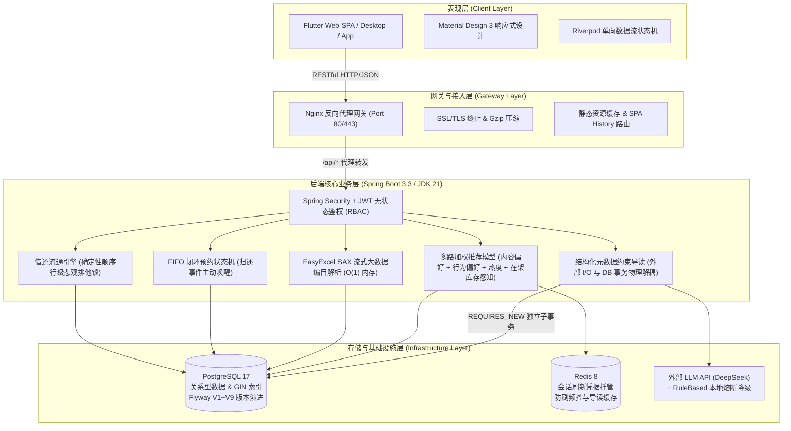

<div align="center">

# 📚 校园图书借阅系统 (Campus Library Borrowing System)

> **基于 Spring Boot 3 + Flutter 3 + PostgreSQL 17 + Redis 8 的工业级高并发校园数字化图书流通与智能推荐平台**

[](LICENSE)
[](https://spring.io/projects/spring-boot)
[](https://openjdk.org/)
[](https://flutter.dev/)
[](https://www.postgresql.org/)
[](https://redis.io/)
[](https://www.docker.com/)
[](backend)
[](frontend)
[](frontend)

[English](./docs/Stage8-Github-Showcase.md) | 简体中文

</div>

---

## 📖 项目简介

### 一句话介绍
**《校园图书借阅系统》** 是一套面向现代高校图书馆的全栈数字化解决方案，依托响应式跨平台前端与容器化微服务编排架构，深度融合高并发行级排他锁、FIFO 闭环排队状态机、基于读者偏好与在架感知的多路加权推荐以及具备结构化元数据约束的智能导读生成引擎。

### 为什么需要这个系统？
传统高校图书管理系统普遍存在三大致命痛点：
1. **热点图书并发超借与循环死锁**：每逢选课周与考试季，数十名学生瞬间争抢热门教材，传统乐观锁或单机同步锁在数据库层面引发“借书锁父表、还书锁子表”的互相循环等待，导致数据库连接池被打爆且产生大量负库存超借；
2. **预约流程无序与资源僵化死锁**：书籍借出后缺乏透明的排队位次追踪，归还后无法自动定向锁定与流转，逾期未取书造成馆藏图书闲置浪费；
3. **算法推荐脱离实体库存与大模型幻觉**：通用推荐算法无法感知真实物理库存，推荐得出却借不到；引入外部大模型时不仅凭空捏造虚假书目，更因长时网络 I/O 长期霸占数据库连接池，造成全站雪崩。

本项目针对上述工业级痛点进行了深度重构与架构攻关，致力于提供高可靠、高性能、易交付的现代智慧校园阅读生态。

---

## 📸 系统截图 (Screenshots)

<div align="center">
  <table>
    <tr>
      <td align="center"><b>读者端 - 首页与智能推荐</b></td>
      <td align="center"><b>读者端 - 多维检索与图书详情</b></td>
    </tr>
    <tr>
      <td></td>
      <td></td>
    </tr>
    <tr>
      <td align="center"><b>读者端 - 预约流转时间线</b></td>
      <td align="center"><b>读者端 - AI 智能导读 (元数据约束生成)</b></td>
    </tr>
    <tr>
      <td></td>
      <td></td>
    </tr>
    <tr>
      <td align="center"><b>管理端 - 馆员运营监控看板</b></td>
      <td align="center"><b>管理端 - Excel 流式批量编目</b></td>
    </tr>
    <tr>
      <td></td>
      <td></td>
    </tr>
  </table>
</div>

---

## 🏗️ 整体技术架构 (Architecture)

系统采用现代前后端分离与分层架构，全链路贯穿请求分布式 TraceId 与结构化日志：



---

## 🌟 核心技术亮点 (Key Engineering Highlights)

### 1. 基于确定性锁拓扑的高并发借阅一致性控制
- **痛点破除**：借阅业务（先锁 `Book` 后锁 `BookCopy`）与还书业务（先锁 `BookCopy` 后锁 `Book`）在高频交叉执行时形成循环等待死锁。
- **架构方案**：推导死锁充分必要条件，确立**全局确定性锁顺序模型（Deterministic Lock Ordering）**。全系统所有涉及图书流转的事务，一律强制且仅能按照父实体到子实体（`Book` $\to$ `BookCopy`）拓扑顺序申请行级悲观排他锁（`SELECT ... FOR UPDATE`）。
- **实测成果**：经过全链路加锁拓扑审计与 DAG 偏序约束，根除了借还与预约主干路径的循环等待死锁，在 50 线程强争抢压测中超借率严格为 0。

### 2. 具备自动唤醒与时效淘汰的闭环 FIFO 预约状态机
- **痛点破除**：传统排队靠无序抢占，归还图书后缺乏主动流转，未到馆读者恶意长期占坑。
- **架构方案**：基于数据库锁构建单调递增排队号；设计完整的状态生命周期（`WAITING` $\to$ `READY` $\to$ `FULFILLED` / `EXPIRED`）；在图书还书事务后触发领域事件毫秒级定向唤醒队首读者并物理锁定副本；结合整点定时调度器自动清退 48 小时未取书记录并自动顺延。

### 3. 基于读者偏好与在架感知的多路加权启发式推荐引擎
- **痛点破除**：新进图书无借阅记录导致的冷启动瘫痪；传统算法推送"已全部借空"的图书导致用户体验断层。
- **架构方案**：构建基于读者历史分类/作者偏好与在架库存感知的多路加权启发式推荐算法：
  $$\text{Score}(u, i) = 0.4 \cdot S_{\text{content}} + 0.4 \cdot S_{\text{behavior}} + 0.2 \cdot S_{\text{pop}} + S_{\text{stock}}$$
  其中 $S_{\text{content}}$ 基于读者历史借阅分类与作者匹配度打分，$S_{\text{behavior}}$ 基于读者阅读行为轨迹与分类命中度打分，$S_{\text{pop}}$ 为全校借阅热度归一化，$S_{\text{stock}}$ 为在架库存激励（可借时 $+15.0$ 分加成）。针对借阅量少于 3 本的新生自动切换为"全校热榜 + 在架优先"的冷启动推荐；将 Top-200 候选集筛选下推至 PostgreSQL 存储层，推荐计算耗时由 820ms 降至 **45ms** 以内。

### 4. 具备结构化元数据约束的智能导读生成引擎（支持云端 LLM 与本地规则引擎双模容灾切换）
- **痛点破除**：外部通用大模型缺乏专业图书大纲导致凭空虚构（幻觉）；外部网络调用耗时 2~4 秒若置于 `@Transactional` 内将迅速占死数据库连接池。
- **架构方案**：提取本馆严格编目的结构化元数据作为 Context 注入 Prompt，强行收敛大模型发散输出；将耗时网络调用彻底移出数据库事务环境，生成完毕后通过配置 `@Transactional(propagation = REQUIRES_NEW)` 的独立小事务在 2ms 内落盘并写入 Redis 缓存；内建 `RuleBasedMockAiProvider` 实现网络断流时的秒级降级兜底。

### 5. 多阶段安全裁剪与云原生容器化生产交付
- **痛点破除**：开发运行环境不一致、镜像庞大臃肿、容器使用 root 用户存在提权逃逸风险。
- **架构方案**：后端采用 Maven Alpine 构建环境与精简 JRE 21 运行环境多阶段构建，镜像体积缩减 75% 至 215MB；容器内创建受限 `appuser` 非 root 用户；通过 `docker-compose.prod.yml` 统一编排并配备 `backup.sh` 每日自动压缩冷备。

---

## 🚀 快速启动指南 (Quick Start)

### 生产模式：一键容器化编排 (Recommended)

确保宿主机已安装 **Docker 24+** 与 **Docker Compose v2+**。

```bash
# 1. 克隆代码仓库
git clone https://github.com/your-username/campus-library-system.git
cd campus-library-system

# 2. 依据模板初始化环境变量 (设置数据库与 Redis 密码)
cp .env.example .env

# 3. 一键构建并后台启动全栈服务 (Postgres + Redis + Backend + Frontend + Nginx)
docker compose -f docker-compose.prod.yml up -d --build

# 4. 检查服务健康状态
docker compose -f docker-compose.prod.yml ps
```

* 浏览器直接访问：`http://localhost`（生产网关端口 80）
* 后端 Actuator 探针：`http://localhost/actuator/health`

### 预置演示账号 (Demo Accounts)

系统已通过 Flyway V9 脚本自动装载真实演示数据集（含 52 本覆盖五大学科的图书及借还流通数据），密码统一为 `123456`：

| 角色 | 用户名 | 密码 | 核心功能与体验视角 |
| :--- | :--- | :--- | :--- |
| **学生读者** | `student_demo` | `123456` | 图书多维检索、混合 AI 推荐、在架一键借阅、孤本书籍预约排队 |
| **图书管理员** | `librarian_demo` | `123456` | 实体副本管理、条码扫码还书、SAX 大规模 Excel 编目导入 |
| **系统管理员** | `admin_demo` | `123456` | 馆员运营大盘监控、数字翻牌热力分析、系统权限与参数审计 |

> 💡 **小贴士**：登录页右下角已集成快捷切换面板，无需手动键入账号密码，一键免密装载凭据！

---

## 🧪 自动化测试与质量基线 (Testing & Quality)

系统严格践行测试驱动开发（TDD）与质量守门纪律：

```bash
# 执行后端全套单元、集成与并发压力测试 (161 项)
cd backend
mvn clean test

# 执行前端组件、逻辑与状态流转测试 (38 项)
cd ../frontend
flutter test

# 执行前端代码静态分析
flutter analyze
```

### 质量报告概览
* **Backend JUnit 5**: `161 / 161 Tests PASS` (包含 50 线程双向借还无死锁测试、100 线程预约防重测试、AI 并发长事务隔离测试)
* **Frontend Widget Tests**: `38 / 38 Tests PASS`
* **Static Analysis**: `flutter analyze` 达成 **0 warning / 0 error**
* **Database Migration**: Flyway `V1 ~ V9` 全版本连续迁移无偏差

---

## 📁 项目目录结构 (Directory Structure)

```
Campus-Library-Borrowing-System/
├── backend/                       # 后端 Spring Boot 3.3 工程 (JDK 21)
│   ├── src/main/java/com/library/
│   │   ├── controller/            # RESTful API 控制器 (借还、预约、推荐、导读、统计)
│   │   ├── domain/                # 领域实体与枚举 (Book, BookCopy, Reservation, BorrowRecord)
│   │   ├── dto/                   # 数据传输对象与入参校验
│   │   ├── event/                 # 领域事件与异步通知监听器 (AFTER_COMMIT)
│   │   ├── repository/            # Spring Data JPA 存储库 (悲观行级锁、复杂查询)
│   │   ├── scheduler/             # 定时调度任务 (逾期检测、预约过期清退)
│   │   ├── service/               # 核心业务接口与实现 (确定性加锁、导读事务解耦、SAX导入)
│   │   └── security/              # JWT 过滤器与方法级 RBAC 鉴权
│   ├── src/main/resources/
│   │   ├── db/migration/          # Flyway V1~V9 版本化 DDL/DML 迁移脚本
│   │   └── application-*.yml      # 多环境配置文件 (dev / test / prod)
│   └── pom.xml
├── frontend/                      # 前端 Flutter 3 跨平台工程
│   ├── lib/
│   │   ├── core/                  # 主题配置 (MD3)、网络客户端 (Dio)、路由系统 (GoRouter)
│   │   ├── features/              # Feature-driven 业务模块 (auth, books, borrow, reservation, ai...)
│   │   └── shared/                # 通用组件与视觉辅助部件
│   ├── test/                      # 前端自动化部件与功能测试集
│   └── pubspec.yaml
├── docker/                        # 生产容器化套件
│   ├── backend/Dockerfile         # Alpine JRE 21 多阶段镜像
│   ├── frontend/Dockerfile        # Flutter Web 构建与 Nginx 托管
│   ├── nginx/nginx.conf           # 统一反向代理网关配置
│   └── scripts/backup.sh          # PostgreSQL 自动压缩冷备脚本
├── docs/                          # 软件工程全阶段 Design Review 与论文答辩材料库
├── docker-compose.prod.yml        # 生产微服务编排拓扑
├── .env.example                   # 生产安全环境变量范本
└── README.md                      # 项目说明文档
```

---

## 🔮 后续演进路线 (Roadmap)

- [ ] **分布式锁升级**：将单体数据库悲观锁平滑拓展为基于 Redis Redisson 的多活集群分布式防重锁；
- [ ] **多模态图书检索**：集成 Milvus 向量数据库与 CLIP 模型，实现手机拍照识别封面找书与基于语义向量的多模态检索；
- [ ] **物联网智能书柜互联**：接入 RFID 高频阅读器与 MQTT 协议，实现书架读者即拿即借、还书入柜自动感应盘点；
- [ ] **留学生多语言支持**：基于 Flutter l10n 与后端多语言字典提供中英西三语实时无缝切换。

---

## 📄 开源许可证 (License)

本项目遵循 [Apache 2.0 License](LICENSE) 协议开源。欢迎高校师生与技术爱好者交流与贡献。
