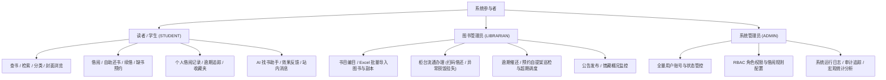
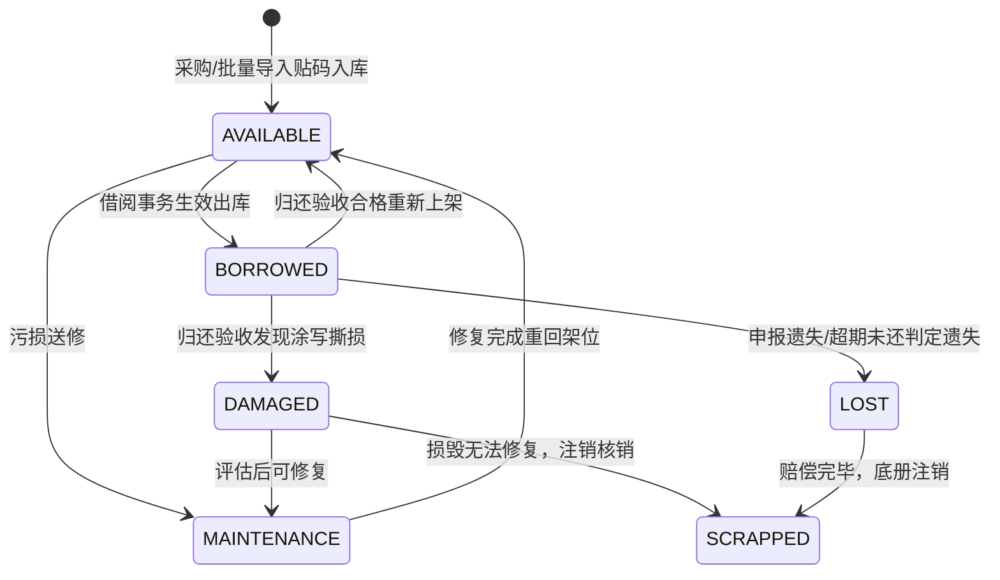
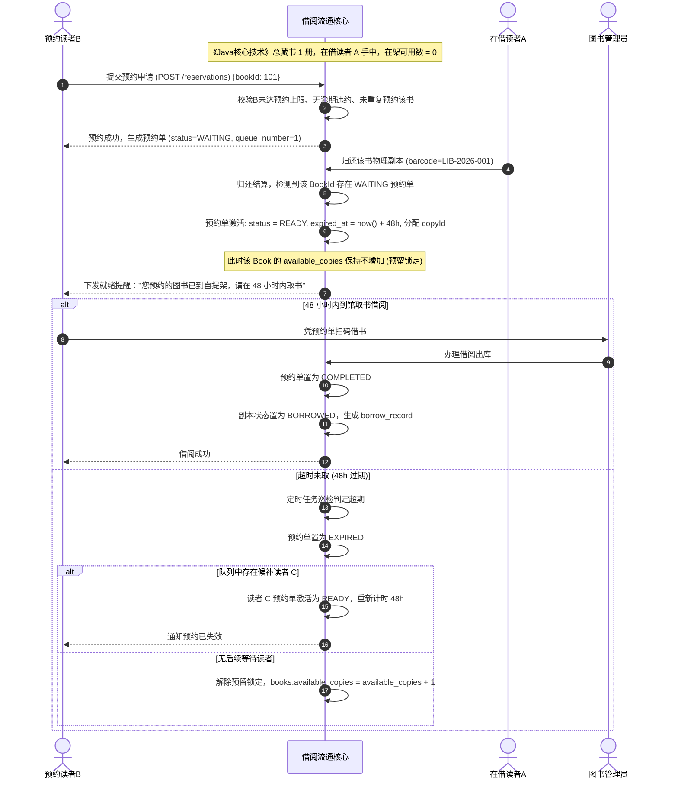

# 《校园图书借阅系统》需求分析与业务建模说明书 (Stage 0.5 修订版)

---

## 1. 文档定位与业务背景

### 1.1 系统定位
本项目为**全功能数字化校园图书借阅平台**（Campus Library Borrowing System），服务于高校在校师生、图书管理员及系统运维人员。系统旨在解决传统高校图书馆存在的“排队借还效率低、副本物理状态脱节、超借与逾期监管滞后、借阅高峰期并发冲突、批量图书建档低效、荐书搜索死板盲目”等痛点，提供规范化、可配置、高可靠的端到端借阅流转体系。

### 1.2 建设目标
1. **业务真实化与精确建模**：
   * 严格区分“书目（Bibliographic Work）”与“物理副本（Physical Copy）”。
   * **精确界定预约对象**：读者预约的是“书目（Book）”而非某一特定副本（BookCopy）；物理副本只有真实的物理状态，不包含虚拟预约态。
2. **规则可配置化**：读者身份不同（本科生/研究生/教职工），借阅规则动态可调，禁止硬编码业务限制。
3. **并发安全与有序锁机制**：借阅事务采用统一自顶向下（先锁 Book，再锁 BookCopy）的排他锁策略，根除死锁与超借。
4. **现实馆藏工程能力**：支持管理员端 Excel 图书批量导入与验重，提供图书封面图片资源管理服务（支持本地与未来 OSS 扩展）。
5. **端到端体验现代化与可评价 AI**：学生端采用 Flutter 跨平台现代架构；集成基于真实在馆藏书的 DeepSeek Grounded-RAG 导读助手，并建立真实的推荐效果闭环评估机制。

---

## 2. 核心用户角色与需求画像

| 角色代码 | 角色名称 | 核心职责与业务特征 | 典型高频使用场景 |
| :--- | :--- | :--- | :--- |
| **STUDENT** | 学生 / 读者 | 查询馆藏、办理借书、自主还书/柜台还书、在线续借、缺书预约、查看个人书架、接收还书提醒、AI 智能导读及反馈。 | 移动端随时随地查询专业参考书借还状态，期末前集中借书，扫码自助还书。 |
| **LIBRARIAN** | 图书管理员 | 负责图书编目录入、**Excel 批量图书及条码导入**、物理副本贴签入库、柜台借还核验、破损/遗失图书处理、催还通知督导、归还上架流转。 | 开学初批量导入新采购图书 Excel，扫描学生校园码与图书条形码进行流通登记。 |
| **ADMIN** | 系统管理员 | 平台最高管理者，管理师生账号、分配管理员、调整借阅规则（如寒暑假延期、借阅上限修改）、安全审计、备份监控。 | 开学初批量导入新生名单，设置不同年级/身份借阅规则，排查异常操作日志。 |

---

## 3. 核心领域建模深度推导

### 3.1 图书（Book）与图书副本（BookCopy）的职责边界

* **书目实体（Book）**：抽象题名信息，拥有全局唯一 ISBN、书名、作者、出版社、分类、版次、封面图片（`cover_url`，存储类型 `storage_type`）、总册数（`total_copies`）与在架可用数（`available_copies`）。
* **物理副本实体（BookCopy）**：具体的物理实物单册，拥有全局唯一条形码编号（`barcode`，如 `LIB-2026-000101`）、精确索书号（`call_number`）、架位地点（`shelf_location`）、物理磨损备注（`condition_note`）及物理流转状态（`status`）。
* **关系基数**：`Book` 1 : N `BookCopy`。借阅流水记录（`borrow_records`）强绑定借出的具体 `copy_id`。

---

### 3.2 物理副本与借阅记录的状态机设计（Stage 0.5 关键修正）

#### 1. 物理副本状态（BookCopy Status）
> **【Stage 0.5 架构收敛】**：
> **彻底删除 BookCopy 中的 `RESERVED` 状态**。
> 读者预约的是抽象的“书（Book）”，而非某一册特定的物理实物。物理副本只表达物理实物的真实流通状态，预约生命周期由独立的 `reservations` 实体全权管理。

修正后物理副本仅保留 6 大状态：
* **AVAILABLE（在架可借）**：在架可用，处于正常物理流通状态。
* **BORROWED（已借出）**：已被借出，正处于某一读者手中。
* **MAINTENANCE（检修维护）**：脱离流通进行装订、修补、贴码。
* **DAMAGED（损坏待赔付）**：验收异常，等待定损与读者赔偿。
* **LOST（遗失处理中）**：读者申报丢失，等待补购或照价赔偿。
* **SCRAPPED（已报废注销）**：不可恢复损毁或超期未还已赔付后的终态注销。

#### 2. 借阅流水状态机（BorrowRecord Status）
借阅历史必须具备不可篡改性与全历史保留机制：
* **BORROWING（借阅中）**：借出成功出馆。
* **RETURNED（按期正常归还）**：在应还日期前正常归还。
* **OVERDUE（逾期未还）**：超过截止日期未还。
* **OVERDUE_RETURNED（逾期归还）**：逾期后补还，留存历史逾期证据与信用违约记录。
* **ABNORMAL_LOST（挂失结案）**：以挂失赔偿形式结案。
* **ABNORMAL_DAMAGED（损坏结案）**：以破损赔偿形式结案。

---

### 3.3 预约机制（Reservation）领域独立建模（Stage 0.5 核心调整）

#### 1. 预约模型职责定义
* 读者只能在某书目 **`available_copies == 0`（即全馆藏全部借出或无在架副本）** 时发起预约。
* 预约单面向 **Book**，创建时并不绑定具体的 `BookCopy`。
* 预约状态枚举 `reservation_status`：
  * **WAITING（排队等待中）**：书籍全借出，排队等待任意一本副本归还。
  * **READY（已就绪待取）**：某一物理副本归还，预约命中，该预约单分配到指定副本并在自提架保留 48 小时。
  * **COMPLETED（取书完成）**：读者到馆成功借出该书，预约单履约完结。
  * **CANCELLED（主动取消）**：读者在等待期间主动取消预约。
  * **EXPIRED（超时未取失效）**：就绪满 48 小时读者未取，预约单失效，名额顺延。

#### 2. 预约生命周期流转图

---

### 3.4 借阅规则引擎（Borrowing Rules）

* 针对 `STUDENT`、`POSTGRADUATE`、`FACULTY` 动态设定：
  * 最大借阅册数（`max_borrow_count`）
  * 基础借期天数（`borrow_days`）
  * 续借次数（`max_renew_count`）与续借天数（`renew_days`）
  * **逾期严禁续借**：`allow_overdue_renew = false`
  * 最大同时预约数（`max_reservation_count`）与自提保留时长（`reservation_hold_hours = 48`）
  * 违约熔断机制：只要存在逾期未还图书，即刻冻结读者借书与预约权限。

---

### 3.5 新增需求规格：Excel 图书批量导入与资源存储

1. **Excel 批量导入（Book Import）**：
   * 解决管理员手动逐本录入的繁琐，支持按标准模板批量导入图书书目及多册条码。
   * 流程：上传 Excel → 后端数据完整性校验与查重（ISBN/条码） → 前端差异预览（展示成功行、警告行与错误原因） → 确认无误后事务性落库。
2. **图书封面资源管理（Cover Resource）**：
   * 建立 `cover_url` 与 `storage_type`（当前支持 `LOCAL` 本地静态资源服务，架构设计预留未来无缝切换至 `OSS` 对象存储）。
   * 坚决禁止将封面图片以二进制大对象（BLOB）直接塞入 PostgreSQL 数据库。

---

## 4. 非功能性需求（NFR）

| 维度 | 指标与实现要求 |
| :--- | :--- |
| **并发数据一致性** | 最后一本书并发争抢必须做到**零超卖、零库存负数、零死锁**。遵循统一自顶向下先锁 Book 再锁 BookCopy 顺序。 |
| **系统响应性能** | 核心借还与检索 API P95 响应时间 < 150ms；批量导入 1000 条数据解析与校验耗时 < 3 秒。 |
| **安全鉴权收敛** | 采用**轻量安全 JWT 机制**（无状态 AccessToken + Redis 托管 RefreshToken）；严密防范 IDOR 水平越权。 |
| **AI 真实可评价** | 坚守 Grounded-RAG 防幻觉底线，落库记录 AI 推荐日志并提供点击、收藏、借阅与显式评分等真实量化指标。 |
