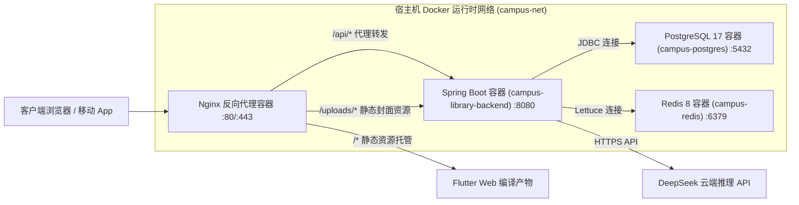

# 《校园图书借阅系统》系统总体架构设计说明书 (Stage 0.5 修订版)

---

## 1. 总体技术栈选型与环境基准

基于工作区宿主机已安装的核心开发套件，结合高可靠性与毕业设计工程规范，确定技术栈基准如下：

| 技术维度 | 选型组件 | 运行版本 | 选型原因与技术论证 |
| :--- | :--- | :--- | :--- |
| **开发语言** | Java | OpenJDK 17.0.2 LTS | 现代企业级基石，具备强类型安全、Record 语法糖、更优的 G1 GC 性能与长期支持保障。 |
| **后端框架** | Spring Boot | 3.3.x / 3.4.x | 与 Java 17 原生兼容，成熟的生态体系（Spring Security 6、Spring Data JPA/Hibernate 6、Actuator）。 |
| **关系型数据库**| PostgreSQL | 17.11 | 企业级开源关系型数据库之首，具备卓越的 ACID 事务特性、丰富的 JSONB 支持、内置高效全文检索（`pg_trgm` / `tsvector`），完美承载图书业务。 |
| **缓存与分布式辅助**| Redis | 8.10.1 | 超高吞吐量内存结构，用于热点图书元数据缓存、RefreshToken 托管、登录防刷频控。 |
| **移动跨端框架**| Flutter / Dart | Flutter 3.47.2 / Dart 3.13.2 | 单套代码支持 Android / iOS / Web / 桌面端，声明式 UI 高性能渲染，Material 3 现代质感。 |
| **前端状态管理**| Flutter Riverpod | 2.5+ | 编译期安全、无上下文依赖、支持依赖注入、利于单元测试与清晰的状态流分治。 |
| **网络通信** | Dio + RESTful | 5.x | 支持拦截器链（自动注入 Bearer Token、全局 traceId、统一 401 静默刷新与错误弹窗）。 |
| **大模型集成** | DeepSeek API | V3 / R1 开放接口 | 具有极高的中文语义理解与推理性价比，通过 Grounded-RAG 严密约束荐书上下文并进行效果埋点。 |
| **容器化交付** | Docker & Compose | Docker 29.7.2 | 生产/测试环境完全镜像化，消除“在我的电脑上可以跑”的环境不一致风险。 |

---

## 2. 总体逻辑架构图

系统采用**经典四层整洁架构（Clean / Layered Architecture）**，拒绝过度分布式微服务设计，确保模块间高内聚、低耦合。

```mermaid
graph TB
    subgraph ClientLayer ["1. 表现层 (Presentation Layer)"]
        FlutterApp["Flutter 跨平台客户端 (移动端 / Web / 桌面)"]
        AdminWeb["Web 管理工作台 (Flutter Web / 现代化 Admin UI)"]
    end

    subgraph GatewayLayer ["2. 接入控制层 (Security & Gateway Layer)"]
        CORS["CORS 跨域过滤器"]
        RateLimit["RateLimiter 频控防刷 (Redis 令牌桶)"]
        TraceFilter["TraceId MDC 链路日志过滤器"]
        AuthFilter["轻量 JWT 鉴权过滤器 (Spring Security 6)"]
        ExceptionAdvisor["全局统一异常处理器 (@RestControllerAdvice)"]
    end

    subgraph AppServiceLayer ["3. 业务服务层 (Business Logic Layer)"]
        AuthService["认证服务 (AuthService - 双Token托管)"]
        BookService["图书编目服务 (BookCatalogService)"]
        BookImportService["图书批量导入服务 (BookImportService - Excel解析与校验)"]
        FileStorageService["静态资源服务 (FileStorageService - 封面本地/OSS存储)"]
        BorrowService["借阅流通核心服务 (BorrowEngineService - 有序排他锁)"]
        ReservationService["预约排队调度服务 (ReservationService - 独立模型)"]
        RuleEngine["借阅规则引擎 (RuleEngineService)"]
        NotificationService["通知推送服务 (NotificationService)"]
        StatisticsService["数据统计分析服务 (StatisticsService)"]
        AIService["AI 导读与效果评估服务 (DeepSeekRAGService + Log)"]
    end

    subgraph DataAccessLayer ["4. 领域持久层 (Persistence & Infrastructure)"]
        SpringData["Spring Data JPA + PostgreSQL Dialect"]
        HikariCP["HikariCP 高性能连接池"]
        RedisTemplate["Spring Data Redis (Cache & RefreshToken)"]
        PostgresDB[(PostgreSQL 17.11 核心数据库)]
        RedisCache[(Redis 8.10.1 缓存实例)]
        DeepSeekLLM["DeepSeek LLM 远程推理服务"]
    end

    ClientLayer --> GatewayLayer
    GatewayLayer --> AppServiceLayer
    AppServiceLayer --> DataAccessLayer
```

---

## 3. 架构重大技术决策与 Push Back 论证 (Stage 0.5 汇总结论)

### 3.1 决策一：坚持单体模块化（Modular Monolith），坚决否决微服务拆分
* **[Decision]**：**采用单体分包模块化架构，严禁在本项目中引入 Spring Cloud / Dubbo / Nacos 微服务全家桶。**
* **[Reason]**：
  1. 校园图书借阅系统是典型的强一致性事务系统（借书涉及：扣减图书可借数、修改副本状态、扣减用户可借额度、新增借阅记录）。单体模块在单进程内通过 Spring 事务（`@Transactional`）即可享受最高级别的数据库 ACID 强一致性保障，吞吐性能反超微服务。
  2. 微服务显著增加部署与排错门槛（需要启动 5~8 个 JVM 进程，吃光 8G 内存），对学生演示与评委老师本地审查极不友好。
* **[Impact]**：架构极其整洁稳固，极大地减少了运维事故与网络排错开销。

### 3.2 决策二：使用 PostgreSQL 内置检索，坚决否决引入 Elasticsearch
* **[Decision]**：**图书全文搜索使用 PostgreSQL 17 原生 `pg_trgm` (三元分词) + B-Tree / GIN 索引，不引入 Elasticsearch。**
* **[Reason]**：高校图书馆书目数量一般在 1 万 ~ 30 万册之间。PostgreSQL GIN 索引在十万级数据下模糊查询响应时间稳定在 5~15ms，完全满足性能需求；且避免了引入 ES 带来的 2GB+ 内存占用与数据主从同步延迟问题。
* **[Impact]**：大幅简化部署依赖，确保数据检索 100% 实时一致。

### 3.3 决策三：采用轻量站内信 + 本地定时提醒，坚决否决引入 Kafka / RocketMQ
* **[Decision]**：**消息通知采用 PostgreSQL 关系表（`notifications`），不引入大型 MQ。**
* **[Reason]**：单校图书借阅通知写频次属于典型中小规模，关系型数据库直接插入并带未读标志（`is_read = false`）在查询、分页、一键已读还是数据统计上最为直观可靠。

### 3.4 决策四：收敛 JWT 鉴权方案，坚决否决复杂的 AccessToken Redis 黑名单 (Stage 0.5 关键简化)
* **[Decision]**：**采用“无状态 AccessToken + Redis 托管 RefreshToken 哈希”的轻量方案，废弃无必要的短令牌 Redis 黑名单拦截。**
* **[Reason]**：
  1. 短期 AccessToken（2 小时）在每次 HTTP 请求中由 Spring Security 进行本地无状态 CPU 验签，无需每秒数千次穿透查询 Redis 黑名单，性能高且架构干净。
  2. 长期凭证 RefreshToken（7 天）以哈希键 `refresh_token:{userId}` 存储在 Redis 中，当用户主动点击“退出登录”时，**服务端只需立即在 Redis 中删除该用户的 RefreshToken**。
  3. 一旦 RefreshToken 被删，攻击者或过期客户端将彻底失去无感续约能力；而残留的 AccessToken 在最长 2 小时后自然失效，对于校园图书借阅系统而言安全性已完全足够，彻底免除了维护庞大过期 JTI 黑名单集合的高昂复杂度。
* **[Impact]**：大幅降低 Redis 写入与内存开销，提升常规接口处理吞吐量，代码实现极其精简优雅。

### 3.5 决策五：图书封面资源存储解耦（本地存储优先 + 抽象接口预留 OSS）
* **[Decision]**：**图片文件绝不存入数据库二进制字段，采用“本地静态文件服务（开发/毕设期）+ 存储接口抽象（面向未来可扩展 OSS）”。**
* **[Reason]**：
  1. 毕业设计通常单机部署，本地目录静态映射（如 `/uploads/covers/xxx.jpg`）零成本、开箱即用，免去申请公网 OSS 付费密钥与网络依赖。
  2. 通过封装 `FileStorageService` 接口，未来可无缝平滑切换为 MinIO 或阿里云 OSS。

---

## 4. 容器化部署拓扑设计

---

## 5. 可观测性与工程治理规范

1. **链路追踪标识（Trace ID）**：
   * 客户端每次请求透传 `X-Trace-Id`（UUID），若无则网关过滤器自动生成，通过 SLF4J MDC 注入日志输出。
2. **结构化统一日志输出**：
   * 采用 Logback JSON 格式化输出，明确记录：时间戳、日志级别、线程号、TraceId、调用类、异常堆栈。
3. **健康检查体系（Health Check）**：
   * 启用 Spring Boot Actuator：暴露 `/actuator/health`。
