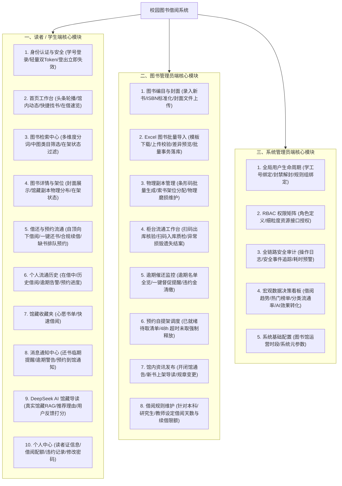

# 《校园图书借阅系统》功能模块详细设计说明书 (Stage 0.5 修订版)

---

## 1. 系统功能模块全景蓝图

---

## 2. 学生端功能规格详解

### 2.1 身份认证与凭证管理（Auth）
1. **统一学籍号注册/登录**：
   * 输入学号（如 `20260101`）、姓名、手机号、密码登录。
   * 采用 BCrypt 高强度哈希存储，杜绝明文密码。
2. **轻量收敛的双 Token 机制**：
   * `AccessToken`（有效期 2 小时）：无状态 JWT，包含 `userId`、`username`、`roles`，每次请求携带在 `Authorization: Bearer <token>` 请求头中。由 Spring Security 进行本地高效无状态验签，无需穿透 Redis。
   * `RefreshToken`（有效期 7 天）：以哈希键 `refresh_token:{userId}` 保存在 Redis 中。AccessToken 过期时由 Dio 拦截器静默刷新。
   * **主动退出登录**：服务端直接从 Redis 中删除该用户的 `refresh_token:{userId}`，客户端彻底无法续期，安全干净。

### 2.2 图书检索与发现中心（Search & Browse）
1. **多重复合条件检索**：
   * **全文匹配**：支持输入关键词，同时在书名、作者、ISBN、出版社、图书摘要中进行模糊与三元分词检索。
   * **分类分面导航**：按照《中图法》两级层级树状展开筛选。
   * **可用性过滤开关**：支持勾选「仅显示在架可借书籍（`available_copies > 0`）」，过滤借空图书。
   * **排序维度**：支持按“上架时间最新”、“借阅热度最高”、“出版年份最新”正逆序排列。

### 2.3 图书详情与物理架位透视（Book Detail & Copies View）
1. **元数据展示**：高清封面（`cover_url`，本地静态资源或 OSS）、书名、作者、出版社、出版年份、标准 ISBN、定价、中图分类及详细导读简介。
2. **物理副本真实状态矩阵**：
   * 列表展示该书目下的全部物理副本：
     * 物理条码号（如 `LIB-2026-000101`）
     * 索书架位（如 `工科馆 3F-A-04-12`）
     * 当前状态标签（在架可借 AVAILABLE、已借出 BORROWED、维修中 MAINTENANCE）
     * 若处于借出中，直观显示预计归还日期（`due_at`）。
3. **动态业务交互行为**：
   * **当在架可借数 > 0**：高亮显示「立即借阅」按钮。
   * **当在架可借数 == 0**：置灰借阅按钮，点亮「加入预约排队」按钮（展示当前前方等待人数）。
   * **收藏按钮**：点击即时切换心愿单状态。

### 2.4 借阅流通核心（Borrow & Return & Renew）
1. **自顶向下事务借阅**：
   * 遵循统一锁顺序：先锁定 `Book` 行，检查 `available_copies > 0`，再锁定目标 `BookCopy`，确保并发零超借。
2. **合规续借**：
   * 学生在借阅到期前 7 天内可申请续借。
   * 强校验：已续借次数 < 规则上限、该书目无其他读者正在排队预约（无 WAITING 预约单）、名下无逾期书籍。
3. **自助还书 / 柜台还书**：
   * 扫码还书机或管理员扫码验收入库，恢复物理副本为 `AVAILABLE`，解除读者在借计数。

### 2.5 缺书预约与智能候补（Reservation）
1. **面向书目的独立预约**：
   * 读者针对“书目（Book）”发起预约，预约单状态初始化为 `WAITING`，分配排队序号 `queue_number`。
2. **就绪激活与 48 小时取书**：
   * 任何一册副本归还入库时，后台自动触发预约匹配，将队列首位预约单状态置为 `READY`，并计算 `expired_at = now() + 48h`。
   * 书目的 `available_copies` 保持锁定，向读者下发就绪站内信通知。
   * 读者 48 小时内凭码取书借阅，预约单置为 `COMPLETED`；超时未取则标记为 `EXPIRED`，名额顺延。

### 2.6 DeepSeek AI 导读助手与推荐效果反馈
1. **基于真实馆藏的 Grounded-RAG 问答**：输入自然语言，后台数据库粗筛后喂给 DeepSeek，绝不编造虚构书籍。
2. **真实反馈闭环**：学生在推荐卡片下方可进行点赞（👍）、点踩（👎）或评分，系统将日志写入 `ai_recommendation_logs` 表，为统计大屏与推荐效果优化提供真实数据支撑。

---

## 3. 图书管理员端功能规格详解

### 3.1 图书编目与封面资源上传（Cataloging & Cover Upload）
1. **标准化图书录入**：录入 ISBN、书名、作者、出版社、分类、版次、价格、摘要。
2. **封面图片上传服务**：
   * 支持管理员在前端选择本地 JPG/PNG 封面图片上传（`POST /api/v1/files/upload/cover`）。
   * 后端通过 `FileStorageService` 保存至本地静态资源映射目录，并返回访问 URL 写入 `books.cover_url`，同时标记 `storage_type = 'LOCAL'`。

### 3.2 Excel 图书批量导入模块（Book Import - Stage 0.5 新增）
1. **标准化 Excel 模板下载**：
   * 提供官方规范的 `.xlsx` 模板，包含列：`ISBN`（必填）、`书名`（必填）、`作者`（必填）、`出版社`、`分类代码`（必填）、`出版年份`、`定价`、`物理条形码`（必填）、`索书号`（必填）、`架位地点`（必填）。
2. **上传解析与合规校验（Upload & Preview）**：
   * 管理员上传 Excel 文件，系统在内存中逐行解析并执行四层校验：
     * **必填字段校验**：检查 ISBN、书名、条码是否缺失。
     * **格式有效性校验**：检查 ISBN 校验位、价格是否为正数。
     * **唯一性查重校验**：检查 Excel 内部条形码是否重复、条形码在数据库中是否已存在。
     * **外键关系校验**：校验分类代码是否存在于 `categories` 表中。
   * 返回预览视图：展示“总记录数”、“待新增书目数”、“待追加副本数”、“异常错误行列表与明细”，由管理员审查。
3. **事务性批量确认落库（Confirm Import）**：
   * 管理员点击「确认导入」，系统在单一大事务中批量执行：
     * 若 ISBN 已存在：在原书目下批量新增 `BookCopy`，并累加书目 `total_copies` 与 `available_copies`。
     * 若 ISBN 不存在：新建 `Book` 记录，建立 `BookAuthor` 关联，再批量插入 `BookCopy`。
     * 过程中若发生未知异常，全量回滚，保证数据库零脏数据。

### 3.3 物理副本维护与柜台流通工作台（Copies & Circulation Desk）
1. **物理条码批处理生成**：自动生成 `LIB-2026-xxxxxx` 规范条码，分配索书架位。
2. **柜台扫码借还一体机**：扫描学号与条码，即刻展示借阅资格并办理借还。
3. **异常损毁遗失结案**：将副本标记为 `DAMAGED` 或 `LOST`，收取违约赔偿金并结案。

### 3.4 预约自提架巡检（Reservation Shelf Dispatcher）
1. **就绪待取清单监控**：展示当前处于 `READY` 状态的待取书单与剩余倒计时。
2. **超时未取强制释放 / 定时调度**：后台调度器每 10 分钟巡检超期预约，自动废弃原单并指派给下一位候补者。

---

## 4. 系统管理员端功能规格详解

### 4.1 组织用户与权限治理（Users & RBAC）
1. **用户台账维护**：冻结/解冻违约账号、重置密码、切换借阅规则组。
2. **RBAC 权限矩阵配置**：配置角色与细粒度接口权限点。

### 4.2 借阅规则动态引擎管理（Rule Configuration）
* 动态配置各读者组的借书册数、借期、续借限制与每日违约金标准。

### 4.3 审计与宏观数据决策看板（Audit & Statistics）
* 查看全链路操作审计流水（TraceId、耗时、操作入参）。
* 查看流通概览大屏、借阅趋势图表、热门借阅排行以及 **AI 推荐转化与满意度报表**。
