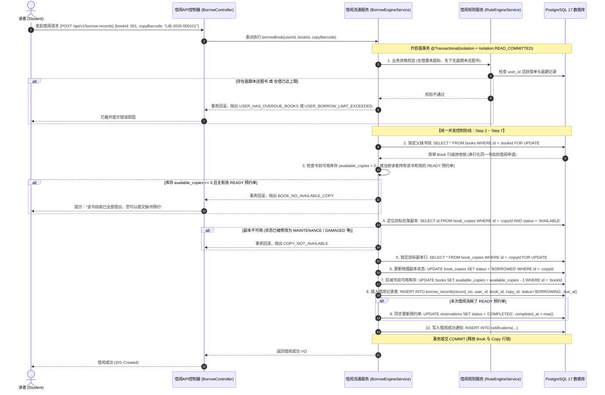
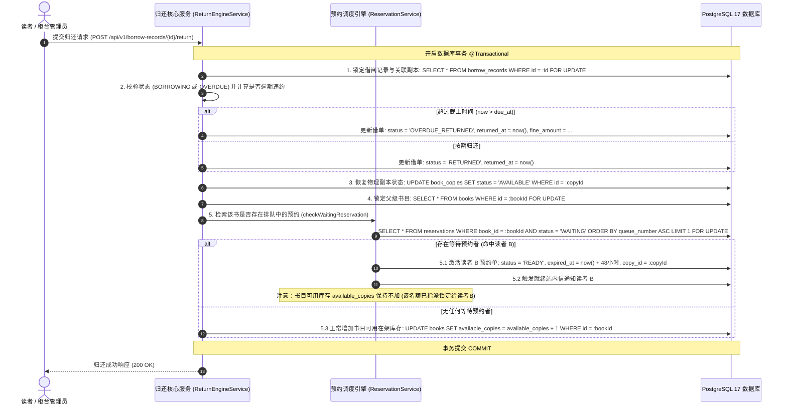
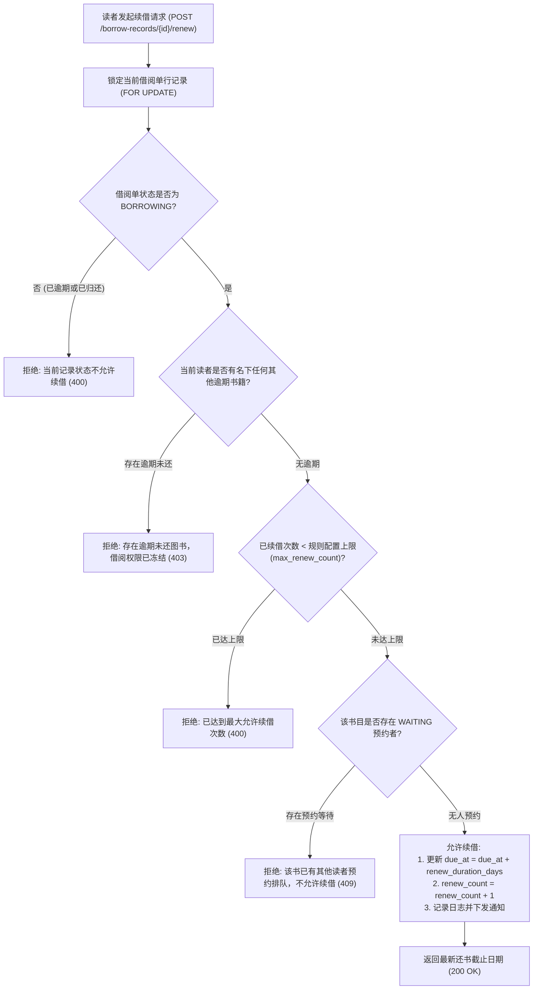
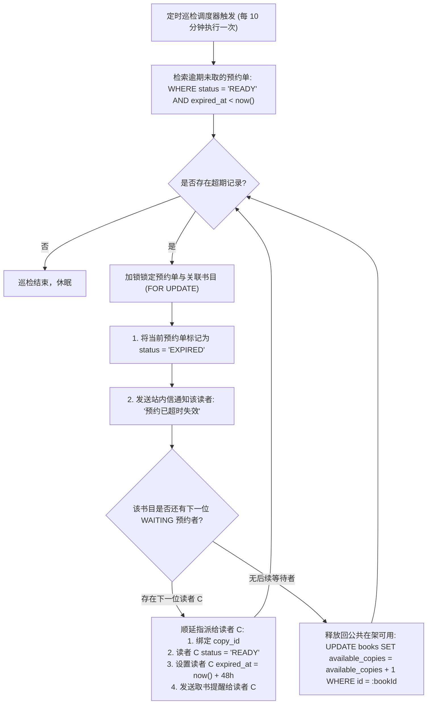
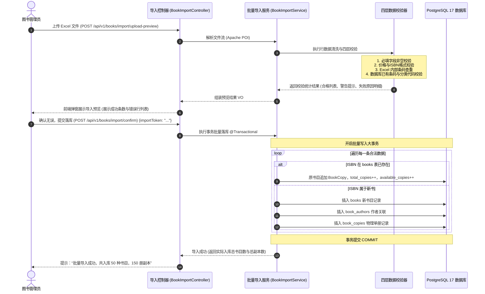

# 《校园图书借阅系统》核心业务流程设计说明书 (Stage 0.5 修订版)

---

## 1. 统一借阅并发事务流程（自顶向下有序排他锁机制）

### 1.1 统一借阅事务时序与状态流转

为彻底解决锁粒度不统一与潜在死锁问题，借阅流通事务采用**自顶向下（先锁 Book，再锁 BookCopy）的确定性锁顺序**：

### 1.2 统一有序锁机制的技术优势
1. **彻底消除死锁（Deadlock-Free）**：无论系统中存在多少个并发线程、借阅同一本书的不同副本，所有事务**一律先获取 `books` 表对应行的排他锁，再获取 `book_copies` 表对应行的排他锁**。加锁顺序完全一致，从图论拓扑上彻底杜绝循环等待导致的死锁。
2. **绝对防止库存超卖与负数**：在持有 `books` 行锁期间严格判定 `available_copies > 0` 并原子递减，同时底层有数据库约束 `CHECK (available_copies >= 0)` 双重兜底，高并发下绝不穿透。

---

## 2. 图书归还与预约队列就绪激活流程

### 2.1 归还流通时序图

---

## 3. 图书合规续借流程设计

---

## 4. 预约超时释放巡检调度流程（Cron Job）

---

## 5. Excel 图书批量导入业务流程（Stage 0.5 新增）

---

## 6. 异常流转：挂失与损坏责任认定流程

1. **读者线上申报挂失**：借单状态变更为 `ABNORMAL_LOST`，冻结逾期天数累加。
2. **管理员核验定损**：系统依据图书标价与规则赔付倍数（如原价 1.5 倍）生成定损单。
3. **清缴赔偿与结案**：
   * 读者结清赔偿款后，管理员执行结案：借阅单归档，解除读者借阅冻结；
   * 物理副本变更为 `LOST` 或 `SCRAPPED`，书目总藏书量 `total_copies` 减 1。
