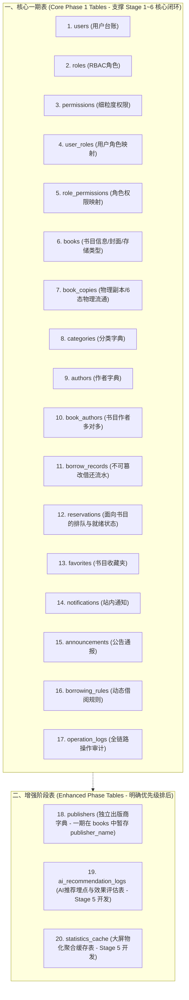
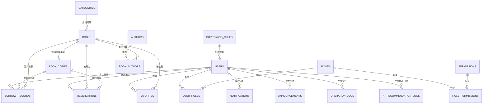

# 《校园图书借阅系统》数据库深度设计说明书 (PostgreSQL 17 - Stage 0.5 修订版)

---

## 1. 数据库表分层与演进策略（Database Phasing Strategy）

为了保障项目在本科毕业设计周期内高质量交付，既保留高价值业务设计，又避免开发初期战线过长，将数据表结构划分为两期：



---

## 2. 实体关系模型（ER Diagram - Stage 0.5 修订版）



---

## 3. 核心一期表结构定义（Core Phase 1 Tables）

### 3.1 组织用户与权限体系

#### 1. 用户表 `users`
| 字段名 | 类型 | 可空 | 默认值 | 约束 / 说明 |
| :--- | :--- | :--- | :--- | :--- |
| `id` | BIGSERIAL | NO | 自增 | 主键 PRIMARY KEY |
| `student_no` | VARCHAR(32) | NO | 无 | 学号/工号（登录唯一凭证），UNIQUE |
| `username` | VARCHAR(50) | NO | 无 | 用户登录昵称，UNIQUE |
| `password_hash` | VARCHAR(128) | NO | 无 | BCrypt 加密密文（Cost=12） |
| `real_name` | VARCHAR(50) | NO | 无 | 真实姓名 |
| `email` | VARCHAR(100) | YES | NULL | 邮箱（用于密码找回及通知） |
| `phone` | VARCHAR(20) | YES | NULL | 联系电话（SMS/到馆提醒） |
| `avatar_url` | VARCHAR(255) | YES | NULL | 用户头像路径 |
| `status` | VARCHAR(20) | NO | 'ACTIVE' | 账号状态：ACTIVE, DISABLED, FROZEN |
| `borrow_rule_id`| BIGINT | NO | 无 | 绑定的借阅规则组 ID，外键引用 borrowing_rules(id) |
| `created_at` | TIMESTAMPTZ | NO | CURRENT_TIMESTAMP | 注册创建时间 |
| `updated_at` | TIMESTAMPTZ | NO | CURRENT_TIMESTAMP | 更新时间 |

#### 2. 角色表 `roles`
* 字段：`id BIGSERIAL PRIMARY KEY`, `code VARCHAR(32) NOT NULL UNIQUE`, `name VARCHAR(50) NOT NULL`, `description VARCHAR(255)`, `created_at TIMESTAMPTZ NOT NULL DEFAULT CURRENT_TIMESTAMP`。

#### 3. 权限表 `permissions`
* 字段：`id BIGSERIAL PRIMARY KEY`, `code VARCHAR(64) NOT NULL UNIQUE`, `name VARCHAR(50) NOT NULL`, `resource VARCHAR(50) NOT NULL`, `created_at TIMESTAMPTZ NOT NULL DEFAULT CURRENT_TIMESTAMP`。

#### 4. 用户-角色关联表 `user_roles`
* 复合主键：`PRIMARY KEY (user_id, role_id)`，外键级联删除。

#### 5. 角色-权限关联表 `role_permissions`
* 复合主键：`PRIMARY KEY (role_id, permission_id)`，外键级联删除。

---

### 3.2 基础分类与图书元数据体系

#### 6. 图书分类表 `categories`
* 字段：`id BIGSERIAL PRIMARY KEY`, `parent_id BIGINT REFERENCES categories(id)`, `code VARCHAR(20) NOT NULL UNIQUE`, `name VARCHAR(50) NOT NULL`, `sort_order INT NOT NULL DEFAULT 0`, `created_at TIMESTAMPTZ NOT NULL DEFAULT CURRENT_TIMESTAMP`, `updated_at TIMESTAMPTZ NOT NULL DEFAULT CURRENT_TIMESTAMP`。

#### 7. 作者表 `authors`
* 字段：`id BIGSERIAL PRIMARY KEY`, `name VARCHAR(100) NOT NULL`, `country VARCHAR(50) DEFAULT '中国'`, `description TEXT`, `created_at TIMESTAMPTZ NOT NULL DEFAULT CURRENT_TIMESTAMP`。

#### 8. 图书书目表 `books`（抽象书目实体 - Stage 0.5 增加封面资源设计）
| 字段名 | 类型 | 可空 | 默认值 | 约束 / 说明 |
| :--- | :--- | :--- | :--- | :--- |
| `id` | BIGSERIAL | NO | 自增 | 主键 PRIMARY KEY |
| `isbn` | VARCHAR(20) | NO | 无 | 国际标准书号，**全局唯一 UNIQUE** |
| `title` | VARCHAR(200) | NO | 无 | 图书题名 / 书名 |
| `original_title`| VARCHAR(200) | YES | NULL | 原作外文题名 |
| `category_id` | BIGINT | NO | 无 | 关联 categories(id) 外键 |
| `publisher_name`| VARCHAR(100) | YES | NULL | 出版社名称（一期字段存储，二期升级独立表） |
| `publish_year` | INT | YES | NULL | 出版年份（如 2024） |
| `price` | NUMERIC(8,2) | NO | 0.00 | 标价，CHECK (price >= 0) |
| `total_copies` | INT | NO | 0 | 馆藏总册数，CHECK (total_copies >= 0) |
| `available_copies`| INT | NO | 0 | **在架可借册数，CHECK (available_copies >= 0 AND available_copies <= total_copies)** |
| `location_prefix`| VARCHAR(50) | YES | NULL | 建议存放馆区（如 工科馆3楼） |
| `cover_url` | VARCHAR(500) | YES | NULL | **图书封面图片访问 URL（拒绝数据库二进制大对象）** |
| `storage_type` | VARCHAR(20) | NO | 'LOCAL' | **资源存储类型：LOCAL（本地静态目录）, OSS（对象存储）** |
| `description` | TEXT | YES | NULL | 图书详细导读与目录摘要 |
| `created_at` | TIMESTAMPTZ | NO | CURRENT_TIMESTAMP | 入库录入时间 |
| `updated_at` | TIMESTAMPTZ | NO | CURRENT_TIMESTAMP | 更新时间 |

#### 9. 图书-作者多对多关联表 `book_authors`
* 复合主键：`PRIMARY KEY (book_id, author_id)`，外键级联删除。

#### 10. 图书物理副本表 `book_copies`（Stage 0.5 彻底剔除 RESERVED 虚拟状态）
| 字段名 | 类型 | 可空 | 默认值 | 约束 / 说明 |
| :--- | :--- | :--- | :--- | :--- |
| `id` | BIGSERIAL | NO | 自增 | 主键 PRIMARY KEY |
| `book_id` | BIGINT | NO | 无 | 外键引用 books(id) ON DELETE CASCADE |
| `barcode` | VARCHAR(32) | NO | 无 | **单册物理条码（如 LIB-2026-000101），全局唯一 UNIQUE** |
| `call_number` | VARCHAR(64) | NO | 无 | 索书号/排架架位（如 TP312JA/G64-2/3F-A04） |
| `shelf_location`| VARCHAR(100)| NO | 无 | 物理存放地点（如：工科馆第三阅览室A架4层12号） |
| `status` | VARCHAR(20) | NO | 'AVAILABLE' | **纯物理状态枚举：AVAILABLE, BORROWED, MAINTENANCE, DAMAGED, LOST, SCRAPPED** |
| `condition_note`| VARCHAR(255)| YES | NULL | 副本磨损程度备注 |
| `created_at` | TIMESTAMPTZ | NO | CURRENT_TIMESTAMP | 贴码入库时间 |
| `updated_at` | TIMESTAMPTZ | NO | CURRENT_TIMESTAMP | 状态变更时间 |

---

### 3.3 借阅流通与预约核心体系

#### 11. 借阅规则表 `borrowing_rules`
* 字段：`id BIGSERIAL PRIMARY KEY`, `rule_name VARCHAR(50) NOT NULL`, `user_type VARCHAR(20) NOT NULL UNIQUE`, `max_borrow_count INT NOT NULL DEFAULT 5 CHECK (max_borrow_count > 0)`, `borrow_days INT NOT NULL DEFAULT 30 CHECK (borrow_days > 0)`, `max_renew_count INT NOT NULL DEFAULT 1 CHECK (max_renew_count >= 0)`, `renew_days INT NOT NULL DEFAULT 30 CHECK (renew_days > 0)`, `allow_overdue_renew BOOLEAN NOT NULL DEFAULT FALSE`, `allow_reservation BOOLEAN NOT NULL DEFAULT TRUE`, `max_reservation_count INT NOT NULL DEFAULT 2 CHECK (max_reservation_count >= 0)`, `reservation_hold_hours INT NOT NULL DEFAULT 48 CHECK (reservation_hold_hours > 0)`, `daily_fine_amount NUMERIC(6,2) NOT NULL DEFAULT 0.10 CHECK (daily_fine_amount >= 0)`, `created_at TIMESTAMPTZ NOT NULL DEFAULT CURRENT_TIMESTAMP`, `updated_at TIMESTAMPTZ NOT NULL DEFAULT CURRENT_TIMESTAMP`。

#### 12. 借阅流水记录表 `borrow_records`
| 字段名 | 类型 | 可空 | 默认值 | 约束 / 说明 |
| :--- | :--- | :--- | :--- | :--- |
| `id` | BIGSERIAL | NO | 自增 | 主键 PRIMARY KEY |
| `record_no` | VARCHAR(32) | NO | 无 | 借阅流水单号（如 REC-202609160001），UNIQUE |
| `user_id` | BIGINT | NO | 无 | 外键引用 users(id) |
| `book_id` | BIGINT | NO | 无 | 冗余外键引用 books(id)（加速查询） |
| `copy_id` | BIGINT | NO | 无 | 外键引用具体的物理单册 book_copies(id) |
| `borrow_rule_id`| BIGINT | NO | 无 | 生效规则快照 ID |
| `borrowed_at` | TIMESTAMPTZ | NO | CURRENT_TIMESTAMP | 借阅出库时间戳 |
| `due_at` | TIMESTAMPTZ | NO | 无 | 应还截止时间戳 |
| `returned_at` | TIMESTAMPTZ | YES | NULL | 实际归还时间戳 |
| `renew_count` | INT | NO | 0 | 已续借次数 |
| `status` | VARCHAR(20) | NO | 'BORROWING' | BORROWING, RETURNED, OVERDUE, OVERDUE_RETURNED, ABNORMAL_LOST, ABNORMAL_DAMAGED |
| `fine_amount` | NUMERIC(8,2) | NO | 0.00 | 产生的逾期或定损赔付金额 |
| `operator_id` | BIGINT | YES | NULL | 办理经手人 ID（NULL 为自助借还） |
| `return_operator_id`| BIGINT | YES | NULL | 还书验收经手人 ID |
| `remark` | VARCHAR(255) | YES | NULL | 业务备注 |
| `created_at` | TIMESTAMPTZ | NO | CURRENT_TIMESTAMP | 创建时间 |
| `updated_at` | TIMESTAMPTZ | NO | CURRENT_TIMESTAMP | 更新时间 |

#### 13. 缺书预约表 `reservations`（Stage 0.5 独立领域模型）
| 字段名 | 类型 | 可空 | 默认值 | 约束 / 说明 |
| :--- | :--- | :--- | :--- | :--- |
| `id` | BIGSERIAL | NO | 自增 | 主键 PRIMARY KEY |
| `user_id` | BIGINT | NO | 无 | 预约读者 ID，外键引用 users(id) |
| `book_id` | BIGINT | NO | 无 | 目标书目 ID，外键引用 books(id) |
| `queue_number` | INT | NO | 1 | 排队位次序号 |
| `status` | VARCHAR(20) | NO | 'WAITING' | **预约状态：WAITING, READY, COMPLETED, CANCELLED, EXPIRED** |
| `copy_id` | BIGINT | YES | NULL | 就绪时分配锁定的物理单册 ID，外键引用 book_copies(id) |
| `created_at` | TIMESTAMPTZ | NO | CURRENT_TIMESTAMP | 预约提交时间 |
| `expired_at` | TIMESTAMPTZ | YES | NULL | 自提保留失效截止时间（就绪时计算为 ready_at + 48h） |
| `completed_at` | TIMESTAMPTZ | YES | NULL | 取书借出履约完成时间 |
| `updated_at` | TIMESTAMPTZ | NO | CURRENT_TIMESTAMP | 更新时间 |

---

### 3.4 辅助业务与运维审计体系

#### 14. 用户书目收藏夹表 `favorites`
* 复合唯一约束：`UNIQUE (user_id, book_id)`。

#### 15. 站内通知表 `notifications`
* 字段：`id BIGSERIAL PRIMARY KEY`, `user_id BIGINT NOT NULL`, `title VARCHAR(100) NOT NULL`, `content TEXT NOT NULL`, `type VARCHAR(30) NOT NULL`, `is_read BOOLEAN NOT NULL DEFAULT FALSE`, `read_at TIMESTAMPTZ`, `created_at TIMESTAMPTZ NOT NULL DEFAULT CURRENT_TIMESTAMP`。

#### 16. 馆内公告表 `announcements`
* 字段：`id BIGSERIAL PRIMARY KEY`, `title VARCHAR(150) NOT NULL`, `content TEXT NOT NULL`, `priority VARCHAR(20) NOT NULL DEFAULT 'NORMAL'`, `status VARCHAR(20) NOT NULL DEFAULT 'PUBLISHED'`, `publisher_id BIGINT NOT NULL`, `published_at TIMESTAMPTZ`, `created_at TIMESTAMPTZ NOT NULL DEFAULT CURRENT_TIMESTAMP`, `updated_at TIMESTAMPTZ NOT NULL DEFAULT CURRENT_TIMESTAMP`。

#### 17. 全链路操作与安全审计日志表 `operation_logs`
* 字段：`id BIGSERIAL PRIMARY KEY`, `trace_id VARCHAR(64) NOT NULL`, `user_id BIGINT`, `username VARCHAR(50)`, `module VARCHAR(50) NOT NULL`, `action VARCHAR(50) NOT NULL`, `request_method VARCHAR(10) NOT NULL`, `request_url VARCHAR(255) NOT NULL`, `ip_address VARCHAR(45)`, `user_agent VARCHAR(255)`, `request_params TEXT`, `response_status INT NOT NULL`, `execution_time_ms BIGINT NOT NULL`, `error_message TEXT`, `created_at TIMESTAMPTZ NOT NULL DEFAULT CURRENT_TIMESTAMP`。

---

## 4. 增强阶段表结构定义（Enhanced Phase Tables）

#### 18. 出版社表 `publishers`（增强阶段）
* 字段：`id BIGSERIAL PRIMARY KEY`, `name VARCHAR(100) NOT NULL UNIQUE`, `address VARCHAR(200)`, `contact VARCHAR(50)`, `created_at TIMESTAMPTZ NOT NULL DEFAULT CURRENT_TIMESTAMP`。

#### 19. AI 推荐日志与效果评估表 `ai_recommendation_logs`（Stage 0.5 新增，Stage 5 开发落库）
| 字段名 | 类型 | 可空 | 默认值 | 约束 / 说明 |
| :--- | :--- | :--- | :--- | :--- |
| `id` | BIGSERIAL | NO | 自增 | 主键 PRIMARY KEY |
| `user_id` | BIGINT | YES | NULL | 发起提问读者 ID，外键引用 users(id) |
| `query` | VARCHAR(255) | NO | 无 | 读者自然语言原始提问内容 |
| `retrieved_books`| JSONB | NO | '[]' | 数据库粗筛召回的候选图书快照（JSON 格式） |
| `recommended_books`| JSONB| NO | '[]' | DeepSeek 推理返回的推荐书籍 ID 及理由 |
| `feedback` | VARCHAR(50) | YES | NULL | 用户反馈结果：LIKE(点赞), DISLIKE(点踩), RATING_1~5 |
| `created_at` | TIMESTAMPTZ | NO | CURRENT_TIMESTAMP | 推荐生成时间 |

---

## 5. 核心性能索引与完整 PostgreSQL 17 DDL 脚本

```sql
-- ======================================================================
-- 校园图书借阅系统 PostgreSQL 17 DDL 模式建表脚本 (Stage 0.5 修订版)
-- ======================================================================

BEGIN;

CREATE EXTENSION IF NOT EXISTS pg_trgm;

-- 1. 借阅规则表
CREATE TABLE borrowing_rules (
    id BIGSERIAL PRIMARY KEY,
    rule_name VARCHAR(50) NOT NULL,
    user_type VARCHAR(20) NOT NULL UNIQUE,
    max_borrow_count INT NOT NULL DEFAULT 5 CHECK (max_borrow_count > 0),
    borrow_days INT NOT NULL DEFAULT 30 CHECK (borrow_days > 0),
    max_renew_count INT NOT NULL DEFAULT 1 CHECK (max_renew_count >= 0),
    renew_days INT NOT NULL DEFAULT 30 CHECK (renew_days > 0),
    allow_overdue_renew BOOLEAN NOT NULL DEFAULT FALSE,
    allow_reservation BOOLEAN NOT NULL DEFAULT TRUE,
    max_reservation_count INT NOT NULL DEFAULT 2 CHECK (max_reservation_count >= 0),
    reservation_hold_hours INT NOT NULL DEFAULT 48 CHECK (reservation_hold_hours > 0),
    daily_fine_amount NUMERIC(6,2) NOT NULL DEFAULT 0.10 CHECK (daily_fine_amount >= 0),
    created_at TIMESTAMPTZ NOT NULL DEFAULT CURRENT_TIMESTAMP,
    updated_at TIMESTAMPTZ NOT NULL DEFAULT CURRENT_TIMESTAMP
);

-- 2. 用户表
CREATE TABLE users (
    id BIGSERIAL PRIMARY KEY,
    student_no VARCHAR(32) NOT NULL UNIQUE,
    username VARCHAR(50) NOT NULL UNIQUE,
    password_hash VARCHAR(128) NOT NULL,
    real_name VARCHAR(50) NOT NULL,
    email VARCHAR(100),
    phone VARCHAR(20),
    avatar_url VARCHAR(255),
    status VARCHAR(20) NOT NULL DEFAULT 'ACTIVE' CHECK (status IN ('ACTIVE', 'DISABLED', 'FROZEN')),
    borrow_rule_id BIGINT NOT NULL REFERENCES borrowing_rules(id),
    created_at TIMESTAMPTZ NOT NULL DEFAULT CURRENT_TIMESTAMP,
    updated_at TIMESTAMPTZ NOT NULL DEFAULT CURRENT_TIMESTAMP
);

-- 3. 角色与权限体系
CREATE TABLE roles (
    id BIGSERIAL PRIMARY KEY,
    code VARCHAR(32) NOT NULL UNIQUE,
    name VARCHAR(50) NOT NULL,
    description VARCHAR(255),
    created_at TIMESTAMPTZ NOT NULL DEFAULT CURRENT_TIMESTAMP
);

CREATE TABLE permissions (
    id BIGSERIAL PRIMARY KEY,
    code VARCHAR(64) NOT NULL UNIQUE,
    name VARCHAR(50) NOT NULL,
    resource VARCHAR(50) NOT NULL,
    created_at TIMESTAMPTZ NOT NULL DEFAULT CURRENT_TIMESTAMP
);

CREATE TABLE user_roles (
    user_id BIGINT NOT NULL REFERENCES users(id) ON DELETE CASCADE,
    role_id BIGINT NOT NULL REFERENCES roles(id) ON DELETE CASCADE,
    PRIMARY KEY (user_id, role_id)
);

CREATE TABLE role_permissions (
    role_id BIGINT NOT NULL REFERENCES roles(id) ON DELETE CASCADE,
    permission_id BIGINT NOT NULL REFERENCES permissions(id) ON DELETE CASCADE,
    PRIMARY KEY (role_id, permission_id)
);

-- 4. 分类与作者字典
CREATE TABLE categories (
    id BIGSERIAL PRIMARY KEY,
    parent_id BIGINT REFERENCES categories(id) ON DELETE SET NULL,
    code VARCHAR(20) NOT NULL UNIQUE,
    name VARCHAR(50) NOT NULL,
    sort_order INT NOT NULL DEFAULT 0,
    created_at TIMESTAMPTZ NOT NULL DEFAULT CURRENT_TIMESTAMP,
    updated_at TIMESTAMPTZ NOT NULL DEFAULT CURRENT_TIMESTAMP
);

CREATE TABLE authors (
    id BIGSERIAL PRIMARY KEY,
    name VARCHAR(100) NOT NULL,
    country VARCHAR(50) DEFAULT '中国',
    description TEXT,
    created_at TIMESTAMPTZ NOT NULL DEFAULT CURRENT_TIMESTAMP
);

-- 5. 图书书目与物理副本 (移除 RESERVED 状态，增加封面存储配置)
CREATE TABLE books (
    id BIGSERIAL PRIMARY KEY,
    isbn VARCHAR(20) NOT NULL UNIQUE,
    title VARCHAR(200) NOT NULL,
    original_title VARCHAR(200),
    category_id BIGINT NOT NULL REFERENCES categories(id),
    publisher_name VARCHAR(100),
    publish_year INT,
    price NUMERIC(8,2) NOT NULL DEFAULT 0.00 CHECK (price >= 0),
    total_copies INT NOT NULL DEFAULT 0 CHECK (total_copies >= 0),
    available_copies INT NOT NULL DEFAULT 0 CHECK (available_copies >= 0 AND available_copies <= total_copies),
    location_prefix VARCHAR(50),
    cover_url VARCHAR(500),
    storage_type VARCHAR(20) NOT NULL DEFAULT 'LOCAL' CHECK (storage_type IN ('LOCAL', 'OSS')),
    description TEXT,
    created_at TIMESTAMPTZ NOT NULL DEFAULT CURRENT_TIMESTAMP,
    updated_at TIMESTAMPTZ NOT NULL DEFAULT CURRENT_TIMESTAMP
);

CREATE TABLE book_authors (
    book_id BIGINT NOT NULL REFERENCES books(id) ON DELETE CASCADE,
    author_id BIGINT NOT NULL REFERENCES authors(id) ON DELETE CASCADE,
    PRIMARY KEY (book_id, author_id)
);

CREATE TABLE book_copies (
    id BIGSERIAL PRIMARY KEY,
    book_id BIGINT NOT NULL REFERENCES books(id) ON DELETE CASCADE,
    barcode VARCHAR(32) NOT NULL UNIQUE,
    call_number VARCHAR(64) NOT NULL,
    shelf_location VARCHAR(100) NOT NULL,
    status VARCHAR(20) NOT NULL DEFAULT 'AVAILABLE' 
        CHECK (status IN ('AVAILABLE', 'BORROWED', 'MAINTENANCE', 'DAMAGED', 'LOST', 'SCRAPPED')),
    condition_note VARCHAR(255),
    created_at TIMESTAMPTZ NOT NULL DEFAULT CURRENT_TIMESTAMP,
    updated_at TIMESTAMPTZ NOT NULL DEFAULT CURRENT_TIMESTAMP
);

-- 6. 借阅流水记录
CREATE TABLE borrow_records (
    id BIGSERIAL PRIMARY KEY,
    record_no VARCHAR(32) NOT NULL UNIQUE,
    user_id BIGINT NOT NULL REFERENCES users(id),
    book_id BIGINT NOT NULL REFERENCES books(id),
    copy_id BIGINT NOT NULL REFERENCES book_copies(id),
    borrow_rule_id BIGINT NOT NULL REFERENCES borrowing_rules(id),
    borrowed_at TIMESTAMPTZ NOT NULL DEFAULT CURRENT_TIMESTAMP,
    due_at TIMESTAMPTZ NOT NULL,
    returned_at TIMESTAMPTZ,
    renew_count INT NOT NULL DEFAULT 0 CHECK (renew_count >= 0),
    status VARCHAR(20) NOT NULL DEFAULT 'BORROWING' 
        CHECK (status IN ('BORROWING', 'RETURNED', 'OVERDUE', 'OVERDUE_RETURNED', 'ABNORMAL_LOST', 'ABNORMAL_DAMAGED')),
    fine_amount NUMERIC(8,2) NOT NULL DEFAULT 0.00 CHECK (fine_amount >= 0),
    operator_id BIGINT REFERENCES users(id),
    return_operator_id BIGINT REFERENCES users(id),
    remark VARCHAR(255),
    created_at TIMESTAMPTZ NOT NULL DEFAULT CURRENT_TIMESTAMP,
    updated_at TIMESTAMPTZ NOT NULL DEFAULT CURRENT_TIMESTAMP
);

-- 7. 缺书预约表 (面向 Book 的独立模型)
CREATE TABLE reservations (
    id BIGSERIAL PRIMARY KEY,
    user_id BIGINT NOT NULL REFERENCES users(id) ON DELETE CASCADE,
    book_id BIGINT NOT NULL REFERENCES books(id) ON DELETE CASCADE,
    queue_number INT NOT NULL DEFAULT 1,
    status VARCHAR(20) NOT NULL DEFAULT 'WAITING' 
        CHECK (status IN ('WAITING', 'READY', 'COMPLETED', 'CANCELLED', 'EXPIRED')),
    copy_id BIGINT REFERENCES book_copies(id),
    created_at TIMESTAMPTZ NOT NULL DEFAULT CURRENT_TIMESTAMP,
    expired_at TIMESTAMPTZ,
    completed_at TIMESTAMPTZ,
    updated_at TIMESTAMPTZ NOT NULL DEFAULT CURRENT_TIMESTAMP
);

-- 8. 辅助表
CREATE TABLE favorites (
    id BIGSERIAL PRIMARY KEY,
    user_id BIGINT NOT NULL REFERENCES users(id) ON DELETE CASCADE,
    book_id BIGINT NOT NULL REFERENCES books(id) ON DELETE CASCADE,
    created_at TIMESTAMPTZ NOT NULL DEFAULT CURRENT_TIMESTAMP,
    UNIQUE (user_id, book_id)
);

CREATE TABLE notifications (
    id BIGSERIAL PRIMARY KEY,
    user_id BIGINT NOT NULL REFERENCES users(id) ON DELETE CASCADE,
    title VARCHAR(100) NOT NULL,
    content TEXT NOT NULL,
    type VARCHAR(30) NOT NULL,
    is_read BOOLEAN NOT NULL DEFAULT FALSE,
    read_at TIMESTAMPTZ,
    created_at TIMESTAMPTZ NOT NULL DEFAULT CURRENT_TIMESTAMP
);

CREATE TABLE announcements (
    id BIGSERIAL PRIMARY KEY,
    title VARCHAR(150) NOT NULL,
    content TEXT NOT NULL,
    priority VARCHAR(20) NOT NULL DEFAULT 'NORMAL' CHECK (priority IN ('NORMAL', 'IMPORTANT', 'URGENT')),
    status VARCHAR(20) NOT NULL DEFAULT 'PUBLISHED' CHECK (status IN ('DRAFT', 'PUBLISHED', 'ARCHIVED')),
    publisher_id BIGINT NOT NULL REFERENCES users(id),
    published_at TIMESTAMPTZ,
    created_at TIMESTAMPTZ NOT NULL DEFAULT CURRENT_TIMESTAMP,
    updated_at TIMESTAMPTZ NOT NULL DEFAULT CURRENT_TIMESTAMP
);

CREATE TABLE operation_logs (
    id BIGSERIAL PRIMARY KEY,
    trace_id VARCHAR(64) NOT NULL,
    user_id BIGINT,
    username VARCHAR(50),
    module VARCHAR(50) NOT NULL,
    action VARCHAR(50) NOT NULL,
    request_method VARCHAR(10) NOT NULL,
    request_url VARCHAR(255) NOT NULL,
    ip_address VARCHAR(45),
    user_agent VARCHAR(255),
    request_params TEXT,
    response_status INT NOT NULL,
    execution_time_ms BIGINT NOT NULL,
    error_message TEXT,
    created_at TIMESTAMPTZ NOT NULL DEFAULT CURRENT_TIMESTAMP
);

-- 9. 增强阶段表：AI 推荐日志表 (Stage 5 启用)
CREATE TABLE ai_recommendation_logs (
    id BIGSERIAL PRIMARY KEY,
    user_id BIGINT REFERENCES users(id) ON DELETE SET NULL,
    query VARCHAR(255) NOT NULL,
    retrieved_books JSONB NOT NULL DEFAULT '[]',
    recommended_books JSONB NOT NULL DEFAULT '[]',
    feedback VARCHAR(50),
    created_at TIMESTAMPTZ NOT NULL DEFAULT CURRENT_TIMESTAMP
);

-- 10. 核心索引构建
CREATE INDEX idx_books_isbn ON books(isbn);
CREATE INDEX idx_books_category_id ON books(category_id);
CREATE INDEX idx_books_title_trgm ON books USING gin (title gin_trgm_ops);
CREATE INDEX idx_books_available ON books(available_copies) WHERE available_copies > 0;

CREATE UNIQUE INDEX idx_book_copies_barcode ON book_copies(barcode);
CREATE INDEX idx_book_copies_book_status ON book_copies(book_id, status);

CREATE UNIQUE INDEX idx_borrow_records_no ON borrow_records(record_no);
CREATE INDEX idx_borrow_records_user_active ON borrow_records(user_id, status) 
  WHERE status IN ('BORROWING', 'OVERDUE');

-- 预约防刷与排队索引 (同一用户对同一本书仅能有 1 条活跃预约 WAITING/READY)
CREATE UNIQUE INDEX idx_reservations_uniq_active ON reservations(book_id, user_id) 
  WHERE status IN ('WAITING', 'READY');
CREATE INDEX idx_reservations_queue ON reservations(book_id, queue_number) 
  WHERE status = 'WAITING';
CREATE INDEX idx_reservations_expire_job ON reservations(expired_at) 
  WHERE status = 'READY';

CREATE INDEX idx_notifications_user_unread ON notifications(user_id, is_read) 
  WHERE is_read = FALSE;

CREATE INDEX idx_operation_logs_trace ON operation_logs(trace_id);
CREATE INDEX idx_operation_logs_created ON operation_logs(created_at DESC);

COMMIT;
```
