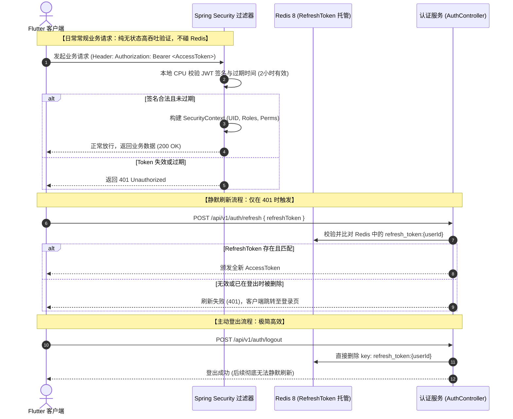

# 《校园图书借阅系统》RBAC 权限模型与安全防护设计说明书 (Stage 0.5 修订版)

---

## 1. RBAC（基于角色的访问控制）模型设计

系统采用标准的 **RBAC-1 模型（支持角色与细粒度权限解耦）**，实现“用户 → 角色 → 权限”的三层映射体系，杜绝权限硬编码。

```mermaid
graph LR
    User["用户 (User)"] -->|N : M (user_roles)| Role["角色 (Role)"]
    Role -->|N : M (role_permissions)| Permission["权限点 (Permission)"]
    Permission -->|拦截校验| Resource["受保护 API 资源 / URL"]

    subgraph RolesEnum ["预置系统角色"]
        R1["ROLE_STUDENT (在校读者)"]
        R2["ROLE_LIBRARIAN (图书管理员)"]
        R3["ROLE_ADMIN (系统超级管理员)"]
    end
```

---

## 2. 角色-权限全量控制矩阵（Permission Matrix - Stage 0.5 修订版）

| 业务模块 | 权限代码 `permission:code` | 功能行为说明 | STUDENT | LIBRARIAN | ADMIN |
| :--- | :--- | :--- | :---: | :---: | :---: |
| **图书检索** | `book:query` | 检索图书目录、查看图书详情 | ✅ | ✅ | ✅ |
| **图书编目** | `book:create` | 录入新书书目元数据 | ❌ | ✅ | ✅ |
| **封面上传** | `book:cover:upload` | 上传图书封面图片资源 | ❌ | ✅ | ✅ |
| **批量导入** | `book:import` | **Excel 批量导入图书与条形码** | ❌ | ✅ | ✅ |
| **图书修改** | `book:update` | 修改书名、简介、封面等 | ❌ | ✅ | ✅ |
| **图书下架** | `book:delete` | 软删除/注销书目 | ❌ | ❌ | ✅ |
| **副本维护** | `copy:manage` | 批量赋码入库、架位调配、报废标记 | ❌ | ✅ | ✅ |
| **借阅申请** | `borrow:apply` | 自助或柜台发起借书（自顶向下锁） | ✅ | ✅ | ❌ |
| **还书处理** | `borrow:return` | 自助还书或柜台验收归还 | ✅ | ✅ | ✅ |
| **续借申请** | `borrow:renew` | 延长在借图书期限 | ✅ | ❌ | ❌ |
| **异常定损** | `borrow:abnormal`| 处理图书遗失/损毁与赔偿结案 | ❌ | ✅ | ✅ |
| **借阅审计** | `borrow:query:all`| 查看全校读者所有借阅历史 | ❌ | ✅ | ✅ |
| **个人借阅** | `borrow:query:my` | 查看当前登录者本人的借还单 | ✅ | ❌ | ❌ |
| **缺书预约** | `reservation:create`| 缺书提交书目候补预约 | ✅ | ❌ | ❌ |
| **预约调度** | `reservation:manage`| 预约自提架维护与超期释放巡检 | ❌ | ✅ | ✅ |
| **馆内公告** | `notice:publish` | 起草、发布开闭馆通知与要闻 | ❌ | ✅ | ✅ |
| **AI 导读与反馈**| `ai:feedback` | 发起荐书问答并提交推荐反馈 | ✅ | ✅ | ❌ |
| **用户台账** | `user:manage` | 停用/激活账号、重置初始密码 | ❌ | ❌ | ✅ |
| **规则配置** | `rule:manage` | 修改借阅天数、额度与罚款标准 | ❌ | ❌ | ✅ |
| **系统审计** | `log:query` | 检索全链路调用日志与安全事件 | ❌ | ❌ | ✅ |
| **统计大屏** | `stat:view` | 查看馆藏流通报表与借阅排行榜 | ❌ | ✅ | ✅ |

---

## 3. 后端安全防御与防越权（IDOR）核心机制

### 3.1 权限安全拦截双重守卫
* 前端 UI 按钮隐藏仅作为交互优化，**所有安全性必须由后端 Spring Security 过滤器链与方法级注解双重阻断**：
  ```java
  @PreAuthorize("hasAuthority('book:import')")
  @PostMapping("/api/v1/books/import/confirm")
  public ApiResponse<ImportResultVO> confirmImport(@RequestBody ImportConfirmDTO dto) { ... }
  ```

### 3.2 水平越权（IDOR）深度防御
* 针对用户私有数据接口（如借阅记录详情、个人预约单查询），业务服务层强制比对所有权：
  ```java
  @Transactional(readOnly = true)
  public BorrowRecordVO getBorrowRecordDetail(Long recordId, CurrentUser currentUser) {
      BorrowRecord record = borrowRecordRepository.findById(recordId)
          .orElseThrow(() -> new BusinessException(ErrorCode.RESOURCE_NOT_FOUND));

      // 若当前操作者是普通学生，强制要求只能访问属于本人的记录
      if (currentUser.hasRole("ROLE_STUDENT") && !record.getUserId().equals(currentUser.getId())) {
          log.warn("检测到越权攻击! 用户: {} 尝试访问他人借阅单: {}", currentUser.getId(), recordId);
          throw new BusinessException(ErrorCode.AUTH_FORBIDDEN, "无权访问此记录");
      }
      return BorrowRecordVO.fromEntity(record);
  }
  ```

---

## 4. 简化的轻量安全 JWT 凭证机制 (Stage 0.5 简化收敛)



### 4.1 方案收敛价值
* **无状态高性能**：99.9% 的正常业务接口请求无需穿透访问 Redis，大大提高系统吞吐量。
* **干净登出能力**：用户主动退出登录时，删除 Redis 里的 `refresh_token:{userId}`，客户端彻底无法续期，短期 AccessToken 自然过期后攻击窗口完全关闭。
* **剔除无谓开销**：无需设计庞大的 AccessToken JTI 黑名单集合，消除内存堆积隐患。

### 4.2 密码安全与接口防刷频控
* **密码存储**：采用 **BCrypt 哈希算法**，工作因子设置为 `12`。
* **登录频控防爆破**：基于 Redis 令牌桶，针对同一 IP 或学号，1 分钟内连续失败 5 次自动锁定 15 分钟。
