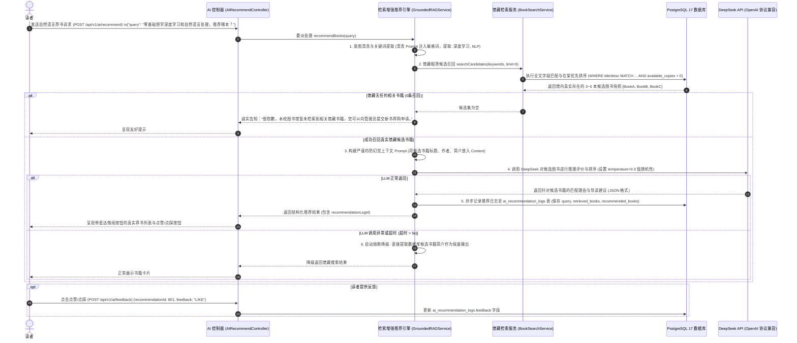

# 《校园图书借阅系统》DeepSeek AI 智能导读模块设计说明书 (Stage 0.5 修订版)

---

## 1. 业务定位与设计哲学（防幻觉 Grounded-RAG）

### 1.1 核心痛点与错误做法警示
在传统 Demo 系统中，将大模型（LLM）粗暴地直接接入前端：
* **用户提问**：“我想借一本讲解红黑树和二叉堆的优质入门书。”
* **错误做法（直接问 LLM）**：直接把用户原句透传给 LLM。LLM 会根据其预训练权重推荐《算法导论》、《算法（第4版）》甚至自己杜撰一本《趣味二叉树入门》。
* **致命灾难**：读者拿着 AI 推荐的书名跑到图书馆，发现**本馆根本没有采购这本书**，或者书名根本是虚构的！这不仅摧毁了系统的实用性，更在毕业设计答辩中被视为严重的逻辑硬伤。

### 1.2 架构原则：必须以馆藏数据库为唯一真理之源（Grounded-RAG）
* **原则 1：AI 绝不能凭空编造馆藏书籍。** 所有推荐的书目，其 `book_id`、ISBN、索书号必须来自当前 PostgreSQL 馆藏库。
* **原则 2：在架可用性感知（Stock-Aware）。** 推荐时优先筛选 `available_copies > 0` 的图书，让学生“问得到、看得到、马上借得到”。
* **原则 3：降级兜底保障（Graceful Fallback）。** 一旦外部大模型网络超时（> 5s）或 API 发生抖动，系统自动降级为标准馆藏检索结果，绝不阻断用户交互。
* **原则 4：真实推荐行为可度量（Behavioral Audit）。** 记录每一次提问、召回候选、推荐结果与用户真实反馈，形成闭环数据。

---

## 2. 核心架构与处理全流程



---

## 3. 防幻觉 Prompt 工程体系规范

### 3.1 System Prompt 系统设定
```text
你是一位严谨、专业的大学图书馆智能导读馆员助手。
【核心纪律】
1. 你必须严格、绝对仅根据下方【馆藏候选图书清单】中提供的书籍信息回答学生的提问。
2. 绝对严禁杜撰、编造任何清单之外的图书名称、作者或索书号。如果清单中的书籍与学生需求关联度较低，请如实告知其局限性。
3. 请为读者分析为什么这几本书适合他，并给出通俗易懂、具有鼓励性质的阅读建议。
4. 语言风格：平实、温和、富有书香气息。
```

### 3.2 User Prompt 上下文组装模板
```text
【读者提问】：
{student_query}

【本校图书馆当前真实在馆候选图书清单】：
---
1. [ID: {book_id_1}] 《{title_1}》
- 作者：{authors_1}
- 索书架位：{call_number_1}
- 在架可借：{available_copies_1} 册
- 简介：{description_1}
---
2. [ID: {book_id_2}] 《{title_2}》
- 作者：{authors_2}
- 索书架位：{call_number_2}
- 在架可借：{available_copies_2} 册
- 简介：{description_2}
---

请根据上述本馆真实藏书，用亲切的语气向读者作答，说明推荐理由，并按照如下 JSON 结构返回：
{
  "summary": "导读推荐总评语",
  "recommendations": [
    {"bookId": 123, "reason": "针对读者需求的推荐理由（100字以内）"}
  ]
}
```

---

## 4. AI 推荐日志与数据实体设计 (`ai_recommendation_logs`)

| 字段名 | 类型 | 说明 |
| :--- | :--- | :--- |
| `id` | BIGSERIAL PRIMARY KEY | 日志主键 |
| `user_id` | BIGINT | 发起提问读者 ID |
| `query` | VARCHAR(255) | 提问文本 |
| `retrieved_books` | JSONB | 粗筛候选集快照 `[{"id": 1, "title": "..."}, ...]` |
| `recommended_books`| JSONB | AI 最终推荐给用户的书籍及推荐理由快照 |
| `feedback` | VARCHAR(50) | 读者点赞点踩：`LIKE`、`DISLIKE`、`RATING_1~5` |
| `created_at` | TIMESTAMPTZ | 记录生成时间 |

---

## 5. AI 效果评估方案（拒绝虚假准确率）

在以往学生项目中，常见“AI 推荐准确率 98.7%”等虚假编造数据。本系统基于真实业务流转，建立**4 个客观、可量化、可追踪的行为转化评估指标**：

1. **推荐点击率（Recommendation Click-Through Rate, CTR）**：
   $$\text{CTR} = \frac{\text{读者点击进入推荐书籍详情页的次数}}{\text{AI 推荐卡片展现总次数}} \times 100\%$$
   * **量化价值**：直接衡量推荐书目与读者意图的表面契合度与吸引力。
2. **收藏转化率（Favorite Conversion Rate）**：
   $$\text{收藏率} = \frac{\text{推荐后 24 小时内读者将推荐书籍加入收藏夹的次数}}{\text{AI 推荐图书展示总数}} \times 100\%$$
   * **量化价值**：衡量推荐书籍是否击中读者的中长期阅读兴趣。
3. **借阅转化率（Borrow Conversion Rate）**：
   $$\text{借阅转化率} = \frac{\text{推荐后 7 天内读者对推荐书籍发生借阅/预约的册数}}{\text{AI 推荐图书展示总数}} \times 100\%$$
   * **量化价值**：终极衡量 AI 导读对校园图书馆线下物理流通的带动实效，是毕业设计中最具说服力的数据。
4. **用户显式反馈评分（User Feedback Rating）**：
   * 汇总点赞与点踩：$\text{满意度} = \frac{\text{LIKE 次数}}{\text{LIKE 次数} + \text{DISLIKE 次数}} \times 100\%$。
   * 为管理员 Prompt 优化与微调提供读者第一视角的客观依据。

---

## 6. AI 功能边界裁定与 Push Back 决策

| 规划功能候选 | 裁定决策 | 理由阐述 (Reason) | 后续影响 (Impact) |
| :--- | :--- | :--- | :--- |
| **智能馆藏找书助手** | **[采用]** | 解决传统检索死板匹配痛点，通过 Grounded-RAG 杜绝幻觉，学术答辩价值极高。 | 成为学生端核心亮点功能。 |
| **推荐效果量化评估闭环**| **[采用 - Stage 0.5]**| 基于 `ai_recommendation_logs` 沉淀真实数据，拒绝虚假的“99%准确率”，提升答辩学术真实性。 | 支撑毕业设计中“系统评估与效果分析”章节。 |
| **图书简介智能提炼** | **[采用]** | 将长篇前言提炼为 3 条核心要点与适合人群，方便读者 3 秒决策。 | 极大提升图书详情页阅读效率。 |
| **全自动阅读打卡计划** | **[否决 / 延后]** | 脱离图书借阅流通核心主线，功能堆砌且学生极少按照计划打卡。 | 砍掉此组件，节省大量 Token 与数据库开销。 |
| **自由开放式闲聊助手** | **[坚决否决]** | 脱离图书借阅场景，易被利用进行越权 Prompt 注入，存在内容合规风险。 | 严格限制 AI 提问范围在图书咨询以内。 |
