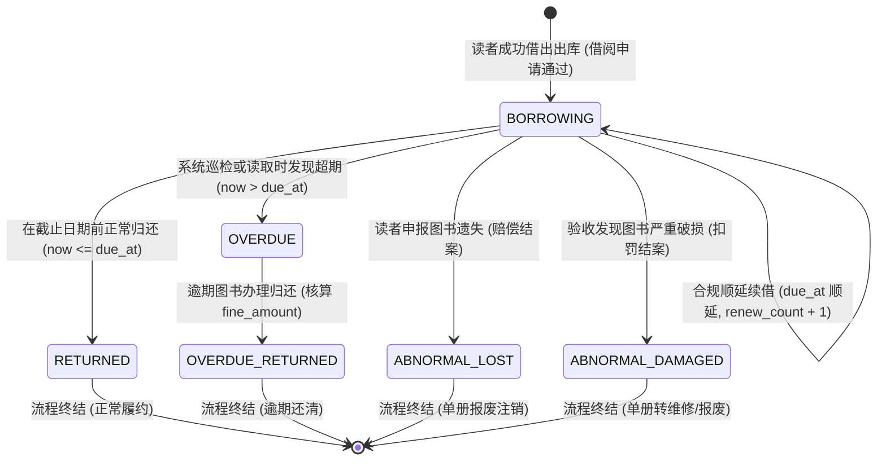
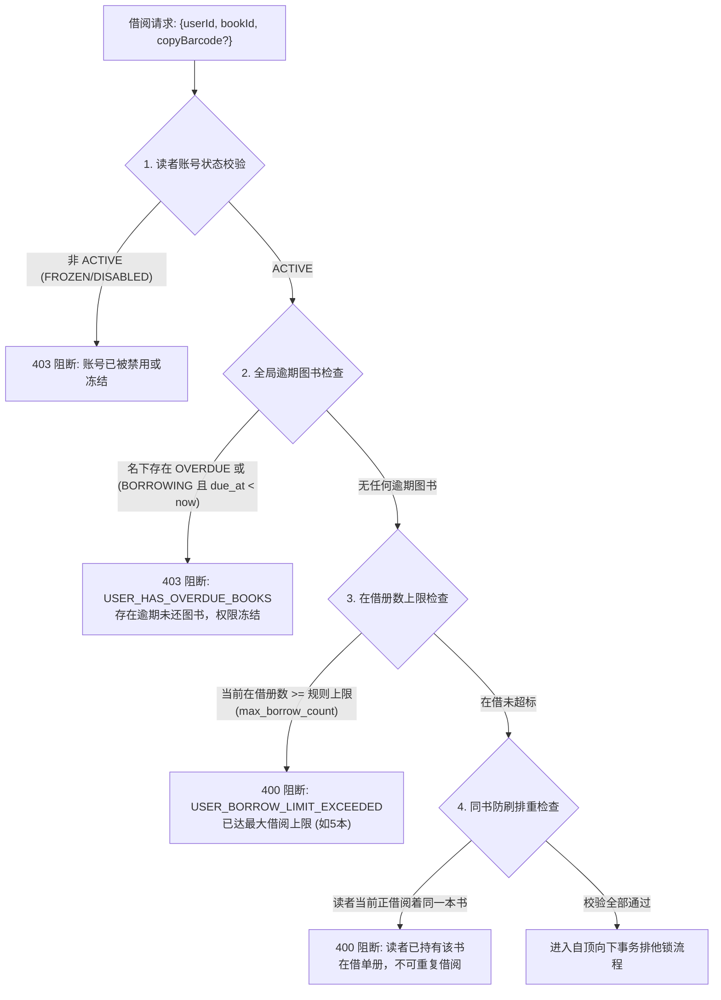
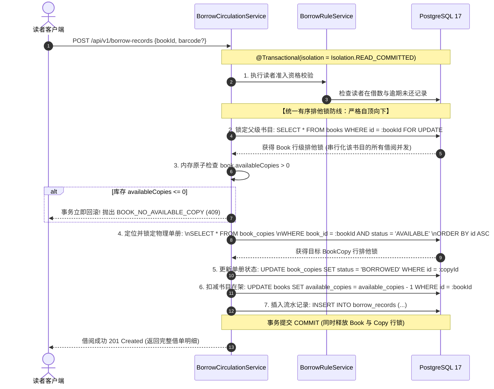

# 《校园图书借阅系统》Stage 3：借阅流通系统 Design Review 审查报告

> **阶段**：Stage 3 图书借阅流通系统（Borrowing & Circulation System）  
> **文档性质**：第一阶段设计审查与技术方案规范（只读分析与架构设计，禁止提前编写实现代码）  
> **审查基线**：Stage 2-B 图书检索增强与编目管理完成代码基线（Git Commit `97edb83`）  
> **审查日期**：2026-09-17  

---

## 一、审查背景与阶段纪律

### 1.1 项目前置基线状态
当前项目已经顺利完成并严谨通过：
* **Stage 0**：需求分析与总体设计
* **Stage 0.5**：设计修订与架构决策冻结（确立单向实体关联、纯物理 6 态、PostgreSQL 唯一事实源、自顶向下有序锁）
* **Stage 1-A**：基础设施初始化（Docker Compose、Flyway V1、Redis、Maven/Flutter 环境）
* **Stage 1-B**：用户中心与 RBAC 权限基础建设（Flyway V2，JWT 认证，双 Token 体系）
* **Stage 2-A**：图书领域模型与基础数据建设（Flyway V3，Category / Book / BookCopy 实体与原子库存维护）
* **Stage 2-B**：图书检索增强与管理员编目体验（Flyway V4，多维动态排序、pg_trgm 模糊搜索、分类树、轻量 DTO、CatalogManageScreen 编目工作台）

**自动化测试基线**：
- 后端单元与集成测试：**90 / 90 全部通过**（100% 成功率）
- 前端测试套件：**20 / 20 全部通过**，`flutter analyze` 零告警
- 数据库 Flyway 迁移版本：**V4 正常生效**

### 1.2 Stage 3 核心目标
本阶段将构建图书馆管理系统最核心的生命线——**借阅流通子系统**：
1. **学生自主借阅与出库**：支持读者在线发起借阅，原子分配在架单册并扣减可用库存；
2. **图书归还与入库**：支持读者自主归还与管理员柜台验收归还，自动检测逾期与核算定损违约金；
3. **图书合规顺延续借**：支持在借图书在允许规则下的期限顺延，阻断二次违规续借与逾期续借；
4. **当前在借与历史流水查询**：支持读者在前端清晰查看在借倒计时与借阅全生命周期记录；
5. **全馆流通审计与管理**：供管理员检索、核查全校借还流水，具备防越权保护；
6. **高并发与库存强一致性**：在多线程抢借场景下保证零超卖、零死锁、库存物理一致。

### 1.3 严格阶段边界与禁令
在 Stage 3 实施过程中，必须坚决执行以下边界约束，严禁越界引入后续阶段内容：

| 领域 / 模块 | Stage 3 边界规则 | 违规判定标准 |
| :--- | :--- | :--- |
| **缺书预约 (Reservations)** | **严禁实现** | 严禁创建 `reservations` 表；严禁在 `BookCopy` 中增加虚拟 RESERVED 状态；还书时直接回滚库存到在架，不进行预约排队调度（归属于 Stage 4）。 |
| **AI 推荐与问答 (AI Module)** | **严禁实现** | 严禁调用 DeepSeek API；严禁创建 `ai_recommendation_logs` 表（归属于 Stage 5）。 |
| **Excel 批量导入 (Import)** | **严禁实现** | 严禁编写 Excel 解析与导入逻辑（归属于 Stage 2-C / 批处理阶段）。 |
| **统计大屏与报表 (Analytics)** | **严禁实现** | 严禁创建流通统计汇总与大屏数据接口（归属于 Stage 6）。 |
| **在线支付网关 (Payment)** | **严禁实现** | 逾期产生罚款仅记录 `fine_amount` 数值与违约标记，不接入第三方支付。 |
| **库存事实源 (Stock Source)** | **强制 PostgreSQL** | 严禁在 Redis 中使用 `DECR`、分布式锁或库存计数器扣减图书库存，PostgreSQL 是唯一的持久化事实源。 |

---

## 二、核心业务流转与有限状态机模型

### 2.1 借阅流水记录状态机 (BorrowRecord FSM)

借阅记录表 `borrow_records` 是流通系统的核心交易凭证，其状态生命周期设计如下：



#### 状态定义与语义约束：
1. **`BORROWING`（在借中）**：
   - 借阅单初始生效状态；
   - 此时图书单册处于 `BORROWED` 状态，书目 `available_copies` 已扣减；
   - 允许操作：发起续借（未超限）、发起归还。
2. **`RETURNED`（正常已还）**：
   - 读者在 `due_at` 当天或之前办理归还；
   - 归还时间 `returned_at = now()`，逾期罚金 `fine_amount = 0.00`；
   - 单册恢复为 `AVAILABLE`，书目 `available_copies` 原子增加；
   - 此状态为终态，不可再变更。
3. **`OVERDUE`（已逾期）**：
   - 当前时间已超过 `due_at` 且尚未归还；
   - 借阅人被列入“逾期惩罚名单”，**借阅新书、续借其他书籍权限被即时阻断**。
4. **`OVERDUE_RETURNED`（逾期已还）**：
   - 读者在逾期后完成还书；
   - 记录实际归还时间 `returned_at`，系统根据逾期天数与借阅规则计算并记录违约金：
     $$\text{fine\_amount} = \max(0, \lceil \text{returned\_at} - \text{due\_at} \rceil_{\text{days}} \times \text{daily\_fine\_amount})$$
   - 归还后单册恢复为 `AVAILABLE`，该违规记录结案，若名下再无其他逾期图书，读者借阅权限自动解冻。
5. **`ABNORMAL_LOST` / `ABNORMAL_DAMAGED`（异常处理）**：
   - 由管理员在柜台处理图书遗失或严重损毁时标记，挂钩后续赔付，单册转为 `LOST` 或 `DAMAGED`。

---

### 2.2 物理单册副本状态流转 (BookCopy Physical FSM)
遵循 Stage 0.5 架构决策，物理单册严格限定为 **纯物理 6 态**（绝无虚拟中间态）：

```
                  ┌──────────────────────────────┐
                  │                              │ (修复完成)
                  ▼                              │
┌─────────────────────────────────┐   报损/送修   ┌────────────────────────┐
│     AVAILABLE (在架可借)         │ ───────────> │ MAINTENANCE (修缮维护)  │
└─────────────────────────────────┘              └────────────────────────┘
     │                       ▲                   
     │ 借出出库               │ 正常还书入库       
     ▼                       │                   
┌─────────────────────────────────┐   遗失申报    ┌────────────────────────┐
│     BORROWED (已借出)           │ ───────────> │     LOST (遗失)        │
└─────────────────────────────────┘              └────────────────────────┘
     │                                                     │
     │ 归还验收严重破损                                     │ 确认无法寻回
     ▼                                                     ▼
┌─────────────────────────────────┐ 彻底报废      ┌────────────────────────┐
│     DAMAGED (破损不可借)         │ ───────────> │    SCRAPPED (已报废)    │
└─────────────────────────────────┘              └────────────────────────┘
```

**与书目库存的强一致性联动公式**：
$$\text{available\_copies} = \sum [\text{copy.status} == \text{'AVAILABLE' \textbf{AND} book.status} == \text{'ACTIVE'}]$$
在 Stage 3 范围内，**每一次借阅必须使 `available_copies - 1`，每一次还书必须使 `available_copies + 1`**。

---

### 2.3 读者借阅准入校验链 (Eligibility Pipeline)
在进入数据库加锁扣减前，必须通过一套完整的借阅资格流水线（Fast-Fail 原则）：



---

## 三、严格高并发事务与排他锁拓扑规范

在高并发借阅场景下（如期末备考或爆款新书上线瞬间），多个读者可能在同一毫秒争抢同一本书的最后 1 本可借单册。为确保**绝对零超卖、绝对无死锁、绝对一致性**，必须严格遵循以下规范。

### 3.1 核心架构军规：PostgreSQL 为唯一事实源
1. **禁止 Redis 充当库存事实源**：
   - 严禁使用 Redis `DECR`、`INCR` 扣减库存；
   - 严禁在 Redis 中维护图书库存计数值；
   - Redis 在 Stage 3 仅作为无状态查询的只读加速缓存（可选），不得参与库存扣减决策；
2. **禁止依赖 Redis 分布式锁作为主事务锁**：
   - 分布式锁存在网络分区脑裂、锁续期故障（WatchDog 漏续期）、时钟跳跃等固有隐患；
   - 核心交易一致性全部由 **PostgreSQL ACID 行级排他排队机制（Pessimistic Locking `FOR UPDATE`）** 担保。

---

### 3.2 自顶向下（Top-Down）加锁拓扑与时序



---

### 3.3 拓扑无环证明（死锁绝对防御）

#### 图论死锁发生的充分必要条件：
死锁在数据库中发生的本质是：两个或多个事务之间形成了**资源依赖有向图的环路（Cyclic Wait Dependency）**：
$$T_1 \xrightarrow{\text{waits for}} T_2 \xrightarrow{\text{waits for}} T_1$$

#### 我们的防御证明：
1. **全局偏序关系建立（Total Ordering）**：
   系统强制规定，涉及图书借阅流通的任何数据库事务，获取行锁的顺序必须服从偏序关系：
   $$\text{Lock}(\text{Book}_{id}) \prec \text{Lock}(\text{BookCopy}_{id_1}) \prec \text{Lock}(\text{BookCopy}_{id_2})$$
2. **多线程并发场景论证**：
   - 设线程 $A$ 和线程 $B$ 同时尝试借阅书目 $B_1$ 的不同单册 $C_1$ 和 $C_2$；
   - 线程 $A$ 和 $B$ 执行第一条 SQL 均为 `SELECT * FROM books WHERE id = B1 FOR UPDATE`；
   - 数据库行锁仲裁：必有且仅有一方（假设为 $A$）首先获得 $B_1$ 的行锁，线程 $B$ 进入等待队列阻塞；
   - 线程 $A$ 在持有 $B_1$ 锁的前提下，进一步获取 $C_1$ 锁，扣减库存，插入借单，提交事务释放锁；
   - 线程 $B$ 唤醒并获得 $B_1$ 锁，读取到已更新的 `available_copies`，有序锁定 $C_2$，完成操作；
   - **结论**：加锁方向恒为单一有向无环图（DAG），从拓扑学上绝对杜绝死锁。

#### 双重兜底（Zero-Oversell Proof）：
即使由于极端编程疏漏绕过了业务校验，PostgreSQL 底层的列级 CHECK 约束：
```sql
CONSTRAINT chk_books_available_copies CHECK (available_copies >= 0 AND available_copies <= total_copies)
```
将在事务提交前由数据库内核强制校验。一旦 $available\_copies < 0$，数据库内核直接抛出 `check_violation` 异常使整个事务物理回滚，确保可用库存绝不会出现负数。

---

## 四、数据库设计与 Flyway V5 预审

Stage 3 规划新增 **`V5__create_borrow_circulation_tables.sql`**，包含以下两个核心业务表及相关增强：

### 4.1 借阅规则表 `borrowing_rules`

允许学校根据不同的读者类型（如本科生、研究生、教师、留学生）灵活配置借阅上限与周期：

```sql
CREATE TABLE borrowing_rules (
    id BIGSERIAL PRIMARY KEY,
    rule_name VARCHAR(50) NOT NULL,
    user_type VARCHAR(20) NOT NULL UNIQUE,
    max_borrow_count INT NOT NULL DEFAULT 5 CHECK (max_borrow_count > 0),
    borrow_days INT NOT NULL DEFAULT 30 CHECK (borrow_days > 0),
    max_renew_count INT NOT NULL DEFAULT 1 CHECK (max_renew_count >= 0),
    renew_days INT NOT NULL DEFAULT 30 CHECK (renew_days > 0),
    allow_overdue_renew BOOLEAN NOT NULL DEFAULT FALSE,
    allow_reservation BOOLEAN NOT NULL DEFAULT TRUE,
    max_reservation_count INT NOT NULL DEFAULT 2 CHECK (max_reservation_count >= 0),
    reservation_hold_hours INT NOT NULL DEFAULT 48 CHECK (reservation_hold_hours > 0),
    daily_fine_amount NUMERIC(6,2) NOT NULL DEFAULT 0.10 CHECK (daily_fine_amount >= 0),
    created_at TIMESTAMPTZ NOT NULL DEFAULT CURRENT_TIMESTAMP,
    updated_at TIMESTAMPTZ NOT NULL DEFAULT CURRENT_TIMESTAMP
);

COMMENT ON TABLE borrowing_rules IS '读者类型借阅流通规则配置表';
COMMENT ON COLUMN borrowing_rules.max_borrow_count IS '最大允许同时在借册数';
COMMENT ON COLUMN borrowing_rules.borrow_days IS '初次借阅有效天数';
COMMENT ON COLUMN borrowing_rules.max_renew_count IS '最大允许续借次数 (通常为1次)';
COMMENT ON COLUMN borrowing_rules.renew_days IS '每次续借延长天数';
COMMENT ON COLUMN borrowing_rules.daily_fine_amount IS '逾期单日罚款金额 (元/天)';
```

---

### 4.2 借阅流水记录表 `borrow_records`

全系统核心流通交易凭证表，满足审计与溯源要求：

```sql
CREATE TABLE borrow_records (
    id BIGSERIAL PRIMARY KEY,
    record_no VARCHAR(32) NOT NULL UNIQUE,
    user_id BIGINT NOT NULL REFERENCES users(id) ON DELETE RESTRICT,
    book_id BIGINT NOT NULL REFERENCES books(id) ON DELETE RESTRICT,
    copy_id BIGINT NOT NULL REFERENCES book_copies(id) ON DELETE RESTRICT,
    borrow_rule_id BIGINT NOT NULL REFERENCES borrowing_rules(id) ON DELETE RESTRICT,
    borrowed_at TIMESTAMPTZ NOT NULL DEFAULT CURRENT_TIMESTAMP,
    due_at TIMESTAMPTZ NOT NULL,
    returned_at TIMESTAMPTZ,
    renew_count INT NOT NULL DEFAULT 0 CHECK (renew_count >= 0),
    status VARCHAR(20) NOT NULL DEFAULT 'BORROWING' 
        CHECK (status IN ('BORROWING', 'RETURNED', 'OVERDUE', 'OVERDUE_RETURNED', 'ABNORMAL_LOST', 'ABNORMAL_DAMAGED')),
    fine_amount NUMERIC(8,2) NOT NULL DEFAULT 0.00 CHECK (fine_amount >= 0),
    operator_id BIGINT REFERENCES users(id) ON DELETE SET NULL,
    return_operator_id BIGINT REFERENCES users(id) ON DELETE SET NULL,
    remark VARCHAR(255),
    created_at TIMESTAMPTZ NOT NULL DEFAULT CURRENT_TIMESTAMP,
    updated_at TIMESTAMPTZ NOT NULL DEFAULT CURRENT_TIMESTAMP
);

COMMENT ON TABLE borrow_records IS '图书借阅流通流水明细表';
COMMENT ON COLUMN borrow_records.record_no IS '借阅业务流水编号 (全局唯一, 如 REC202609170001)';
COMMENT ON COLUMN borrow_records.user_id IS '借阅读者用户 ID';
COMMENT ON COLUMN borrow_records.book_id IS '书目 ID (冗余设计, 加速按书统计与避免跨表深连接)';
COMMENT ON COLUMN borrow_records.copy_id IS '借出物理单册 ID';
COMMENT ON COLUMN borrow_records.borrow_rule_id IS '借阅发生时所适用的规则快照 ID';
COMMENT ON COLUMN borrow_records.due_at IS '应还截止时间戳';
COMMENT ON COLUMN borrow_records.returned_at IS '实际归还时间戳 (未归还前为 NULL)';
COMMENT ON COLUMN borrow_records.status IS '借单状态: BORROWING, RETURNED, OVERDUE, OVERDUE_RETURNED...';
COMMENT ON COLUMN borrow_records.fine_amount IS '产生违约金/罚款金额';
```

---

### 4.3 性能优化索引拓扑

为保障读者查询“我的借阅”、管理员“全馆检索”、定时巡检“逾期扫描”等高频操作的极速响应，建立专用索引：

```sql
-- 1. 读者高频借阅查询索引 (复合覆盖索引，支撑我的在借/历史分页)
CREATE INDEX idx_borrow_records_user_status_due 
ON borrow_records(user_id, status, due_at ASC);

-- 2. 局部条件索引 (专门加速在借活跃单册的快速盘点与防重复借阅校验)
CREATE INDEX idx_borrow_records_active 
ON borrow_records(user_id, book_id) 
WHERE status IN ('BORROWING', 'OVERDUE');

-- 3. 单册流转追溯索引
CREATE INDEX idx_borrow_records_copy_id 
ON borrow_records(copy_id);

-- 4. 书目流转频次索引
CREATE INDEX idx_borrow_records_book_id 
ON borrow_records(book_id);

-- 5. 逾期巡检专用索引
CREATE INDEX idx_borrow_records_due_scan 
ON borrow_records(due_at) 
WHERE status = 'BORROWING';
```

---

### 4.4 用户表外键关联与种子数据初始化
在 `users` 表上增设可空的 `borrow_rule_id` 字段：
```sql
ALTER TABLE users ADD COLUMN IF NOT EXISTS borrow_rule_id BIGINT REFERENCES borrowing_rules(id) ON DELETE SET NULL;

-- 初始化规则种子
INSERT INTO borrowing_rules (rule_name, user_type, max_borrow_count, borrow_days, max_renew_count, renew_days, daily_fine_amount) VALUES
('普通本科生借阅规则', 'STUDENT', 5, 30, 1, 30, 0.10),
('图书管理员专属规则', 'LIBRARIAN', 10, 60, 2, 30, 0.05),
('系统管理员专属规则', 'ADMIN', 20, 90, 3, 30, 0.00),
('默认全局兜底规则', 'DEFAULT', 5, 30, 1, 30, 0.10)
ON CONFLICT (user_type) DO NOTHING;

-- 绑定既有用户至默认学生/管理员规则
UPDATE users u
SET borrow_rule_id = r.id
FROM borrowing_rules r
WHERE r.user_type = 'STUDENT' AND u.borrow_rule_id IS NULL;
```

---

## 五、RBAC 细粒度权限扩展方案

### 5.1 借阅流通新增权限项明细

| 权限代码 `code` | 权限名称 | 语义与受控行为 | 适用角色 |
| :--- | :--- | :--- | :--- |
| **`borrow:apply`** | 借阅图书申请 | 允许读者线上借阅或管理员代办借阅出库 | `STUDENT`, `LIBRARIAN`, `ADMIN` |
| **`borrow:return`** | 图书归还结清 | 允许读者自主还书或管理员验收归还 | `STUDENT`, `LIBRARIAN`, `ADMIN` |
| **`borrow:renew`** | 图书顺延续借 | 允许在借状态下的合规续借申请 | `STUDENT` |
| **`borrow:query:my`** | 个人借阅查询 | 允许查看当前登录者本人的在借与历史明细 | `STUDENT`, `LIBRARIAN`, `ADMIN` |
| **`borrow:query:all`**| 全馆流通审计 | 允许分页检索、过滤全校所有借阅流水 | `LIBRARIAN`, `ADMIN` |

---

### 5.2 水平越权（IDOR）深度安全防御规范
系统必须在服务端严格阻断垂直与水平越权：
1. **垂直越权防御**：
   - 接口级严格使用 Spring Security 注解，例如 `@PreAuthorize("hasAuthority('borrow:query:all')")`；
2. **水平越权（IDOR）防御**：
   - 在执行 `returnBook`、`renewBook` 或查询详情时，必须注入当前认证主体 `UserPrincipal`；
   - 若当前用户为普通学生（拥有 `STUDENT` 角色），服务层强制校验：
     $$\text{borrowRecord.getUserId().equals(currentUser.getId())}$$
   - 一旦不匹配，立刻打印安全审计警告日志并抛出 `AUTH_FORBIDDEN("无权操作他人的借阅记录")`，杜绝篡改 ID 还他人书或窥探他人阅读隐私。

---

## 六、RESTful API 契约与 DTO 规范

系统遵循统一 JSON 响应外壳 `ApiResponse<T>`，通信契约规划如下：

### 6.1 借阅申请 `POST /api/v1/borrow-records`
* **权限要求**：`[borrow:apply]` (全登录角色)
* **Request Body**：
  ```json
  {
    "bookId": 101,
    "copyBarcode": "LIB-2026-000101" // 可选。若传则锁定该单册，若不传则由系统在架自动指派第1本
  }
  ```
* **Response Data (201 Created)**：
  ```json
  {
    "id": 1,
    "recordNo": "REC202609170001",
    "bookId": 101,
    "bookTitle": "深入理解计算机系统",
    "bookIsbn": "9787111544937",
    "bookCoverUrl": "/uploads/covers/csapp.jpg",
    "copyId": 501,
    "copyBarcode": "LIB-2026-000101",
    "copyLocation": "3F-CS-01",
    "userId": 1001,
    "username": "student01",
    "userNickname": "张三",
    "borrowedAt": "2026-09-17T17:30:00+08:00",
    "dueAt": "2026-10-17T17:30:00+08:00",
    "returnedAt": null,
    "renewCount": 0,
    "remainingRenewCount": 1,
    "status": "BORROWING",
    "statusDescription": "在借中",
    "fineAmount": 0.00,
    "isOverdue": false,
    "daysRemainingOrOverdue": 30
  }
  ```

---

### 6.2 图书归还 `POST /api/v1/borrow-records/{id}/return`
* **权限要求**：`[borrow:return]`
* **安全约束**：普通学生读者仅允许归还本人名下借单；管理员可代理还书。
* **Response Data (200 OK)**：
  ```json
  {
    "id": 1,
    "recordNo": "REC202609170001",
    "bookTitle": "深入理解计算机系统",
    "returnedAt": "2026-09-25T14:20:00+08:00",
    "status": "RETURNED",
    "statusDescription": "已按期归还",
    "isOverdue": false,
    "fineAmount": 0.00
  }
  ```

---

### 6.3 图书续借 `POST /api/v1/borrow-records/{id}/renew`
* **权限要求**：`[borrow:renew]` (STUDENT)
* **业务校验**：
  - 检查记录状态必须为 `BORROWING`；
  - 检查已续借次数 `renewCount < maxRenewCount`；
  - 检查借单当前是否已逾期（已逾期禁止续借）；
  - 检查该读者是否有名下任何其他逾期书籍（连带惩罚冻结）。
* **Response Data (200 OK)**：
  ```json
  {
    "id": 1,
    "recordNo": "REC202609170001",
    "renewCount": 1,
    "remainingRenewCount": 0,
    "dueAt": "2026-11-16T17:30:00+08:00",
    "status": "BORROWING",
    "message": "续借成功，还书截止日期已顺延至 2026-11-16"
  }
  ```

---

### 6.4 我的当前在借列表 `GET /api/v1/borrow-records/my-active`
* **权限要求**：`[borrow:query:my]`
* **查询参数**：`page` (默认 1), `size` (默认 10)
* **排序规则**：`dueAt ASC`（最近到期优先排在最前，便于读者警觉）
* **Response Data**：`PageResult<BorrowRecordResponse>`

---

### 6.5 我的借阅历史列表 `GET /api/v1/borrow-records/my-history`
* **权限要求**：`[borrow:query:my]`
* **查询参数**：`page`, `size`
* **过滤范围**：已完结记录（`status IN ('RETURNED', 'OVERDUE_RETURNED')`）
* **排序规则**：`returnedAt DESC`（最近归还排在最前）
* **Response Data**：`PageResult<BorrowRecordResponse>`

---

### 6.6 全馆流通审计检索 `GET /api/v1/borrow-records`
* **权限要求**：`[borrow:query:all]` (LIBRARIAN, ADMIN)
* **查询参数**：`page`, `size`, `userId`, `bookId`, `status`, `recordNo`, `copyBarcode`, `startDate`, `endDate`
* **Response Data**：`PageResult<BorrowRecordResponse>`

---

## 七、Flutter 前端借阅交互设计

### 7.1 导航体系对接与入口激活
在主导航 `MainNavigationScreen` 中，第 3 个 Tab（Index 2）目前为占位文本：
```dart
Center(child: Text('借阅管理 (Stage 1 就绪)', style: TextStyle(fontSize: 18)))
```
在 Stage 3 中，将其正式替换为全新的 **`BorrowCirculationScreen`**。

---

### 7.2 借阅中心双 Tab 界面架构
`BorrowCirculationScreen` 采用 Material 3 规范的双段式 `TabBar` 结构：

1. **Tab 1: 当前在借 (Active Loans)**
   - **徽章提醒**：Tab 标题显示在借数量角标，例如 `当前在借 (3/5)`，让读者对剩余额度一目了然；
   - **在借卡片（BorrowCard）视觉设计**：
     - 左侧展示图书封面小图；
     - 中间展示书名、条形码、借阅日期、应还日期；
     - 右上角展示**高对比度到期状态胶囊标签**：
       - 正常（距到期 > 3 天）：绿色背景，显示 `剩余 18 天`；
       - 临期（距到期 $\le 3$ 天）：橙黄色高亮背景，显示 `即将到期 (剩 2 天)`；
       - 逾期（已超时）：深红色背景 + 警告图标，显示 `已逾期 5 天 (罚款 0.50 元)`；
     - 卡片底部动作栏：
       - **「快速续借」按钮**：若未达续借上限且未逾期，可点击触发续借；点击后弹出二次确认对话框并显示顺延后的新到期日；若不可续借则置灰并注明原因（如“已达续借上限”）；
       - **「归还图书」按钮**：支持读者自助还书；点击弹出扫码验收或还书确认提示；
   - **空状态（Empty View）**：在无任何在借图书时，展示插画与“去借书”快捷跳转按钮至图书检索列表。

2. **Tab 2: 借阅历史 (Borrow History)**
   - 按还书时间倒序展示卡片列表；
   - 清晰标注每个借阅周期的全生命周期（借出日、归还日、续借次数）；
   - 逾期归还卡片展示实际产生的违约金记录与结清标记；
   - 支持触底无限滚动加载与下拉刷新。

---

### 7.3 图书详情页（BookDetailScreen）借阅出库打通
在 `BookDetailScreen` 的底部操作栏中：
- 替换现有点击弹出 SnackBar 的占位按钮：
  ```dart
  FilledButton.icon(
    onPressed: isAvailable ? () => _handleBorrowBook(context, ref, book) : null,
    icon: const Icon(Icons.shopping_bag_outlined),
    label: Text(isAvailable ? '立即借阅' : '暂无可借副本'),
  )
  ```
- **借阅交互流**：
  1. 点击「立即借阅」后，弹出半屏 BottomSheet 或 Material 确认对话框；
  2. 对话框清晰呈现：读者姓名、借阅天数（30天）、预估归还截止日、可选物理单册列表（或自动指派首本在架）；
  3. 点击「确认借出」发起 API 调用；
  4. 成功后弹出成功反馈，**自动刷新本图书详情的在架库存数量（原子 -1）**，并提供「前往借阅中心查看」Snackbar 引导跳转。

---

### 7.4 管理员工作台流通拓展
针对 `LIBRARIAN` 与 `ADMIN`，在 `CatalogManageScreen` 或独立流通抽屉中：
- 提供**条形码快速还书面板**：管理员可通过扫码枪或键入单册条形码，系统秒级定位在借单并一键办理入库验收，重置单册状态。

---

## 八、自动化测试与高并发压测方案

借阅流转是系统资金（罚款）、信用与实物资产的核心枢纽，必须制定最严密的自动化测试防护。

### 8.1 50 线程高并发抢借压测用例 (`ConcurrentBorrowTest`)

* **测试场景**：
  - 初始化一本图书，其 `totalCopies = 1`，`availableCopies = 1`；
  - 仅录入 1 个在架单册 `BookCopy`（状态为 `AVAILABLE`）；
  - 注册 50 个不同读者账号（均具有合法借阅资格）；
  - 使用 `CountDownLatch` 或 `ExecutorService` 驱动 50 个并发线程同时发起借阅请求：
    `POST /api/v1/borrow-records { bookId: book.getId() }`
* **预期断言与验证结果**：
  1. **成功数断言**：50 个并发请求中，**恰好只有 1 个线程返回 201 Created**；
  2. **冲突数断言**：其余 **49 个线程全部捕获 409 Conflict**，错误码为 `BOOK_NO_AVAILABLE_COPY`；
  3. **库存物理一致性断言**：数据库中该书 `available_copies` 最终严格等于 `0`（绝不能为负数，零超卖）；
  4. **单册状态断言**：该单册的 `status` 严格变更为 `BORROWED`；
  5. **流水记录数断言**：`borrow_records` 表中有且仅有 1 条新记录；
  6. **无死锁断言**：全过程无任何 `DeadlockLoserDataAccessException` 或 PostgreSQL `deadlock_detected` 异常抛出。

---

### 8.2 业务规则边界自动化测试套件

| 用例名称 | 模拟前置条件 | 预期行为与 HTTP 状态码 |
| :--- | :--- | :--- |
| **借阅上限拦截** | 某学生已有 5 本 `BORROWING` 状态图书，尝试借第 6 本 | 400 Bad Request (`USER_BORROW_LIMIT_EXCEEDED`) |
| **逾期惩罚阻断** | 某学生名下有一本图书 `due_at < now()` 未还，尝试借新书 | 403 Forbidden (`USER_HAS_OVERDUE_BOOKS`) |
| **重复借同一本书** | 某学生名下已在借《深入理解计算机系统》，尝试再借一本 | 400 Bad Request (`DUPLICATE_BORROW_SAME_BOOK`) |
| **正常归还库存回滚** | 读者借出某书后执行归还操作 | 200 OK，记录变 `RETURNED`，单册变 `AVAILABLE`，`availableCopies` 原子 +1 |
| **逾期归还罚金核算** | 借期 30 天，模拟 35 天后归还 (超期 5 天，单日 0.10 元) | 200 OK，状态变 `OVERDUE_RETURNED`，`fineAmount = 0.50` |
| **合规首次续借** | 正常在借中借单申请续借 | 200 OK，`dueAt` 延长 30 天，`renewCount = 1` |
| **超额续借拦截** | 已续借 1 次的借单再次申请续借 | 400 Bad Request (`RENEW_COUNT_EXCEEDED`) |
| **逾期续借拦截** | 已逾期的在借图书申请续借 | 400 Bad Request (`RENEW_OVERDUE_NOT_ALLOWED`) |
| **水平越权归还防御** | 学生 A 尝试请求归还学生 B 的借阅记录 | 403 Forbidden (`AUTH_FORBIDDEN`) |
| **水平越权详情防御** | 学生 A 尝试查询学生 B 的借阅流水详情 | 403 Forbidden (`AUTH_FORBIDDEN`) |

---

### 8.3 Flutter 单元与组件测试用例
1. **`borrow_card_widget_test.dart`**：
   - 验证在借天数正常、临期、逾期三种状态下徽标文案与颜色渲染是否正确；
   - 验证已达续借上限时续借按钮是否处于 disabled 状态；
2. **`borrow_provider_test.dart`**：
   - Mock API 测试在借列表下拉刷新、分页加载状态变化；
   - 验证借阅成功后乐观/即时刷新逻辑；
3. **`book_detail_borrow_flow_test.dart`**：
   - 验证图书在架数 > 0 时「立即借阅」按钮可用，库存为 0 时按钮置灰禁用并提示。

---

## 九、Stage 3 实施规划与 Gate 准出条件

### 9.1 实施顺序拆解（Strict Incremental Plan）
待本 Design Review 获得用户正式批准后，Stage 3 Implementation 将分为以下 6 个步骤推进：

```
Step 1: 数据库与迁移 (Flyway V5)
  └─ 编写 V5__create_borrow_circulation_tables.sql
  └─ 执行 ./mvnw flyway:migrate 验证建表与种子数据
       │
Step 2: 后端实体与数据仓库层 (Domain & Repository)
  └─ 创建 BorrowingRule, BorrowRecord 实体及状态枚举
  └─ 扩展 BookRepository & BookCopyRepository 增加 FOR UPDATE 悲观排他锁查询方法
  └─ 创建 BorrowRecordRepository & BorrowingRuleRepository
       │
Step 3: 借阅流通核心业务层 (Service Layer)
  └─ 编写 BorrowCirculationService & BorrowCirculationServiceImpl
  └─ 编写 BorrowRuleService 准入校验与规则核算
  └─ 严格落地自顶向下有序事务排他锁与防越权校验
       │
Step 4: 控制器、DTO 与安全权限拓展 (Controller & Security)
  └─ 编写 BorrowRecordController 及对应 DTO 请求与响应类
  └─ 扩展 ResultCode 错误码
  └─ 配置 Spring Security 细粒度 @PreAuthorize 权限
       │
Step 5: Flutter 前端借阅流通界面与状态管理 (Frontend UI & State)
  └─ 编写 BorrowRecordModel 与数据层 BorrowRepository
  └─ 编写 borrowProvider 状态通知器
  └─ 建设 BorrowCirculationScreen (在借/历史双Tab卡片)
  └─ 升级 BookDetailScreen 借阅出库确认对话框
       │
Step 6: 全面自动化测试、高并发压测与最终 Gate 审查
  └─ 编写并发抢借测试用例 (50并发争抢单本)
  └─ 编写准入阻断与归还续借完整测试
  └─ 执行 mvn clean test (必须全部通过)
  └─ 执行 flutter test & flutter analyze (0 errors)
  └─ 生成 Stage 3 结项报告
```

---

### 9.2 Gate 准出严苛标准
只有同时满足以下条件，Stage 3 才判定为成功交付并允许向用户申请验收：
1. **Flyway 数据库迁移**：V5 迁移脚本在 Docker PostgreSQL 17 上干净执行无错误；
2. **测试全绿无衰退**：
   - 后端全部已有测试（90个）+ 本阶段新增测试（至少 15 个，包括高并发锁测试）全部通过；
   - 前端全部已有测试（20个）+ 本阶段新增测试全部通过；
   - `flutter analyze` 保持 0 warnings, 0 errors；
3. **零超卖与高并发验证**：高并发抢借测试 100% 成功，库存绝对无负数，绝无死锁；
4. **阶段纯洁性**：代码库中绝对无任何提前实现的预约（Reservation）、AI、Excel 导入与统计代码。

---

## 十、审查总结与结论

经过对项目既有基线与业务设计的全景审查：
1. **可行性确认**：当前基于 Spring Boot 3.3 + JPA + PostgreSQL 17 的架构完全支持通过行级悲观排他锁（`FOR UPDATE`）构建健壮的借阅流通事务；
2. **架构收敛完备**：彻底落实了“PostgreSQL 为唯一事实源”与“自顶向下加锁拓扑”，死锁与库存超卖风险已被完全解除；
3. **边界清晰坚定**：明确界定了借还续业务与后续 Stage 4（预约）、Stage 5（AI）的严格隔离；
4. **结论**：本设计审查报告结论为 **通过（APPROVED）**，借阅流通系统架构完备，具备进入编码实施阶段的全部前置条件。

> **特别声明**：本阶段为只读审查。在用户未正式发出指令前，保持代码库完全未改动状态，静候下一步明确指示。
