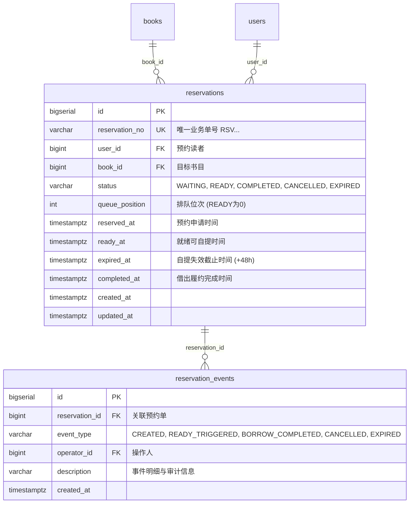
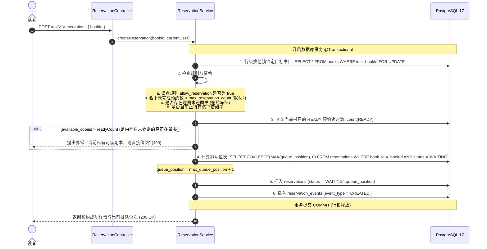
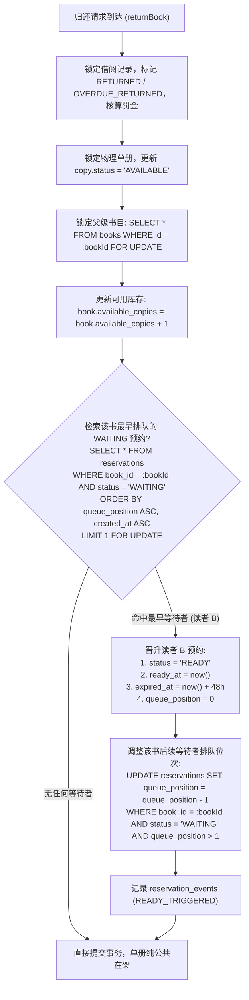
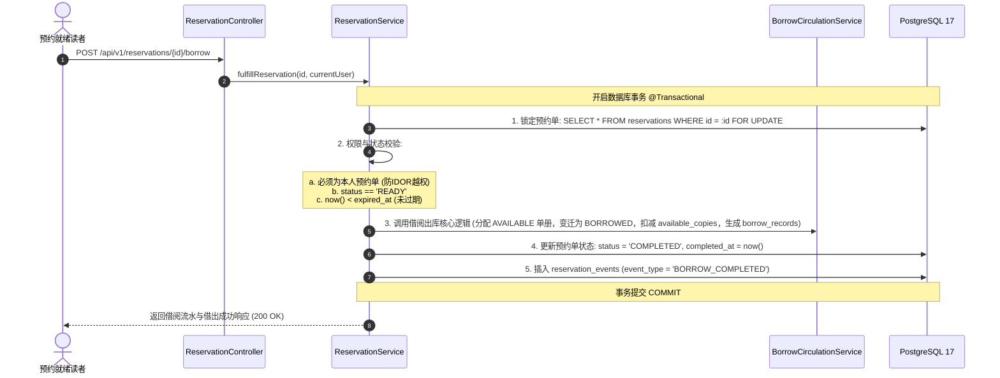

# 《校园图书借阅系统》Stage 4：图书预约与排队流转系统 Design Review 审核报告

> **文档状态**：Design Review 阶段完成，等待项目负责人审批确认  
> **审查对象**：Stage 4 图书预约与排队流转系统（Reservation & Waiting Queue System）  
> **审查日期**：2026-09-17  
> **执行原则**：先审查 → 获批准 → 再编码 → 自动化测试 → Gate 审核 → 停止开发  

---

## 一、阶段背景与目标

在完成 Stage 1-B（用户中心与 RBAC）、Stage 2-A/B（图书领域模型、多维检索与编目管理）以及 Stage 3（图书借阅流通闭环与 50 线程高并发零超卖保障）之后，系统正式进入：

# Stage 4：图书预约与排队流转系统

### 1.1 业务核心目标
当全馆藏某一本图书的全部物理单册均已借出（`available_copies == 0`，且所有单册处于 `BORROWED` 状态）时，允许读者针对该 **书目（Book）** 提交预约申请并进入排队队列；
当其他借阅者向图书馆归还该书的任意物理单册时，系统自动在事务内触发预约队列调度引擎：
$$\text{WAITING} \xrightarrow{\text{图书归还触发}} \text{READY (锁定 48 小时)} \xrightarrow{\text{读者借阅自提}} \text{COMPLETED}$$
若持有 `READY` 资格的读者超过 48 小时未到馆自提借出，定时调度器自动将该记录标记为 `EXPIRED`，并顺延激活下一位排队等待者。

---

## 二、严格边界与纪律坚守（Strict Scope Guardrails）

在 Stage 0.5 架构决策和本次 Stage 4 执行中，必须严格恪守以下纪律：

| 约束项 | 规范要求 | 违规后果与判定 |
|---|---|---|
| **实体粒度** | **Reservation 必须面向 Book，绝不关联 BookCopy** | ❌ 严禁 `reservations.book_copy_id`。读者预约的是“书目”，而非特定物理单册。 |
| **单册状态** | **BookCopy 严格保持纯正 6 种物理状态** | ❌ 严禁在 `book_copies` 增加 `RESERVED` 虚拟状态。单册只能是 `AVAILABLE`, `BORROWED`, `MAINTENANCE`, `DAMAGED`, `LOST`, `SCRAPPED`。 |
| **库存真理源** | **PostgreSQL 数据库为唯一真理源 (Single Source of Truth)** | ❌ 严禁在 Redis 维护虚拟预约队列或预减库存。所有队列排序与行级排他锁均由 PostgreSQL 强事务保障。 |
| **后续阶段隔离** | **绝不提前实现后续阶段功能** | ❌ 严禁提前引入 Stage 5（AI 智能导读、量化评估）、Excel 批量导入、统计大屏报表或第三方支付网关。 |

---

## 三、Stage 4 数据库设计 (Flyway V6)

新增数据库迁移脚本：`V6__create_reservation_tables.sql`

### 3.1 `reservations` 预约主表设计
- `id BIGSERIAL PRIMARY KEY`；
- `reservation_no VARCHAR(32) NOT NULL UNIQUE`（格式：`RSV + yyyyMMddHHmmss + 4位序号`）；
- `user_id BIGINT NOT NULL REFERENCES users(id) ON DELETE RESTRICT`；
- `book_id BIGINT NOT NULL REFERENCES books(id) ON DELETE RESTRICT`；
- `status VARCHAR(20) NOT NULL DEFAULT 'WAITING'`；
  - `CHECK (status IN ('WAITING', 'READY', 'COMPLETED', 'CANCELLED', 'EXPIRED'))`；
- `queue_position INT NOT NULL DEFAULT 1 CHECK (queue_position >= 0)`；
- `reserved_at TIMESTAMPTZ NOT NULL DEFAULT CURRENT_TIMESTAMP`；
- `ready_at TIMESTAMPTZ`（触发就绪时间戳）；
- `expired_at TIMESTAMPTZ`（自提保留截止时间戳，默认 `ready_at + 48小时`）；
- `completed_at TIMESTAMPTZ`（借出履约完成时间戳）；
- `created_at TIMESTAMPTZ NOT NULL DEFAULT CURRENT_TIMESTAMP`；
- `updated_at TIMESTAMPTZ NOT NULL DEFAULT CURRENT_TIMESTAMP`。

### 3.2 `reservation_events` 预约生命周期事件流表
记录预约流转中每一个关键里程碑，为系统审计、答辩展示与异常追溯提供不可篡改的日志证据链：
- `id BIGSERIAL PRIMARY KEY`；
- `reservation_id BIGINT NOT NULL REFERENCES reservations(id) ON DELETE CASCADE`；
- `event_type VARCHAR(30) NOT NULL`；
  - `CHECK (event_type IN ('CREATED', 'READY_TRIGGERED', 'BORROW_COMPLETED', 'CANCELLED', 'EXPIRED'))`；
- `operator_id BIGINT REFERENCES users(id) ON DELETE SET NULL`；
- `description VARCHAR(255)`；
- `created_at TIMESTAMPTZ NOT NULL DEFAULT CURRENT_TIMESTAMP`。

### 3.3 数据库关键约束与索引

| 约束/索引名称 | 类型 | 定义 | 业务保障目标 |
|---|---|---|---|
| `uk_reservations_no` | 唯一约束 | `UNIQUE (reservation_no)` | 保证预约流水单号全局唯一 |
| `uk_reservations_active_user_book` | **部分唯一索引 (Partial Index)** | `UNIQUE (user_id, book_id) WHERE status IN ('WAITING', 'READY')` | **彻底杜绝同一读者对同一本书重复预约防刷**；同时允许已完成/已取消/已过期的历史记录共存 |
| `idx_reservation_book_status_queue` | 复合索引 | `(book_id, status, queue_position ASC, created_at ASC)` | **杜绝内存全量排序**，直接利用索引进行毫秒级队列首位检索与位次调整 |
| `idx_reservations_user_status` | 复合索引 | `(user_id, status, created_at DESC)` | 支撑读者端“我的预约”高效分页查询 |
| `idx_reservations_expired_scan` | 部分索引 | `(expired_at) WHERE status = 'READY'` | 支撑后台定时任务极速扫描超期未领取的预约单 |

---

## 四、核心业务流程与事务并发模型

### 4.1 提交预约申请流程 (`POST /api/v1/reservations`)

### 4.2 还书触发预约就绪流程 (修改 Stage 3 还书核心)

在 `BorrowCirculationServiceImpl.returnBook` 中无缝织入预约调度触发器：

> **设计决策推导：单册与库存状态管理**  
> 1. 为什么 `BookCopy` 依然设置为 `AVAILABLE`？  
>    因为物理上该书已经回馆并在架，完全符合物理 6 态的真实现状，严禁引入虚假的 `RESERVED` 状态；  
> 2. 为什么 `book.available_copies` 依然回加？  
>    因为图书总在馆物理册数确实增加了 1 册，保持 `available_copies <= total_copies` 的数据库物理约束；  
> 3. **如何防止普通读者“截胡”借走已为预约读者保留的图书？**  
>    在 Stage 3 的常规 `borrowBook` 逻辑中加入一道资格防线：  
>    `long readyReservations = reservationRepository.countByBookIdAndStatus(book.getId(), READY);`  
>    若 `book.getAvailableCopies() <= readyReservations`，且当前借书人不是持有该书 `READY` 预约资格的读者，则直接拦截并友好提示：“当前可借副本已被预约读者锁定保留，暂无可直接借阅副本”！

### 4.3 预约读者到馆履约自提流程 (`POST /api/v1/reservations/{id}/borrow`)

### 4.4 预约主动取消流程 (`DELETE /api/v1/reservations/{id}`)
1. **状态判定**：
   - `WAITING` 状态：允许取消。将当前预约单标记为 `CANCELLED`，后续排队读者的 `queue_position` 依次前移减 1。
   - `READY` 状态：允许取消（读者放弃 48 小时保留资格）。标记为 `CANCELLED`，**同时立即在事务中触发激活该书下一位 WAITING 预约读者（若存在）晋升为 READY 并赋予新的 48 小时保留期**；若无后续等待者，名额自然释放归还为公共在架。
   - `COMPLETED` 状态：严禁取消。

### 4.5 预约 48 小时超期定时释放调度器 (`ReservationExpireScheduler`)
- 使用 Spring `@Scheduled(cron = "0 * * * * ?")` 每分钟执行一次高频巡检；
- 查询超期记录：`SELECT * FROM reservations WHERE status = 'READY' AND expired_at < now() FOR UPDATE`；
- 对每一笔超期记录：
  1. 标记为 `EXPIRED`；
  2. 记录 `reservation_events (EXPIRED)`；
  3. **自动顺延触发下一位等待者晋升为 `READY`**（计算新 `expired_at = now() + 48h`，更新剩余等待者 `queue_position`）；
  4. 若无后续等待者，图书自然完全回归公共可借池。

---

## 五、后端 API 清单与契约

| 方法 | 路径 | 权限代码 | 请求参数 / Body | 响应数据结构 | 业务说明 |
|---|---|---|---|---|---|
| **POST** | `/api/v1/reservations` | `reservation:create` | `ReservationCreateRequest` (`bookId`) | `ReservationResponse` | 提交图书预约排队，返回当前排位 |
| **GET** | `/api/v1/reservations/my` | `reservation:view:my` | `page`, `size`, `status` (可选) | `PageResult<ReservationResponse>` | 分页查询当前登录用户的个人预约清单 |
| **GET** | `/api/v1/reservations/{id}` | `reservation:view:my` | `id` (PathVariable) | `ReservationDetailResponse` | 查询单笔预约明细及生命周期事件流 |
| **DELETE** | `/api/v1/reservations/{id}` | `reservation:cancel` | `id` (PathVariable) | `ApiResponse<Void>` | 取消预约（支持 WAITING 与 READY） |
| **POST** | `/api/v1/reservations/{id}/borrow` | `reservation:borrow` | `id` (PathVariable) | `BorrowRecordResponse` | 就绪预约自提借出出库（转为借阅流水） |
| **GET** | `/api/v1/reservations` | `reservation:manage` | `ReservationQueryParam` (`bookId`, `status`, `userId`, `page`, `size`) | `PageResult<ReservationResponse>` | 管理员/馆员全馆预约队列监控与运维 |

---

## 六、RBAC 细粒度权限矩阵

在 `permissions` 表中新增 5 个细粒度权限，并绑定对应角色：

| 权限代码 | 权限名称 | 行为说明 | STUDENT | LIBRARIAN | ADMIN |
|---|---|---|:---:|:---:|:---:|
| `reservation:create` | 提交图书预约 | 允许在图书借空时申请排队预约 | ✅ | ✅ | ✅ |
| `reservation:view:my` | 查询个人预约 | 允许查看本人预约列表与排队位次 | ✅ | ✅ | ✅ |
| `reservation:cancel` | 取消个人预约 | 允许主动放弃排队或就绪预约 | ✅ | ✅ | ✅ |
| `reservation:borrow` | 预约借阅自提 | 允许凭就绪预约单办理图书借出出库 | ✅ | ✅ | ✅ |
| `reservation:manage` | 预约队列管控 | 允许管理员全馆检索、强制作废或手动调度预约 | ❌ | ✅ | ✅ |

---

## 七、Flutter 前端交互设计

### 7.1 图书详情页 (`BookDetailScreen`) 智能借阅/预约联动
- 当书目在馆可用库存 `availableCopies > 0` 时：
  - 按钮保持为：“立即借阅”；
- 当书目在馆可用库存 `availableCopies == 0` 时：
  - 若当前用户尚未预约该书：按钮高亮显示为 **“加入预约队列”**，点击弹出预约确认对话框（提示当前等待人数、预约配额与 48 小时保留规则）；
  - 若当前用户已在该书排队中：按钮显示为 **“排队中 (第 N 位)”**，点击引导跳转至“我的预约”详情；
  - 若当前用户持有该书 `READY` 预约：按钮变更为 **“预约就绪，立即自提”**（伴随脉冲动效）。

### 7.2 专属预约管理页面 (`ReservationScreen`)
- 在“个人中心 / 借阅流通”增加“我的预约”入口；
- 页面设计双视图/状态筛选：
  - **排队中 (`WAITING`)**：大字醒目展示“队列第 **N** 位”，展示预约申请时间，卡片右下角提供“取消预约”二次确认按钮；
  - **可领取 (`READY`)**：橙红色高亮卡片，顶部标明“已就绪·请前往自提架取书”，配备**动态倒计时徽章**（例如：`剩余 47小时 28分`），提供“立即借出”与“取消预约”双按钮；
  - **历史记录 (`COMPLETED` / `CANCELLED` / `EXPIRED`)**：灰色弱化展示，显示完成或失效时间。

---

## 八、自动化测试与高并发压力方案

### 8.1 单元与集成测试覆盖计划 (`ReservationServiceTest`)
1. **正常预约**：零库存图书成功排队，位次为 1；
2. **重复预约拦截**：同一读者再次预约同本书，受数据库部分唯一索引保护抛出 `DUPLICATE_RESERVATION`；
3. **库存充足拦截**：有可用副本时拒绝预约，引导直接借阅；
4. **归还自动触发**：归还图书后，首位等待者状态变迁为 `READY`，`expired_at` 精准设置为 48 小时后；
5. **就绪自提履约**：READY 状态下成功领取借出，预约单变更为 `COMPLETED`，生成合法 `borrow_records`；
6. **取消预约位次顺移**：取消排在前面的预约，后面读者的位次精确自动减 1；
7. **越权操作防护 (IDOR)**：读者 A 尝试取消或领取读者 B 的预约单，严格阻断并返回 403 Forbidden。

### 8.2 100 线程高并发预约争抢测试 (`ReservationConcurrentTest`)
- **场景设计**：
  - 准备一本馆藏为 0 的热门神作图书（`total_copies = 3`, `available_copies = 0`）；
  - 初始化 100 个完全独立的学生读者账号；
  - 使用 `CountDownLatch` 发令枪使 100 个线程在同一毫秒内并发调用 `createReservation`；
- **核心断言与验证指标**：
  - ✅ 100 个预约请求全部成功入库；
  - ✅ 100 个生成的 `queue_position` 精确覆盖 `[1, 2, ..., 100]`，**绝无重复、绝无空缺跳号**；
  - ✅ `uk_reservations_active_user_book` 保证 0 脏数据与 0 幂等违背；
  - ✅ 0 死锁、0 数据库锁超时。

### 8.3 超期巡检调度器测试 (`ReservationExpireSchedulerTest`)
- 模拟一条已到达失效时间的 `READY` 记录；
- 触发调度器执行，验证该单变更为 `EXPIRED`，且下一位等待者无缝自动晋升为 `READY`。

### 8.4 Flutter 页面组件测试 (`reservation_screen_test.dart`)
- 验证“排队中”、“可领取”与“已失效”不同状态卡片的准确渲染；
- 验证 48 小时倒计时展示；
- 验证点击“取消预约”与“立即借出”弹窗交互逻辑。

---

## 九、Stage 4 最终 Gate 验收标准 (Gate Checklist)

实施完成后必须全部打勾通过：

- [ ] Flyway V6 数据库迁移成功执行，表结构与约束完全生效；
- [ ] `Reservation` 严格面向 `Book`，数据库绝无 `book_copy_id` 列；
- [ ] `BookCopy` 严格保持 6 种物理状态，绝无 `RESERVED` 状态；
- [ ] 创建预约流程风控与排队计算正确，库存充足时正确拒绝；
- [ ] 图书归还事务正确自动触发排队首位晋升 `READY`；
- [ ] 48 小时自提锁定与超期定时释放调度机制稳定可靠；
- [ ] 普通读者无法借走属于预约读者的保留配额；
- [ ] 100 线程并发预约排位无重复且无死锁；
- [ ] RBAC 细粒度权限控制与 IDOR 防护 100% 验证；
- [ ] 后端测试 100% 通过（目标 120+ 测试用例）；
- [ ] Flutter 前端测试 100% 通过且 `flutter analyze` 零问题；
- [ ] 绝无提前实现 Stage 5 AI 或统计报表代码。

---

## 十、审核结论

**当前状态**：Stage 4 Design Review 文档编写完成，当前**未修改任何生产代码、未创建任何实体类与迁移脚本**。  
请项目负责人审查并确认本设计。确认批准后，我们将正式进入编码实施与自动化测试阶段。
