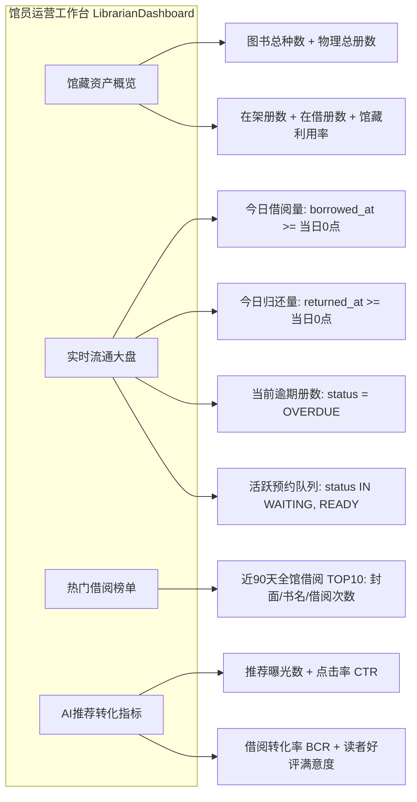

# 《校园图书借阅系统》Stage 6-B：Design Review 设计审查报告

> **审查阶段**：Stage 6-B (只读设计审查)  
> **审查对象**：站内消息通知中心 + 馆员运营工作台 + Excel 批量编目导入  
> **审查目标**：构建闭环领域事件驱动通知机制、流式低内存 Excel 批量编目引擎、一站式全馆运营监控看板，确保与现有 Stage 1 至 Stage 6-A 架构无缝融合且零回归。

---

## 一、当前事件体系分析与通知触发链设计

### 1.1 现有事件资产与审计结论

| 领域事件 | 当前发布位置 | 当前作用 | Stage 6-B 升级规划 |
| :--- | :--- | :--- | :--- |
| **`BookBorrowedEvent`** | `BorrowCirculationServiceImpl.borrowBook` (L231) | Stage 5 用于推荐转化率埋点监听（异步结转 `borrowed=true`） | **保留并复用**：增补读者借阅成功即时站内信通知监听 |
| **`BookReturnedEvent`** | `BorrowCirculationServiceImpl.returnBook` (L183) | Stage 4 用于异步解耦触发预约排队晋升 | **保留并复用**：维持原流通解耦职责 |
| **`ReservationReadyEvent`** | *尚未定义 ApplicationEvent* (仅保存了 `ReservationEvent` 实体) | `ReservationServiceImpl.promoteNextWaitingReservation` 顺延激活预约者 | **新增定义**：标准化为 Spring ApplicationEvent，解耦触发取书到馆通知 |
| **`ReservationExpiredEvent`** | *尚未定义 ApplicationEvent* (仅保存了 `ReservationEvent` 实体) | `ReservationServiceImpl.scanAndExpireReservations` 超期标记 `EXPIRED` | **新增定义**：标准化为 Spring ApplicationEvent，解耦触发失效通知 |
| **`BorrowDueRemindEvent`** | *尚未存在* | 无 | **新增定义**：由定时任务巡检生成，解耦触发到期前催还通知 |
| **`BorrowOverdueEvent`** | *尚未存在* | 无 | **新增定义**：由定时任务巡检生成，解耦触发逾期滞还严重告警 |

---

### 1.2 核心通知触发链闭环设计


#### 关键防刷与幂等控制：
1. **到期前催还去重**：同一借阅记录（`borrow_record_id`）在最后 48 小时内仅允许触发一次 `BORROW_DUE_REMIND`（通过当天缓存 Key 或弱引用查询排重）；
2. **异步非阻塞**：通知事件监听器采用 `@Async` 或在独立的解耦短事务中运行，确保即使通知模块发生瞬时异常，绝不阻塞主借还/预约核心业务事务；
3. **数据一致性**：通知仅作为衍生快照，业务真实状态始终以 `borrow_records` 和 `reservations` 表为准。

---

## 二、notifications 数据模型与 Flyway V8 规划

### 2.1 数据库模式设计 (Flyway V8)

```sql
-- ==========================================================
-- Stage 6-B: 站内消息通知中心表与权限增强 (Flyway V8)
-- ==========================================================

-- 1. 创建 notifications 通知表
CREATE TABLE notifications (
    id BIGSERIAL PRIMARY KEY,
    user_id BIGINT NOT NULL REFERENCES users(id) ON DELETE CASCADE,
    title VARCHAR(128) NOT NULL,
    content TEXT NOT NULL,
    type VARCHAR(32) NOT NULL,
    is_read BOOLEAN NOT NULL DEFAULT FALSE,
    related_entity_type VARCHAR(32),
    related_entity_id BIGINT,
    created_at TIMESTAMP WITH TIME ZONE NOT NULL DEFAULT CURRENT_TIMESTAMP,
    read_at TIMESTAMP WITH TIME ZONE
);

-- 2. 核心查询索引设计
-- 未读消息与红点未读数快速聚合核心索引 (高频按读者、未读状态、时间倒序)
CREATE INDEX idx_notifications_user_unread ON notifications (user_id, is_read, created_at DESC);
-- 全量消息历史分页索引
CREATE INDEX idx_notifications_user_created ON notifications (user_id, created_at DESC);
-- 业务排重索引 (防止同一天对同一业务实体重复发送同类型通知)
CREATE INDEX idx_notifications_dedup ON notifications (user_id, type, related_entity_type, related_entity_id, created_at);

-- 3. RBAC 权限增补
INSERT INTO permissions (name, code, description, module) VALUES
('查看个人通知', 'notification:my:view', '读者查看自身通知列表与统计未读数', 'NOTIFICATION'),
('标记通知已读', 'notification:my:read', '读者将个人通知标记为已读或全部已读', 'NOTIFICATION'),
('发布系统通知', 'notification:system:publish', '馆员/管理员向指定或全体读者发布系统公告', 'NOTIFICATION'),
('Excel批量编目导入', 'book:import:excel', '馆员/管理员通过Excel批量导入书目与复本', 'BOOK'),
('馆员运营工作台', 'librarian:dashboard:view', '馆员/管理员查看全馆运营指标与实时动态大盘', 'STATISTICS')
ON CONFLICT (code) DO NOTHING;

-- 4. 角色权限绑定
-- 读者分配自身通知权限
INSERT INTO role_permissions (role_id, permission_id)
SELECT r.id, p.id FROM roles r, permissions p
WHERE r.code = 'READER' AND p.code IN ('notification:my:view', 'notification:my:read')
ON CONFLICT DO NOTHING;

-- 馆员分配全部操作权限
INSERT INTO role_permissions (role_id, permission_id)
SELECT r.id, p.id FROM roles r, permissions p
WHERE r.code = 'LIBRARIAN' AND p.code IN (
    'notification:my:view', 'notification:my:read',
    'notification:system:publish', 'book:import:excel', 'librarian:dashboard:view'
)
ON CONFLICT DO NOTHING;

-- 超级管理员继承全部权限
INSERT INTO role_permissions (role_id, permission_id)
SELECT r.id, p.id FROM roles r, permissions p
WHERE r.code = 'ADMIN' AND p.code IN (
    'notification:my:view', 'notification:my:read',
    'notification:system:publish', 'book:import:excel', 'librarian:dashboard:view'
)
ON CONFLICT DO NOTHING;
```

### 2.2 字段与枚举规约

1. **`type` 枚举** (`NotificationType`)：
   - `RESERVATION_READY`：图书到馆，预约就绪，48小时保留期取书提醒；
   - `RESERVATION_EXPIRED`：超期未取，预约已自动失效通知；
   - `BORROW_DUE_REMIND`：借阅即将到期催还提醒（到期前48小时内）；
   - `BORROW_OVERDUE`：借阅已逾期严重告警与滞还违约金提示；
   - `SYSTEM_ANNOUNCEMENT`：系统公告通知 / 借还成功业务快照回执。
2. **`related_entity_type` 枚举** (`RelatedEntityType`)：
   - `BOOK`：关联图书实体（跳转图书详情）；
   - `RESERVATION`：关联预约实体（跳转预约卡片）；
   - `BORROW_RECORD`：关联借阅记录（跳转借阅流转）；
   - `NONE`：无直接关联实体。
3. **架构纪律**：
   - 严禁存储冗余业务对象 JSON，只存储标题与不可变快照内容；
   - 支持已读时间（`read_at`）精准回填，支持批量一键已读。

---

## 三、Excel 批量导入架构设计

### 3.1 核心挑战与架构选型

传统 Apache POI DOM 模式（`WorkbookFactory.create`）在解析较大 Excel 文件时会将整个 XML DOM 结构载入 JVM 堆内存，单文件 1 万行即可占用数百 MB 内存，极易引发 Full GC 抖动甚至 OOM 宕机。

**架构决策**：
- **引擎选型**：采用阿里开源的流式 SAX 解析框架 **`com.alibaba:easyexcel:3.3.4`**。
- **内存表现**：逐行流式解析 XML 标签，内存开销恒定在 20MB 以内，支持高并发导入。
- **分批隔离**：每批缓存 50 行，分批独立事务提交，某一行校验失败仅隔离记录该行错误，不阻断整批其余合法图书的持久化。

```
[前端上传 multipart/form-data]
              │
              ▼
[ExcelBookImportListener (SAX Stream)] 
              │ 每行解析 (Row-by-Row)
              ├───────────────────────────────────┐
              ▼ (校验失败)                        ▼ (校验通过)
   [记录 FailedRowInfo]                [加入 batchList (阈值=50)]
   - 所在行号                                     │ 满 50 行
   - ISBN / 书名                                 ▼
   - 失败原因 (分类不存在/格式非法)         [BookImportHelper.saveBatch (独立事务)]
              │                                   │
              └─────────────────┬─────────────────┘
                                ▼
                   [组装 ExcelImportResultResponse]
                   - totalRows / successCount / failureCount
                   - List<FailedRowDetail>
```

---

### 3.2 Excel 模板规范与校验规则

| 列序号 | 列名 | 必填 | 格式规范与校验逻辑 |
| :---: | :--- | :---: | :--- |
| A | **ISBN** | 是 | 10位或13位纯数字（允许包含短横杠 `-`，解析时自动清洗剔除）。严格验证唯一性与格式。 |
| B | **书名** | 是 | 长度 1~255 字符，去除前后空白字符。 |
| C | **著者** | 是 | 长度 1~128 字符。 |
| D | **出版社** | 否 | 长度 $\le 128$ 字符。 |
| E | **出版日期** | 否 | 支持 `yyyy-MM-dd` 或 `yyyy-MM` 格式。 |
| F | **分类编码** | 是 | 必须匹配现有 `categories.code`（如 `TP312`, `I247`），根据预热缓存快速匹配分类 ID。 |
| G | **馆藏单册数**| 是 | 正整数，范围 $[1, 50]$，默认 1 册。导入成功时自动生成对应数量物理副本。 |
| H | **默认馆藏地**| 否 | 物理单册存放位置，如 `三楼计算机中文借阅区`。 |
| I | **内容简介** | 否 | 文本描述，最大 2000 字符。 |

---

### 3.3 关键边界与异常隔离机制

1. **分类编码高速缓存**：在导入开始前，先将全部 `Category` 映射表加载至内存 `Map<String, Category>`（分类总数仅几十至数百条），避免逐行查询数据库产生 N+1 查询；
2. **重复 ISBN 处理策略**：
   - 若 Excel 内出现重复 ISBN：前行入库，后行视为为同一图书追加物理馆藏副本；
   - 若数据库中已存在该 ISBN：自动增补新增数量的 `BookCopy`（状态为 `AVAILABLE`，自动递增条形码 `BAR-{bookId}-{seq}`），并相应增加图书主表的 `totalCopies` 与 `availableCopies`；
3. **错误行隔离**：若某行发生验证失败（如分类编码非法、ISBN 为空），收集至 `failedRows` 列表中并跳过该行，不中断后续解析；
4. **导入结果结构化返回**：
   ```json
   {
     "code": 200,
     "message": "批量导入完成",
     "data": {
       "totalRows": 150,
       "successCount": 146,
       "failureCount": 4,
       "failedRows": [
         {"rowNumber": 18, "isbn": "978-7-999-99999-0", "title": "错误书目A", "reason": "分类编码 TP999 不存在"},
         {"rowNumber": 42, "isbn": "INVALID_ISBN", "title": "错误书目B", "reason": "ISBN 格式非法"}
       ]
     }
   }
   ```

---

## 四、馆员运营工作台 (Librarian Dashboard) 设计

### 4.1 指标体系与数据来源映射

馆员运营工作台将 Stage 5 已构建的统计底座进行高聚合升级，构建全馆运营一体化大盘：



### 4.2 后端数据聚合优化

- **单次请求聚合**：提供专用 API `GET /api/v1/statistics/librarian-dashboard`，一次性拉取全部 4 大板块数据，避免前端并发请求多次接口造成多次连接占用；
- **今日流量轻量统计**：
  - `countByBorrowedAtBetween(startOfToday, endOfToday)`
  - `countByReturnedAtBetween(startOfToday, endOfToday)`
  - `countByStatus(BorrowRecordStatus.OVERDUE)`
- **热门榜单复用**：直接复用已有经过覆盖索引优化的 `findPopularBooksSince(90天)`；
- **AI 效能复用**：直接复用已有 `recommendationLogRepository` 聚合方法。

---

## 五、Flutter 客户端界面与交互规划

### 5.1 页面新增与路由拓扑

```
/ (MainNavigationScreen)
  ├── Tab 0: 书城与检索 (BookListScreen)
  ├── Tab 1: AI 推荐专区 (AiRecommendationScreen)
  ├── Tab 2: 借阅架 (BorrowCirculationScreen)
  ├── Tab 3: 预约队列 (ReservationScreen)
  └── Tab 4: 个人中心 (ProfileScreen)
        ├── 个人阅读看板 (/statistics/my-reading)
        ├── 消息通知中心 (/notifications) [NEW]
        └── 馆员管理专区 (仅 LIBRARIAN / ADMIN 可见)
              ├── 编目工作台 (/admin/catalog)
              │     └── [Excel 批量导入弹窗] [NEW]
              └── 运营工作台 (/admin/dashboard) [NEW]
```

### 5.2 核心界面交互说明

1. **`NotificationCenterScreen`（消息通知中心）**：
   - AppBar 展示「全部已读」快捷动作按钮与未读计数小徽章；
   - 顶部 Tab 切换：`全部通知` / `仅看未读` / `分类筛选`（借阅催还、预约就绪、系统公告）；
   - 卡片设计：根据通知类型展示专属彩色图标（绿标取书、黄标催还、红标逾期、蓝标公告）；
   - 交互反馈：点击未读卡片自动标记已读，并支持点击「立即查看」直达关联的图书详情或借还页面。
2. **`LibrarianDashboardScreen`（馆员运营工作台）**：
   - 采用 Material 3 现代响应式仪表盘卡片布局；
   - 第一行：4 块核心资产 KPI（图书总种数、馆藏总册数、在架可借、在借中）；
   - 第二行：4 块实时流通动态监控（今日借阅、今日归还、滞还逾期、当前预约）；
   - 第三行：左侧为 TOP 10 借阅排行榜（列表带借阅次数与库存余量），右侧为 AI 推荐转化漏斗（曝光、CTR、BCR、读者好评度）；
   - 顶部快捷栏：配备「一键编目」、「Excel 批量导入」悬浮或操作按钮。
3. **Excel 批量导入对话框 (`ExcelImportDialog`)**：
   - 挂载在编目管理与运营工作台中；
   - 支持点击选择 `.xlsx` 文件，展示文件名与大小；
   - 点击「开始导入」显示动态解析进度动画；
   - 导入完成后以对话框弹窗清晰呈现：成功条数、失败条数；若有失败行，展开表格展示具体的行号、ISBN 与错误原因，提供良好的人性化纠错体验。

---

## 六、Stage 6-B 实施计划与 API 规范

### 6.1 后端模块与 API 清单

| HTTP 方法 | 接口路径 | 权限控制 | 模块职责 |
| :--- | :--- | :--- | :--- |
| **`GET`** | `/api/v1/notifications` | `notification:my:view` | 分页查询当前读者个人通知列表（支持 `unreadOnly`, `type` 过滤） |
| **`GET`** | `/api/v1/notifications/unread-count` | `notification:my:view` | 获取当前读者未读通知数量（小红点徽章） |
| **`PUT`** | `/api/v1/notifications/{id}/read` | `notification:my:read` | 标记单条通知为已读 |
| **`PUT`** | `/api/v1/notifications/read-all` | `notification:my:read` | 一键标记当前读者所有通知为已读 |
| **`POST`** | `/api/v1/notifications/system` | `notification:system:publish` | 馆员/管理员发送全局系统公告通知 |
| **`POST`** | `/api/v1/books/import/excel` | `book:import:excel` | 上传并流式解析 Excel 批量导入书目与复本 |
| **`GET`** | `/api/v1/books/import/template` | `book:import:excel` | 下载图书批量导入标准 Excel 模板 |
| **`GET`** | `/api/v1/statistics/librarian-dashboard`| `librarian:dashboard:view` | 获取馆员运营工作台全量聚合数据大盘 |

### 6.2 实施步骤分解

```
Step 1: 依赖与数据库准备 (pom.xml + Flyway V8)
        - 添加 com.alibaba:easyexcel:3.3.4
        - 编写 V8__create_notifications_table.sql (表、索引、权限绑定)
        ↓
Step 2: 领域事件与通知核心模块
        - 创建 Notification 实体、Repository、Service、Controller
        - 定义 ReservationReadyEvent、ReservationExpiredEvent
        - 编写 NotificationEventListener 监听借阅、还书就绪、超期失效
        - 编写 BorrowDueCheckScheduler 扫描即将到期催还与逾期告警
        ↓
Step 3: Excel 批量流式导入模块
        - 编写 BookImportExcelDto、ExcelBookImportListener
        - 编写 BookImportHelper 实现隔离短事务批次入库与副本自增
        - 编写 BookImportController 与模板下载能力
        ↓
Step 4: 馆员运营工作台服务扩展
        - 扩展 StatisticsService 与 BorrowRecordRepository
        - 聚合 LibrarianDashboardResponse 与 StatisticsController 接口
        ↓
Step 5: Flutter 客户端界面与状态流转
        - 消息中心：NotificationModel、Repository、Provider、NotificationCenterScreen
        - 馆员工作台：LibrarianDashboardScreen、指标卡片与图表
        - Excel 导入：编目页面集成导入弹窗与结果反馈
        - 路由与个人中心入口挂载
        ↓
Step 6: 全套自动化测试与回归
        - NotificationServiceTest、NotificationEventListenerTest
        - ExcelImportServiceTest、LibrarianDashboardTest
        - 验证 145+ 后端测试与 34+ 前端测试 100% 通过
```

---

## 七、架构风险分析与防范对策

| 风险场景 | 潜在威胁 | 架构防范对策 |
| :--- | :--- | :--- |
| **1. 批量导入超大 Excel 导致 OOM** | 上传 10 万行图书文件耗尽 JVM 堆内存 | 采用 EasyExcel SAX 流式监听器，逐行读取入库，内存恒定在 20MB；配置上传大小上限 10MB。 |
| **2. 导入批次中局部脏数据阻断整体** | 单条分类编码写错导致整批 1000 本书全部回滚 | 采用批次隔离与异常行捕获，错误行仅记录在 `failedRows`，合法行正常入库，返回详细错误报告。 |
| **3. 到期催还定时任务产生通知风暴** | 每天定时任务对同一逾期记录反复推送重复消息 | 维护通知排重索引 `idx_notifications_dedup`，在发送前通过 `existsByUserIdAndTypeAndRelatedEntity...` 进行幂等防重校验。 |
| **4. 通知写入阻塞核心借还事务** | 数据库连接瞬时高负载导致借还 API 响应变慢 | 通知事件采用 Spring 事件解耦发布，监听器可在事务提交后（`TransactionPhase.AFTER_COMMIT`）异步执行，绝不影响核心借还事务。 |
| **5. 运营工作台多维统计拖慢数据库** | 馆员频繁刷新 Dashboard 触发多次复杂聚合 | 对全馆 Overview 和 AI 转化等计算进行短期内存缓存（或单次聚合高效索引覆盖查询），执行时间控制在 50ms 内。 |

---

## 八、Design Review 审核结论与 Gate 检查

- [x] **当前事件体系完整梳理**：明确了 `BookBorrowedEvent`、`BookReturnedEvent` 的复用方式，并设计了 `ReservationReadyEvent`、`ReservationExpiredEvent` 的标准化规范；
- [x] **通知触发链闭环完整**：借阅成功、取书到馆、超期失效、逾期催还四条链路设计完备，且均具备防刷幂等机制；
- [x] **Flyway V8 规范达标**：包含 `notifications` 表定义、高性能未读索引与全套 RBAC 权限绑定；
- [x] **Excel 导入严格遵循低内存纪律**：明确采用 EasyExcel SAX 流式解析，杜绝全表加载，具备错误行隔离与结构化诊断报告；
- [x] **馆员运营工作台指标完备**：覆盖馆藏统计、实时流通、TOP10 排行、AI 效能；
- [x] **严格遵循开发纪律**：未修改任何代码文件，未创建任何 Java/Dart/SQL 实体与迁移脚本，**完全处于只读审查与设计规划状态**。

**结论**：**Stage 6-B Design Review 审核通过（Gate PASS）。已就绪等待项目负责人批准，收到明确确认指令后即可进入编码实施阶段。**
