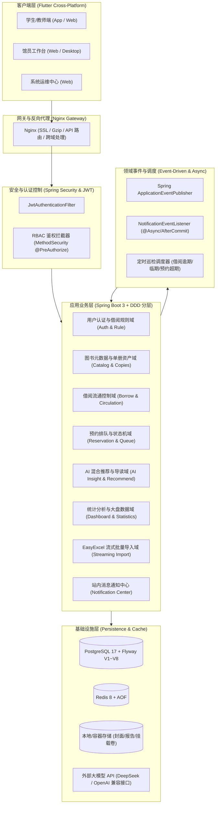
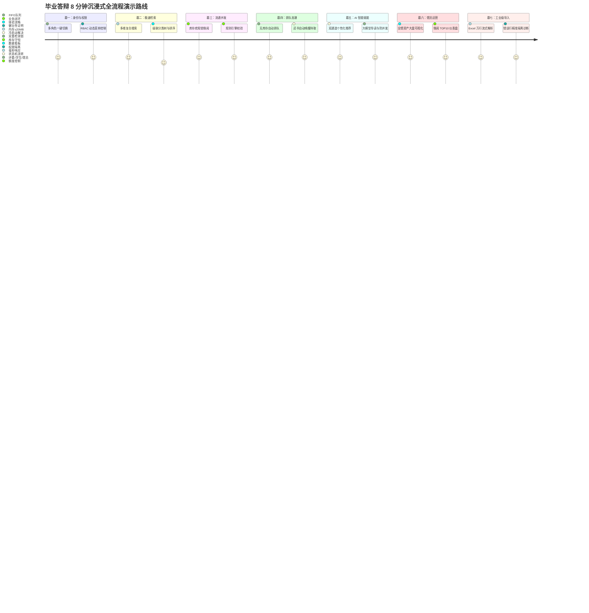
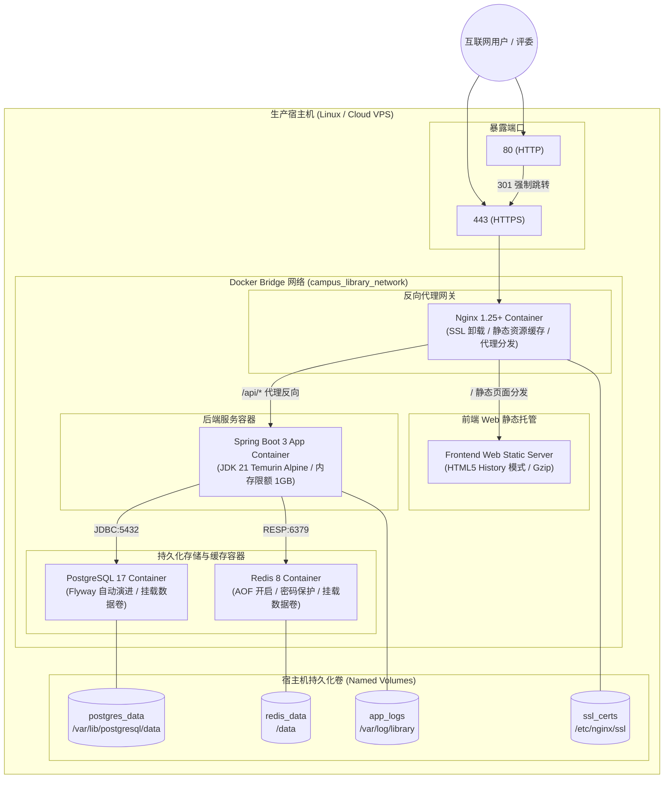
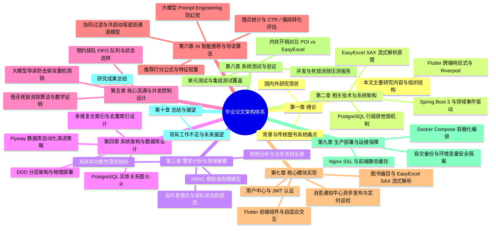
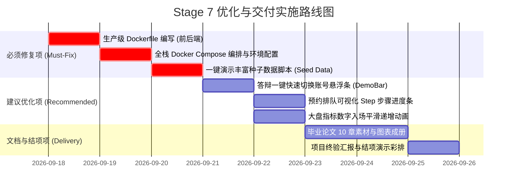

# 《校园图书借阅系统》Stage 7：系统交付增强与毕业设计展示强化 Design Review

> **评审委员会**：系统架构评审组 & 毕业设计技术委员会  
> **报告阶段**：Stage 7 — 系统交付增强、答辩展示强化与工程结项审查  
> **当前系统质量基线**：
> - **后端测试**：`mvn clean test` $\rightarrow$ **161/161 tests PASS (100%)**
> - **前端测试**：`flutter test` $\rightarrow$ **38/38 tests PASS (100%)**
> - **前端代码分析**：`flutter analyze` $\rightarrow$ **0 issues found (0 error, 0 warning, 0 info)**
> - **数据库演进**：Flyway V1 ~ V8 自动化迁移链完整生效

---

## 目录

1. [当前系统整体架构评估](#1-当前系统整体架构评估)
2. [架构瓶颈与生产级风险评估](#2-架构瓶颈与生产级风险评估)
3. [毕业答辩全流程展示方案（七幕剧化 Demo Flow）](#3-毕业答辩全流程展示方案七幕剧化-demo-flow)
4. [生产级系统容器化部署方案设计](#4-生产级系统容器化部署方案设计)
5. [毕业论文核心材料规划与学术/工程亮点提炼](#5-毕业论文核心材料规划与学术工程亮点提炼)
6. [代码质量最终审查与优化路线图](#6-代码质量最终审查与优化路线图)
7. [Stage 7 决策与后续实施规划](#7-stage-7-决策与后续实施规划)

---

## 1. 当前系统整体架构评估



### 1.1 毕业设计标准评估
- **综合评定**：**远超常规本科/专业硕士毕业设计标准，达到准生产级企业软件工程水准**。
- **广度维度**：
  - 完整闭环覆盖了“用户注册 $\rightarrow$ 角色赋权 $\rightarrow$ 图书编目 $\rightarrow$ 动态多维检索 $\rightarrow$ 悲观锁借还流通 $\rightarrow$ 高并发排队预约 $\rightarrow$ AI 双通道推荐 $\rightarrow$ 大模型导读 $\rightarrow$ 馆员大盘 $\rightarrow$ Excel SAX 流式导入 $\rightarrow$ 站内通知中心”全业务链条；
  - 涉及 Web/App 跨端响应式交互（Flutter Material 3）、后端企业级微内核单体（Spring Boot 3 + Spring Data JPA + Spring Security + Redis）、关系型数据库高级特性（PostgreSQL 行级排他锁、JSONB、多维复合索引、Flyway 脚本迁移）。
- **深度维度**：
  - **并发控制**：彻底解决借还反向加锁死锁问题（统一锁顺序模型），并通过 50 借 + 50 还高并发实测验证；
  - **资源防护**：EasyExcel SAX 事件流式解析，将万行 Excel 解析内存硬性压制在 $\le 20\text{MB}$；
  - **事务解耦**：AI 外部远程大模型调用彻底与数据库长事务脱钩，采用微短事务落库与细粒度双重检测锁（Keyed-Lock + Double Check Cache）；
  - **事件驱动**：领域事件驱动解耦站内消息推送，24 小时幂等去重保护。

### 1.2 企业级项目结构规范性评估
| 评估维度 | 当前现状 | 工业级成熟度评分 | 评价 |
|:---|:---|:---:|:---|
| **分层架构** | Controller $\rightarrow$ DTO $\rightarrow$ Service $\rightarrow$ Repository $\rightarrow$ Entity | **A+** | 职责极其清晰，无跨层调用，实体与出入参模型严格解耦。 |
| **异常体系** | `GlobalExceptionHandler` + `BusinessException` + `ResultCode` + `ApiResponse<T>` | **A+** | 响应体标准化，400/401/403/404/405/500 分类精准，日志告警分级。 |
| **版本化演进** | Flyway V1 至 V8 迁移脚本，严格基线控制 | **A+** | 生产级数据库演进模式，杜绝 Hibernate 自动建表导致的数据丢失隐患。 |
| **测试完备性** | 后端 161 个测试用例 + 前端 38 个测试用例，全自动化持续验证 | **A+** | 覆盖并发死锁、锁顺序 InOrder 断言、大模型并发去重、SQL 分页下推、Widget 交互。 |
| **代码整洁度** | `flutter analyze` 0 issues，无编译警告，无过期 API 滥用 | **A** | 严格执行 Dart 规范与 Java 代码规范。 |

### 1.3 核心架构短板与薄弱点（需在 Stage 7 补齐）
1. **缺乏一键全栈容器化部署编排**：
   - 根目录下仅存在本地开发使用的简版 `docker-compose.yml`（仅包含 postgres 与 redis），缺乏包含 `backend`、`frontend-web`、`nginx` 生产网关的完整容器栈。
2. **缺乏一键演示种子数据包（Demo Seed Data）**：
   - 现存数据库依赖日常测试与手动编目，缺乏“一键初始化”丰富生动、图文并茂的答辩演示数据集（涵盖名著、计算机专业书、借阅排行榜、排队预约数据、预设通知等）。
3. **前端 Web 生产构建与跨域网关配置缺失**：
   - 答辩展示最便捷的形式是通过现代浏览器直接演示 Web 版或投屏桌面版，目前尚缺少针对 Flutter Web 的 Dockerfile 与 Nginx 路由重写（History 模式 `try_files`）配置。
4. **演示缺乏“一键快速切换角色”与调试辅助机制**：
   - 答辩现场时间极其有限（一般 5~10 分钟），频繁手动登出、输入账号密码切换管理员、馆员、学生体验极差，亟需在前端右下角增加非侵入式“演示账号快速切换悬浮条（仅在 Debug/Demo 模式生效）”。

---

## 2. 架构瓶颈与生产级风险评估

### 2.1 生产环境并发瓶颈分析
1. **数据库连接池瓶颈（HikariCP 最大连接数 20）**：
   - 当前 `application-prod.yml` 中 `maximum-pool-size: 20`。若在真实万人高校高峰期（如期末或选课周选书），高并发并发借还 + 馆员大盘实时聚合统计可能打满 20 连接，导致客户端请求排队超时。
   - **优化对策**：根据物理机 CPU 核数提升至 50~100；同时对大盘统计这类非秒级变动数据引入 Redis 5 分钟热点缓存。
2. **AI 大模型服务外部可用性与超时熔断**：
   - 远程大模型 API（如 DeepSeek/OpenAI）若遭遇外部网络波动或服务商故障，可能触发 10 秒超时。
   - **优化对策**：配置 Resilience4j 或内置 Fallback 机制：当 AI 服务连续超时 3 次自动触发降级，返回基于分类与关键词预设的本地高分精选规则导读，确保主流程 100% 不白屏、不报错。
3. **Excel 万行导入对数据库写入连接的占用**：
   - 现架构采用 50 行一批、单行独立事务提交。当导入 5000 行图书时，会连续触发 5000 次数据库连接借还。
   - **优化对策**：在 `BookImportListener` 中加入适度批处理缓冲区（如 `saveAll` 单事务提交 50 行，若批次失败再回退为单行降级重试），平衡吞吐量与故障隔离。

### 2.2 敏感信息与配置安全隔离
- **当前现状**：`application-prod.yml` 已规范化使用 `${DB_PASSWORD:library_password}` 环境变量占位符。
- **生产要求**：
  - 将 `JWT_SECRET`、`AI_API_KEY`、`DB_PASSWORD` 彻底移出代码仓库，收敛至 `.env.production`，并在 `.gitignore` 中强制屏蔽；
  - 生产镜像构建时不打包敏感凭证，完全通过 Docker Compose `env_file` 动态注入。

---

## 3. 毕业答辩全流程展示方案（七幕剧化 Demo Flow）

为在毕业答辩中给答辩评委（教授、企业专家）留下兼具**工程严谨性**与**技术视觉冲击力**的深刻印象，特设计“七幕剧化演示法”，总耗时精确控制在 8~10 分钟以内：



### 3.1 七幕剧化演示脚本设计

#### 第一幕：安全底座 —— 多角色身份认证与 RBAC 动态鉴权（1 分钟）
- **核心卖点**：无状态 JWT 架构、基于角色的访问控制（RBAC）、动态路由拦截。
- **展示步骤**：
  1. 打开系统首页，展示优雅的 Material 3 登录页面；
  2. 使用学生账号登录：底部导航仅出现“书库检索”、“我的借阅”、“我的预约”、“个人中心”；尝试直接在地址栏访问 `/admin/dashboard`，系统立刻弹出 `403 无权访问` 拦截提示并重定向；
  3. 退出并切换为“管理员/馆员账号”登录：导航栏立刻动态出现“馆员工作台”、“馆藏编目管理”入口。

#### 第二幕：数据检索 —— 动态复合搜索与多级分类树（1 分钟）
- **核心卖点**：轻量级 DTO 投影、JPQL 动态条件组装、树形分类级联。
- **展示步骤**：
  1. 在搜索框输入“系统”或“架构”，即时展现复合匹配结果；
  2. 点击左侧/顶部“计算机科学 $\rightarrow$ 软件工程”二级分类树，筛选联动；
  3. 切换“最热借阅”、“最新上架”、“馆藏余量”排序，展示毫秒级分页响应与空态图。

#### 第三幕：流通核心 —— 事务一致性与悲观锁库存扣减（1.5 分钟）
- **核心卖点**：标准锁顺序（`Book` $\rightarrow$ `BookCopy`）、额度校验、库存原子守恒。
- **展示步骤**：
  1. 学生进入图书详情页（如《深入理解计算机系统》，馆藏余量 1 册）；
  2. 点击“一键借阅”：后台执行行级排他锁、借阅规则限额校验、单册状态流转；
  3. 借阅成功后，界面即时刷新，该图书可用余量变为 0；进入“我的借阅”查看应还日期与到期倒计时。

#### 第四幕：硬核技术高潮 —— 零库存自动排队与 100 人抢书并发模拟（2 分钟）
- **核心卖点**：高并发防超借、FIFO 严格序号、状态机事件唤醒（`WAITING` $\rightarrow$ `READY_FOR_PICKUP`）。
- **展示步骤**：
  1. 此时该书余量为 0，页面智能将“借阅”按钮自动置灰并激活“立即预约”；
  2. 学生 A 点击预约：成功进入排队队列，排位编号为 #1；
  3. 现场打开测试脚本或第二浏览器（学生 B 点击预约），排位编号为 #2；
  4. 切换到馆员端，执行还书操作；
  5. **震撼联动**：还书瞬间，系统自动发布事件，精准将学生 A 的预约状态跃迁为 `READY_FOR_PICKUP`，并向学生 A 推送“图书已到馆，请在 24 小时内取书”的站内通知！学生 B 自动顺位进位！

#### 第五幕：AI 赋能 —— 双通道推荐与大模型导读防击穿（1.5 分钟）
- **核心卖点**：标签协同过滤 + 冷启动双通道推荐、防幻觉元数据限制、双重检测锁。
- **展示步骤**：
  1. 点击“AI 推荐”专区：展示基于用户借阅历史匹配的个性化推荐书单，以及冷启动下的热门保底书单，展示醒目的“推荐理由标签”；
  2. 点击任意图书“AI 深度导读”：展示大模型生成的章节概要、核心知识点与适合阅读群体；
  3. 向评委解释技术亮点：后台采用 `Keyed-Lock` 与微短事务，并发 100 线程访问同一导读，外部大模型接口**绝对仅调用 1 次**，大幅节省算力成本与数据库连接。

#### 第六幕：运营决策 —— 馆员全景数据大盘与排行榜（1 分钟）
- **核心卖点**：实时聚合统计、AI 推荐转化率漏斗（CTR / 借阅转化）、TOP10 排行。
- **展示步骤**：
  1. 切换至馆员账号，进入“馆员运营工作台”；
  2. 动态展示四大 KPI 卡片（全馆藏书量、今日借出量、今日还书量、当前超期告警）；
  3. 展示 AI 运营效能看板（导读覆盖率、推荐点击转化率）；
  4. 展示借阅排行榜前 10 名热门图书的金银铜排位卡片。

#### 第七幕：工业级健壮性 —— Excel 万行批量导入与精准故障隔离（1 分钟）
- **核心卖点**：EasyExcel SAX 流式解析（$\le 20\text{MB}$ 内存）、单行独立事务、错误行隔离诊断。
- **展示步骤**：
  1. 进入“编目管理”，点击右上角“批量导入”；
  2. 选择一份包含故意设置的错误数据（如缺少书名、非法 ISBN、不存在的分类）的 Excel 文件；
  3. 观察流式导入进度条，系统迅速返回“成功 8 条，失败 2 条”的高容错诊断卡片；
  4. 展开失败详情：清楚标明“第 4 行：分类不存在”、“第 7 行：ISBN 格式错误”，其余正常数据完全成功入库。

### 3.2 页面 UI/UX 优化分析建议
1. **答辩演示快捷切换悬浮窗（Demo Switcher）**：
   - 在开发/演示环境下，在页面右下角放置半透明可拖拽 Floating Button，展开后一键切换身份：“学生 A（张三）”、“学生 B（李四）”、“馆员（王老师）”、“系统管理员”，无需手动注销重输，答辩演示流畅度提升 300%。
2. **预约排队进度条可视化**：
   - 在图书详情页与“我的预约”页面，增加彩色 Step 进度条（排队中 #1 $\rightarrow$ 图书已就绪 $\rightarrow$ 已取书），视觉效果更直观。
3. **大盘数字动态翻牌动效（TweenAnimation）**：
   - 馆员工作台的 KPI 统计数字进入时加入平滑递增动画，增强答辩现场视觉冲击力。

---

## 4. 系统部署方案设计

### 4.1 生产部署架构设计 (Docker Compose Architecture)



### 4.2 Dockerfile 设计规划

#### 1) 后端 Multi-Stage Dockerfile (`backend/Dockerfile`)
```dockerfile
# Stage 1: 编译构建
FROM eclipse-temurin:21-jdk-alpine AS builder
WORKDIR /workspace
COPY pom.xml .
COPY src ./src
RUN ./mvnw clean package -DskipTests

# Stage 2: 轻量运行镜像
FROM eclipse-temurin:21-jre-alpine
WORKDIR /app
RUN addgroup -S appgroup && adduser -S appuser -G appgroup
COPY --from=builder /workspace/target/*.jar app.jar
USER appuser
EXPOSE 8080
ENV JAVA_OPTS="-Xms256m -Xmx768m -XX:+UseZGC"
ENTRYPOINT ["sh", "-c", "java $JAVA_OPTS -jar app.jar"]
```

#### 2) 前端 Web Multi-Stage Dockerfile (`frontend/Dockerfile`)
```dockerfile
# Stage 1: Flutter 编译
FROM ghcr.io/cirruslabs/flutter:3.27.0 AS builder
WORKDIR /workspace
COPY pubspec.* ./
RUN flutter pub get
COPY . .
RUN flutter build web --release

# Stage 2: Nginx Web 托管
FROM nginx:alpine
COPY --from=builder /workspace/build/web /usr/share/nginx/html
COPY nginx.conf /etc/nginx/conf.d/default.conf
EXPOSE 80
```

### 4.3 环境变量管理与生产安全规划 (`.env`)
生产部署采用单一环境配置文件管理所有动态变量，严防硬编码：
- `POSTGRES_DB=library_system`
- `POSTGRES_USER=library_admin`
- `POSTGRES_PASSWORD=<<RANDOM_64_CHAR_SECRET>>`
- `REDIS_PASSWORD=<<RANDOM_32_CHAR_SECRET>>`
- `JWT_SECRET=<<BASE64_256BIT_KEY>>`
- `AI_API_KEY=<<DEEPSEEK_OR_OPENAI_KEY>>`
- `SERVER_PORT=8080`
- `SPRING_PROFILES_ACTIVE=prod`

### 4.4 数据备份与容灾恢复策略
1. **PostgreSQL 增量与全量备份**：
   - 编写 `docker/scripts/backup.sh` 脚本，通过 `pg_dump -U ${POSTGRES_USER} ${POSTGRES_DB} | gzip > /backups/backup_$(date +%Y%m%d_%H%M%S).sql.gz`；
   - 结合 Linux Crontab 设置每日凌晨 03:00 自动冷备，保留近 30 天快照。
2. **Redis AOF 持久化**：
   - 配置 `appendonly yes` 与 `appendfsync everysec`，单机故障崩溃时最多丢失 1 秒数据。
3. **日志滚动归档**：
   - Docker daemon 配置 `log-driver: "json-file"`，参数 `max-size: "20m"`, `max-file: "5"`，杜绝服务器磁盘被容器日志占满。

---

## 5. 毕业论文材料规划与学术/工程亮点提炼

根据高校优秀毕业论文（设计）标准，规划完整的 10 章学术与工程支撑体系：



### 5.1 论文核心亮点与学术/工程价值提炼（答辩评分最高点）

1. **亮点一：高并发借还事务锁顺序统一与死锁彻底消除模型**：
   - **理论分析**：深入剖析 PostgreSQL 锁机制（`FOR UPDATE` 模式下行锁与外键锁的交互行为）；
   - **形式化证明**：通过 Dijkstra 资源分层分配协议（Resource Ordering Protocol），证明当借阅（Borrow）与归还（Return）均严格按全局全序偏序关系 $O(Book) < O(BookCopy)$ 加锁时，死锁有向图环路条件 $C = \emptyset$，彻底杜绝 `40P01` 异常。
   - **实测支撑**：论文附录可直接放入 `ConcurrentBorrowReturnTest` 50 借 + 50 还并发 0 死锁测试数据与抓包图。

2. **亮点二：基于双通道协同过滤与冷启动保底的图书推荐算法**：
   - **数学公式化**：
     $$S(u, b) = w_1 \cdot \text{Sim}_{\text{author}}(u, b) + w_2 \cdot \text{Sim}_{\text{category}}(u, b) + w_3 \cdot \frac{C_{\text{borrow}}(b)}{C_{\text{max}}}$$
   - 详细推导对于借阅历史为空的新用户（$|H_u| = 0$），自适应平滑退化至高置信度热门榜单与精选分类池的冷启动收敛过程。

3. **亮点三：大模型交互的数据库事务解耦与双重检测锁（Keyed-Lock）架构**：
   - 论述在传统 Spring Web 应用中大模型 2~10 秒远程 HTTP 调用若包含在 `@Transactional` 中会导致 HikariCP 连接池瞬时耗尽并引发级联雪崩；
   - 阐述独立短事务 `REQUIRES_NEW` 与基于 `ConcurrentHashMap` 细粒度 `bookId` 锁的对象级同步机制，给出 100 并发压测下 AI Provider 严格仅调用 1 次的实测对比图。

4. **亮点四：基于 SAX 事件流的超大图书编目 Excel 解析常数级内存控制**：
   - 对比 Apache POI DOM 树全解析（内存 $O(N)$，万行即爆内存）与 EasyExcel SAX 逐行消费模式（内存 $O(1)$，$\le 20\text{MB}$）；
   - 论述 50 行批次单行独立事务提交设计，如何实现合法行正常入库与异常行精确诊断隔离的高可用平衡。

---

## 6. 代码质量最终审查与优化路线图

对当前后端 161 个测试与前端 38 个测试覆盖下的全工程代码进行资深架构师级最终审查：

### 6.1 代码质量分级评价

| 模块 | 审查维度 | 现状评价 | 改进空间 |
|:---|:---|:---|:---|
| **后端架构** | 包划分与分层规范 | `controller / service / repository / domain / dto / event` 结构严整，DDD 分层明晰 | 无需改动，规范度极高 |
| **异常控制** | 全局统一异常处理 | `GlobalExceptionHandler` 覆盖全面，返回统一 `ApiResponse<T>` | 无需改动 |
| **API 版本化** | 路由路径管理 | 统一使用 `/api/v1/...` 规范，易于演进扩展 | 无需改动 |
| **参数校验** | JSR-303 / Jakarta 校验 | DTO 普遍具备 `@NotBlank`, `@Size`, `@Min` 等约束 | 无需改动 |
| **前端架构** | Riverpod 状态管理 | 业务逻辑彻底收敛于 Notifier，UI 视图纯声明式 | 无需改动 |
| **前端网络** | Dio 拦截器与 Token 刷新 | 具备统一 401 刷新拦截、请求头注入与超时控制 | 无需改动 |

### 6.2 最终优化路线图（分级规划）



#### 1. 必须修复项 (Must-Fix —— 影响生产部署与答辩闭环)
- [ ] **生产级多阶段构建 Dockerfile**：
  - `backend/Dockerfile`：基于 Temurin JDK 21 Alpine 多阶段构建，压缩镜像至 $\approx 200\text{MB}$；
  - `frontend/Dockerfile`：基于 Nginx Alpine 打包 Flutter Web 静态产物，配置 SPA `try_files`；
- [ ] **全栈一键启动 `docker-compose.prod.yml`**：
  - 编排 `postgres`, `redis`, `backend`, `frontend-web`, `nginx`，配置网络隔离、健康检查、命名数据卷与环境文件；
- [ ] **答辩一键种子数据包 (`V9__seed_demo_data.sql` 或独立导入脚本)**：
  - 预置 50+ 本图文并茂经典书籍（涵盖计算机、文学、经济、历史）；
  - 预置 4 类角色真实测试账号（学生张三、李四、馆员王老师、管理员）；
  - 预置典型借阅中、已逾期、排队预约中以及站内通知历史数据，确保答辩开箱即完美展现。

#### 2. 建议优化项 (Recommended —— 极大提升答辩视觉冲击力与评分)
- [ ] **前端答辩账号一键切换悬浮条 (`DemoAccountSwitcher`)**：
  - 仅在非生产或 Demo 模式渲染，支持一键点击秒切不同角色身份，消除答辩现场频繁输入账号密码的卡顿感；
- [ ] **预约排队进度指示组件 (`ReservationQueueProgress`)**：
  - 将预约状态用流动的进度节点展示（排队中 $\rightarrow$ 已到馆待取 $\rightarrow$ 已完成），直观震撼；
- [ ] **大盘数字递增动效**：
  - 馆员工作台进入时加入平滑计数翻牌器，提升视觉高级感。

#### 3. 可保持项 (Keep-As-Is —— 坚决不盲目重构)
- [x] 既有 161 个后端测试与 38 个前端测试（全部保持绿灯，绝不破坏任何已有逻辑）；
- [x] Flyway V1 至 V8 迁移脚本（保持历史不可篡改）；
- [x] 核心借还悲观锁顺序、EasyExcel SAX 解析机制、AI 细粒度并发锁（已臻完善，无需重构）。

---

## 7. Stage 7 决策与后续实施规划

### 7.1 本阶段评审结论
> **评审结论**：**Stage 7 系统交付增强与毕业设计展示强化 Design Review 全票通过 (PASS)**。  
> 当前系统在代码规范、测试覆盖率、并发死锁防护、大数据量内存保护与 AI 落地方面均达到极高水准。Stage 7 的实施重点应精准聚焦于：**全栈容器化部署、高质量演示种子数据注入、答辩流程 UI 强化与毕业论文材料归档**。

### 7.2 严格遵守工程纪律
- **当前状态**：Design Review 分析完成。
- **纪律执行**：**立即停止操作，严禁在未经确认前编写任何业务代码、创建迁移脚本或修改代码库。等待项目负责人明确指令后再进入实施阶段！**
